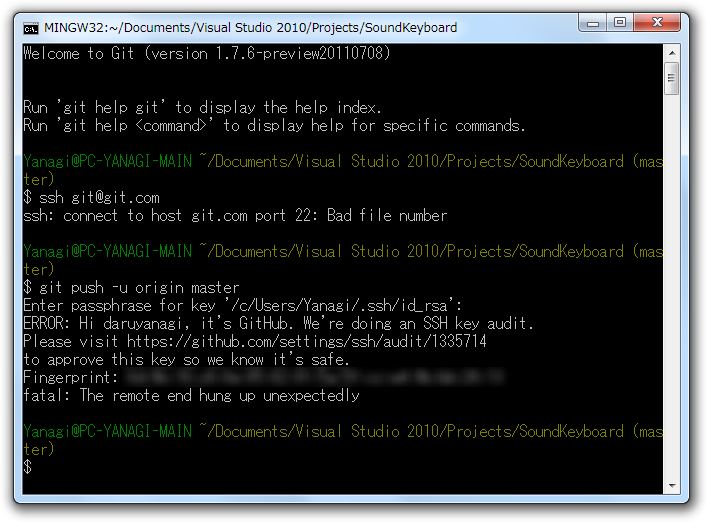
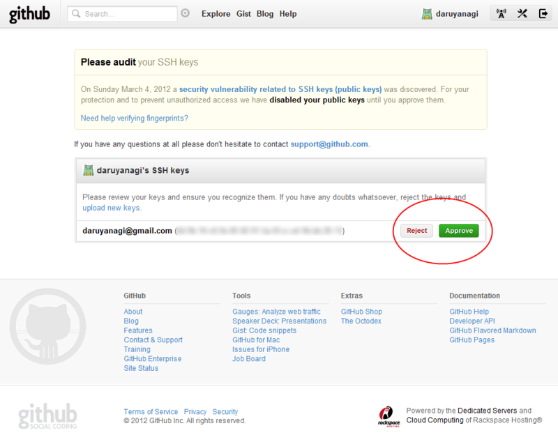

<blockquote cite="http://japan.internet.com/webtech/20120306/2.html">

先週後半、GitHub の <a class="keyword" href="http://d.hatena.ne.jp/keyword/Ruby">Ruby</a> コードにセキュリティ上の欠陥が発見され、GitHub に報告された。GitHub はその欠陥が深刻ではないと判断し、バグを修正せずにクローズした。だが、欠陥を発見した Egor Homakov 氏は黙って引き下がらなかった。GitHub に対して欠陥の深刻さを訴え、修正するべきと迫ったのだ。

GitHub は Homakov 氏のこの行為に対して感謝することはなかった。それどころか Homakov 氏の GitHub アカウントを一時的に利用停止としたのだ

<cite><a href="http://japan.internet.com/webtech/20120306/2.html">GitHub &#x30BB;&#x30AD;&#x30E5;&#x30EA;&#x30C6;&#x30A3;&#x306B;&#x5BFE;&#x3059;&#x308B;&#x7591;&#x5FF5; - &#x30A4;&#x30F3;&#x30BF;&#x30FC;&#x30CD;&#x30C3;&#x30C8;&#x30B3;&#x30E0;</a></cite>
</blockquote>

要は、<i>「セキュリティ問題あるぜ」→「ねーよ」→「あるわ！　試しにハッキングしたった」→「やりやがったな。アカウント停止じゃ」</i>ということらしい。これは GitHub 側に落ち度があると思うが、まぁ、これから気をつけましょうね、でイイと思う。セキュリティ問題の指摘って、ちょっと重箱の隅をつつく嫌いがある。玉石混交の報告の中から「玉」を漏らさず掬いとるのは、受け手からしたら難しいに違いない。

とりあえず遅ればせながらちゃんと対策が施されたので、エンドユーザー側にもちょっとした作業が必要になる。といっても、単に設定画面で<a class="keyword" href="http://d.hatena.ne.jp/keyword/SSH">SSH</a>キーを再承認するだけなのだけど。

