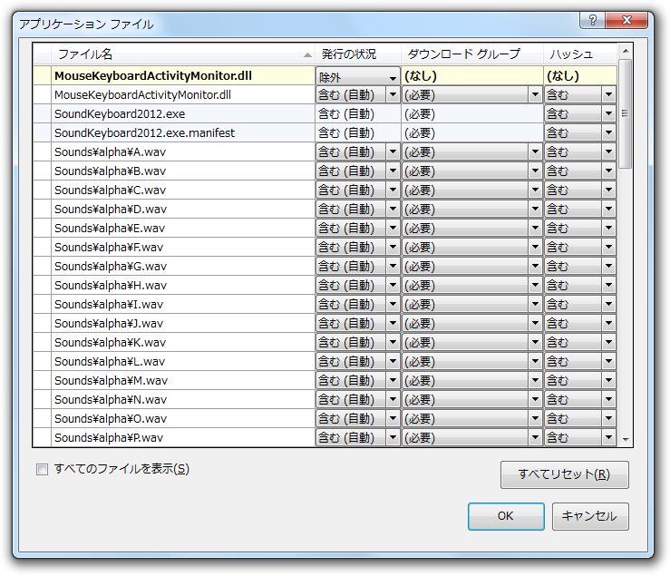

<a class="keyword" href="http://d.hatena.ne.jp/keyword/ClickOnce">ClickOnce</a> インストーラーで、ディスクにGB単位で余裕があるにもかかわらず、こんなエラーが表示される場合がある。

ウチの場合は、同じDLLが2回インストールされようとしていたのが原因らしい。プロジェクトのプロパティにある［発行］タブで［アプリケーションファイル］ボタンを押し、重複ファイルを除外してやればエラーが解消される。

