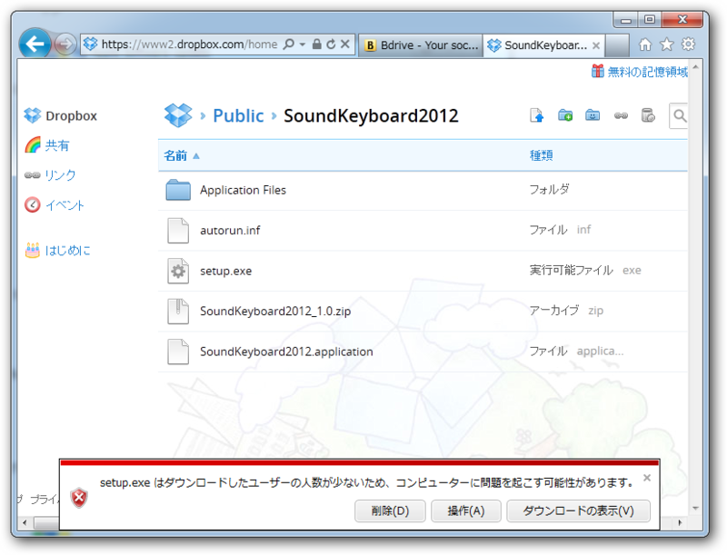
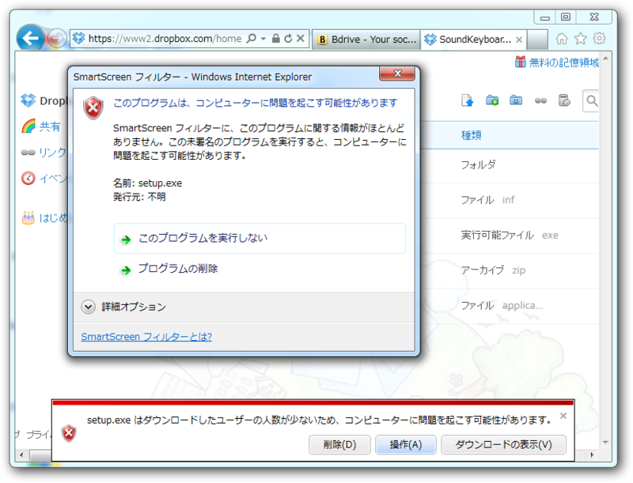
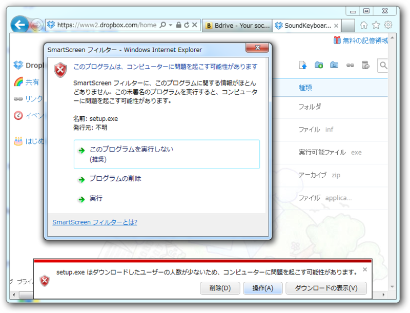

<a href="http://daruyanagi.hatenablog.com/entry/2012/03/07/221611">&#x30AA;&#x30EC;&#x306E;&#x4F5C;&#x3063;&#x305F;&#x30A2;&#x30D7;&#x30EA;&#x304C;&#x4E0D;&#x6B63;&#x306A;&#x30D5;&#x30A1;&#x30A4;&#x30EB;&#x547C;&#x3070;&#x308F;&#x308A;&#x3055;&#x308C;&#x308B;&#x4EF6;&#x306B;&#x3064;&#x3044;&#x3066; - &#x3060;&#x308B;&#x308D;&#x3050;</a> で自分のアプリがなかば<a class="keyword" href="http://d.hatena.ne.jp/keyword/%A5%DE%A5%EB%A5%A6%A5%A7%A5%A2">マルウェア</a>呼ばわりされて o(｀ω´*)oﾌﾟﾝｽｶﾌﾟﾝｽｶ!! してたのだけど、いや待て。日ごろなかなかお目にかかれない IE のスマートスクリーンフィルターを体験できるチャンスではないか？　と前向きに考えることにした。

試してみたところ、ドンピシャ！

ただ、日本語が少し変だ。<i>「ダウンロードした人数が少ないため」→「コンピューターに問題を引き起こす可能性があります」</i>というロジックをすんなり理解できるヒトはあまりいないのではないだろうか。長ったらしくはなるが、<i>「ダウンロードした人数が少ないため」→「ファイルが安全かどうか十分確認できていません」→「そのため、このファイルをダウンロードするとコンピューターに問題が起こる恐れがあります」</i>とでも直せば、かなり意味が通りやすくなるんじゃないかなぁ。

安全でないかもしれないことを承知のうえで、ダウンロード・実行するために作業を進めよう。このとき［操作］というボタンを押すのだけど、これまた意味が通じにくいと思う。漠然としすぎ。何かほかに言い回しはないだろうか……

そしてそこからさらに［詳細オプション］（！）を選ぶと、やっと［実行］に辿りつける。かなりしつこく、しつこく、警告してくれるのが分かる。「間違っちゃった、<a class="keyword" href="http://d.hatena.ne.jp/keyword/%A4%C6%A4%D8%A4%DA%A4%ED">てへぺろ</a>（ゝω・）」なんてことは、よもや起こるまい。

<ul>
<li><a href="http://windows.microsoft.com/ja-JP/internet-explorer/products/ie-9/features/smartscreen-filter">
SmartScreen &#x30D5;&#x30A3;&#x30EB;&#x30BF;&#x30FC; - Microsoft Windows
</a></li>
</ul>