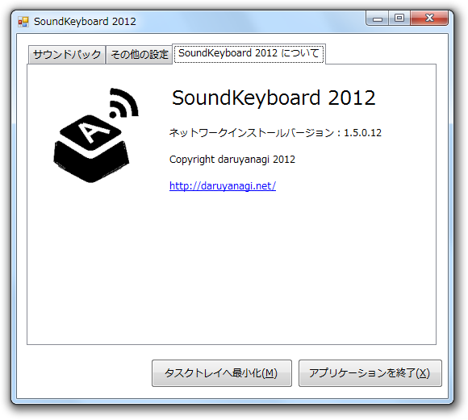
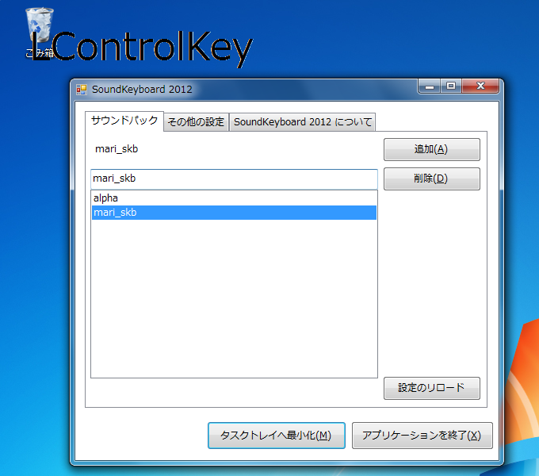
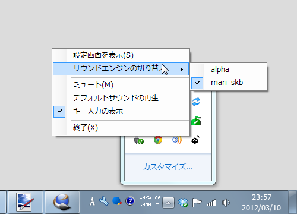

「SoundKeyboard 2012」は、キーのタイプで音を鳴らすタスクトレイ常駐型ソフトです<a href="#f1" name="fn1" title="もともとは @subsfn 氏が Delphi で制作したものですが、だいぶ古くなったので C# で作り直しました。">*1</a>。

<a href="http://daruyanagi.net/SoundKeyboard%202012">http://daruyanagi.net/SoundKeyboard%202012</a>

主要な機能は以下のとおりです。

<ul>
<li>ミュート機能（［Ctrl］＋［Alt］＋［M］キー）</li>
<li>デスクトップに入力キーを表示する機能</li>
<li>サウンドパックの切り替え機能</li>
</ul>
Windows 7 64bit版でのみ動作を確認しています。

<h4>サウンドパックについて</h4>

キーにサウンドを割り当てるには、<b>サウンドパック</b>を作成します。といっても大仰なものではなくて、単にフォルダへWAVEファイルを入れておくだけでです。

例えば、「サウンド」フォルダに「A.wav」を入れて、それをサウンドパックに指定すると、［A］キーを押した時に「A.wav」が再生されます。キーの名前はキー入力のデスクトップ表示機能を利用して確認しながらつけていくとイイと思います。サウンドパックの名前は、フォルダと同じです。さきの例で言えば、「サウンド」がそのままサウンドパックの名前になります。

デフォルトでは2つのサウンドパックを収録しています。

<ol>
<li><b>alpha</b>：アルファベットキーを打つと音がなります。</li>
<li><b>mari_skb</b>：スペースやエンターなどを押すと音がなります。</li>
</ol>
音声を作成してくれました北村真里さんに感謝いたします。

<h4>既知の不具合</h4>

<ul>
<li>サウンドパックの設定は保存されますが、その他のアプリケーションの設定は保存されません。そのうち実装します。</li>
<li>32bit版で動くか不安です。</li>
<li>WAVEファイルの大文字小文字に気をつけて下さい。これはのちのバージョンで修正する予定です。</li>
</ul>

<a href="#fn1" name="f1" class="footnote-number">*1</a>:もともとは @subsfn 氏が <a class="keyword" href="http://d.hatena.ne.jp/keyword/Delphi">Delphi</a> で制作したものですが、だいぶ古くなったので C# で作り直しました。

