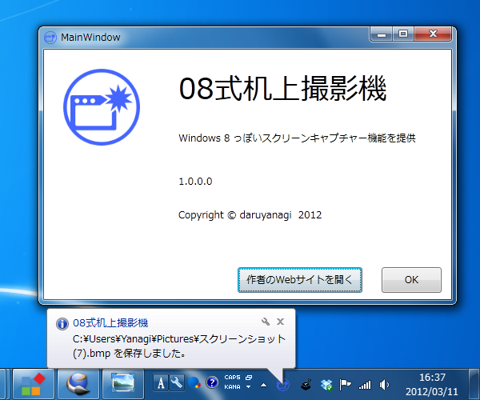

<b>「08式机上撮影機（Type08ScreenCapture）」</b>は、Windows 8の［Windows］＋［PrintScreen］機能をWindows 7で実現します。ホットキーを押すと、デスクトップの<a class="keyword" href="http://d.hatena.ne.jp/keyword/%A5%B9%A5%AF%A5%EA%A1%BC%A5%F3%A5%B7%A5%E7%A5%C3%A5%C8">スクリーンショット</a>を撮影して、ピクチャーフォルダへ自動保存することができます。細部仕様が異なるのはキニシテハイケナイ。

<ul>
<li><a href="http://daruyanagi.net/Type08ScreenCapture">Type08ScreenCapture - Daruboard</a></li>
<li><a href="http://daruyanagi.hatenablog.com/entry/2012/03/05/220912">Windows 8 &#x306F;&#xFF3B;Windows&#xFF3D;&#xFF0B;&#xFF3B;PrintScreen&#xFF3D;&#x30AD;&#x30FC;&#x3067;&#x30C7;&#x30B9;&#x30AF;&#x30C8;&#x30C3;&#x30D7;&#x306E;&#x30B9;&#x30AF;&#x30EA;&#x30FC;&#x30F3;&#x30B7;&#x30E7;&#x30C3;&#x30C8;&#x3092;&ldquo;&#x30D4;&#x30AF;&#x30C1;&#x30E3;&#x30FC;&rdquo;&#x30D5;&#x30A9;&#x30EB;&#x30C0;&#x306B;&#x4FDD;&#x5B58;&#x3067;&#x304D;&#x308B; - &#x3060;&#x308B;&#x308D;&#x3050;</a></li>
</ul>

<h4>注意事項</h4>

<ul>
<li>.NET Framework 4 Client Profile が必要です。インストール時にセットアップされます。</li>
<li>一部ブラウザーがインストーラーを不正なファイルとして検出します。別に怪しい挙動を仕込んではいませんが、気になる方はダウンロードを控えていただけますようお願いいたします。 - <a href="http://daruyanagi.hatenablog.com/entry/2012/03/07/221611">&#x30AA;&#x30EC;&#x306E;&#x4F5C;&#x3063;&#x305F;&#x30A2;&#x30D7;&#x30EA;&#x304C;&#x4E0D;&#x6B63;&#x306A;&#x30D5;&#x30A1;&#x30A4;&#x30EB;&#x547C;&#x3070;&#x308F;&#x308A;&#x3055;&#x308C;&#x308B;&#x4EF6;&#x306B;&#x3064;&#x3044;&#x3066; - &#x3060;&#x308B;&#x308D;&#x3050;</a></li>
</ul>

