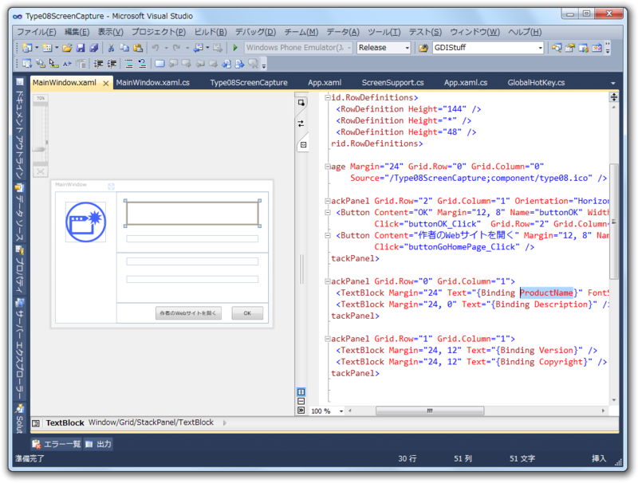

<a class="keyword" href="http://d.hatena.ne.jp/keyword/VisualBasic">VisualBasic</a> では My.Aoolication.Info でバージョン情報なんかを簡単に取得できるらしい。これを使えば簡単にバージョン情報ダイアログを実装できそうだな。これを C# から使ってみよう。

<a href="http://msdn.microsoft.com/ja-jp/library/0f1ec0yf(v=vs.80).aspx">http://msdn.microsoft.com/ja-jp/library/0f1ec0yf(v=vs.80).aspx</a>

Microsoft.<a class="keyword" href="http://d.hatena.ne.jp/keyword/VisualBasic">VisualBasic</a> を参照に追加して、using してあげる。そして、Loaded イベントで DataContext に AssemblyInfo オブジェクトを割り当ててあげる。

<pre class="code" data-unlink>using Microsoft.VisualBasic.ApplicationServices;

namespace Type08ScreenCapture
{
/// &lt;summary&gt;
/// MainWindow.xaml の相互作用ロジック
/// &lt;/summary&gt;
public partial class MainWindow : Window
{
public MainWindow()
{
InitializeComponent();
}

private void Window_Loaded(
object sender, RoutedEventArgs e)
{
DataContext = new AssemblyInfo(
System.Reflection.Assembly.GetExecutingAssembly());
}
：
：</pre>

あとは XAML 側でバインディングしていく。

<pre class="code" data-unlink>&lt;TextBlock Margin=&#34;24&#34; Text=&#34;{Binding ProductName}&#34; /&gt;</pre>

バインディングヒャッホイ！

<a href="http://daruyanagi.hatenablog.com/entry/2012/03/11/165757">&#x300C;08&#x5F0F;&#x673A;&#x4E0A;&#x64AE;&#x5F71;&#x6A5F;&#xFF08;Type08ScreenCapture&#xFF09;&#x300D;&#x3092;&#x516C;&#x958B;&#x3057;&#x307E;&#x3057;&#x305F; - &#x3060;&#x308B;&#x308D;&#x3050;</a> で使ってみたのだけど、WinForm のコードよりもすっきりしていていい感じだ。

