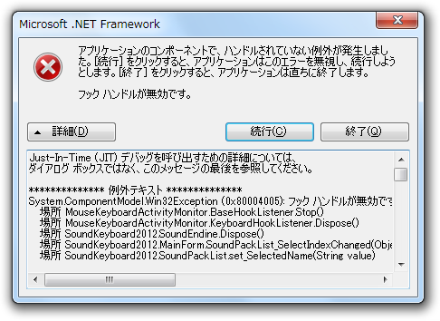

せっかく公開した SoundKeyboard 2012 なのだけど、ちょっとしたバグがある。長い間放置してると、音が鳴らなくなり、サウンドパックを切り替えようとするとエラーで落ちる。どうも、フックが勝手に外れてしまうらしい。

<blockquote class="twitter-tweet" data-in-reply-to="178803300433530880" lang="ja">
@<a href="https://twitter.com/daruyanagi">daruyanagi</a> GC に回収されてるだけじゃないんですかね。GC.KeepAlive とか参照
&mdash; しばやんさん (@shibayan) <a href="https://twitter.com/shibayan/status/178804269456171008" data-datetime="2012-03-11T11:27:14+00:00">3月 11, 2012</a></blockquote>

きっとミラクルしばやんのいう通りなのだろうと思うけど、あんまり GC 周りをよく理解していないのと、問題が<a class="keyword" href="http://d.hatena.ne.jp/keyword/%A5%B5%A1%BC%A5%C9%A5%D1%A1%BC%A5%C6%A5%A3">サードパーティ</a>の DLL 側にあるらしいこともあって、対策がうまくいかない。結局<b>タイマーで定期的にフックが生きているかどうかチェックする</b>という、若干美しくない手段を取らざるを得なかった。数日これで試して問題がなければ、このままリリースするつもり。

<ul>
<li><a href="http://daruyanagi.hatenablog.com/entry/2012/03/11/001549">SoundKeyboard 2012 &#x3092;&#x516C;&#x958B;&#x3057;&#x307E;&#x3057;&#x305F; - &#x3060;&#x308B;&#x308D;&#x3050;</a></li>
</ul>