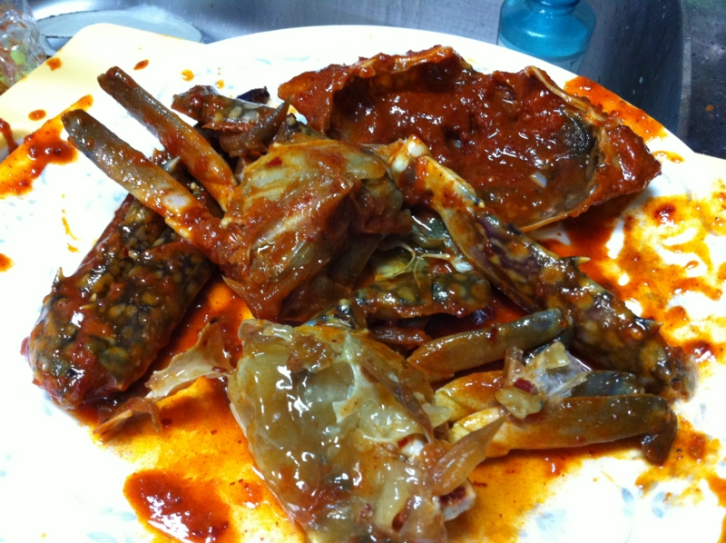
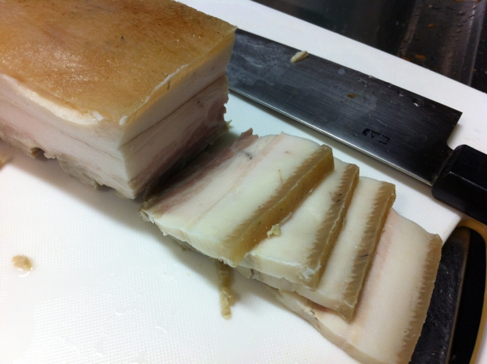
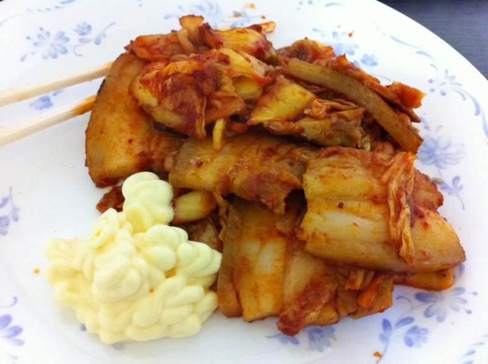

お昼過ぎ、玄関のチャイムが鳴ったのでもそもそとベッドから這い出した。ドアを開けると、サガワのお兄さんが荷物をもって立っていたのだけど、どうも自分に心当たりがない。結局隣の人の荷物だったらしい。

そんなこんなで、2時頃から行動を開始。昨日、大阪の祖母が送ってくれたというケジャンと蒸しブタを母からもらったので、ビールを一杯やりながら食べることにした。こういう韓国系のモノは自分ではあまり買わないので、貰うといつもと違うものが食べられてうれしい。

けど、ケジャンというのは食いにくいな。カニをバラしてエラをとったりしていたのだけど、唐辛子で真っ赤なタレが飛び散る。しょうがないので、台所でそのままバリバリ食べた。美味しかったけど、これでは風情も何もあったものじゃない。やはり、こういうのはお店で食べるほうがよさそうだ。

次は蒸しブタ。そのまま切ってお醤油で食べると美味しい……はずなんだけど、ちょっと脂がしつこいかな。数切れ食べて、ちょっと持て余してしまった。

そこで、薄く切り直して豚キムチに。これはウマい。ペラペラな豚肉を使うより、少々分厚い蒸しブタで作ったほうが豚肉の存在感が重量級。脂が程よく甘くなり、辛いキムチとのハーモニーが素晴らしい。ホントはごま油を少しほしいところだったのだけど、残念ながら家にはなかった。まだ半分ぐらい余っているので、月曜日に買いに行こう。

3月11日は、多くの平凡な日常が一度に失われた日。なので、特別なことはせず、あえてだるだると日常を楽しむことにした。地震ごときに振り回されて、かけがえのない日常が失われるのは非常に腹立たしいし、そんなことで日常を浪費する人を見るのも腹立たしい。なので、ここぞとばかり今日を特別な日にしたがる人は放っておいて、自分は自分の日常を楽しむことにした。

まぁ、そういうことが気になってしまうこと自体、まだまだ修行が足りない証拠なのだけど！

