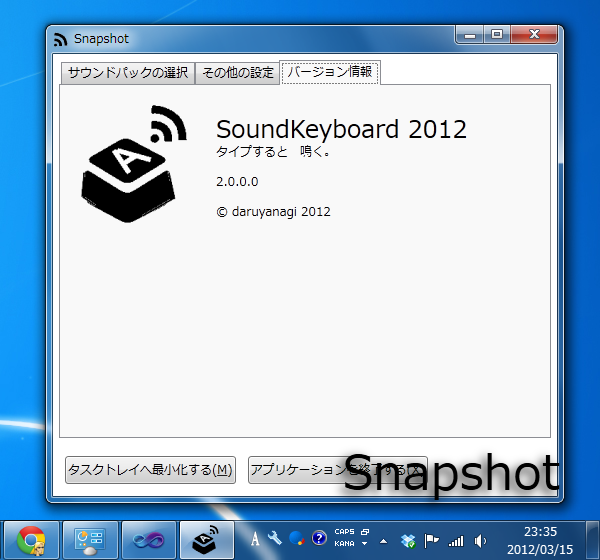
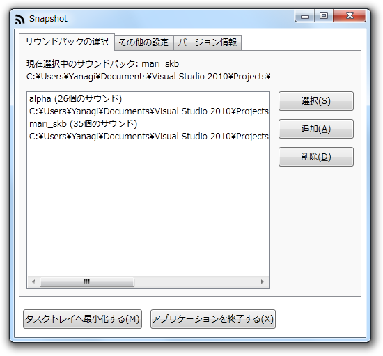
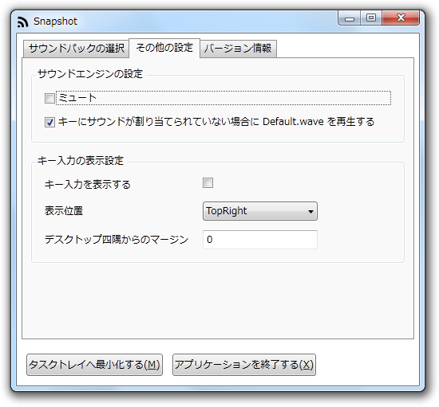
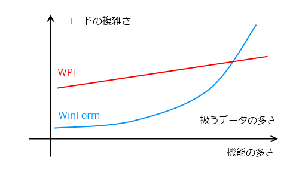

設定が多くなるにつれてコードがこんがらがってきたので、新規に <a class="keyword" href="http://d.hatena.ne.jp/keyword/WPF">WPF</a> で作り直しました。キーの入力表示にドロップシャドウエフェクトが付いたり、設定をウィンドウのユーザーインターフェイスがカッコよくなっています。

<a class="keyword" href="http://d.hatena.ne.jp/keyword/WPF">WPF</a> は最初は面倒くさいし難しいなって思っていましたが、慣れてみるとそうでもないですね。データとユーザーインターフェイスの分離が WinForm よりも進んでいるので、WinForm ではあとから設定をひとつ加えるごとにコードが加速度的に増えていくのに対し、 <a class="keyword" href="http://d.hatena.ne.jp/keyword/WPF">WPF</a> はその点複雑性が増すのが抑えられている感じ。

初期投資はちょっと多めだけど、それなりにメリットはある。何より許せない INotifyPropertyChanged の実装のめんどくささも解決できたし。これに関しては、もう眠いので明日にでも。

<a href="http://daruyanagi.net/SoundKeyboard%202012">SoundKeyboard 2012 - Daruboard</a>

