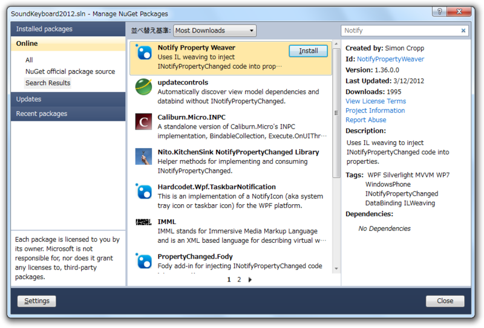
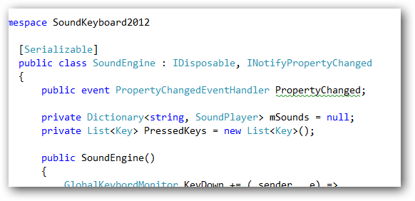

INotifyPropertyChanged の実装って面倒じゃないですか。

<pre class="code" data-unlink>public class Person : INotifyPropertyChanged
{
public event PropertyChangedEventHandler PropertyChanged;

public string GivenNames { get; set; }
public string FamilyName { get; set; }

public string FullName
{
get
{
return string.Format(&#34;{0} {1}&#34;, GivenNames, FamilyName);
}
}

}</pre>

これが、

<pre class="code" data-unlink>public class Person : INotifyPropertyChanged
{

public event PropertyChangedEventHandler PropertyChanged;

string givenNames;
public string GivenNames
{
get { return givenNames; }
set
{
if (value != givenNames)
{
givenNames = value;
OnPropertyChanged(&#34;GivenNames&#34;);
OnPropertyChanged(&#34;FullName&#34;);
}
}
}

string familyName;
public string FamilyName
{
get { return familyName; }
set
{
if (value != familyName)
{
familyName = value;
OnPropertyChanged(&#34;FamilyName&#34;);
OnPropertyChanged(&#34;FullName&#34;);
}
}
}

public string FullName
{
get
{
return string.Format(&#34;{0} {1}&#34;, GivenNames, FamilyName);
}
}

public virtual void OnPropertyChanged(string propertyName)
{
var propertyChanged = PropertyChanged;
if (propertyChanged != null)
{
propertyChanged(this, new PropertyChangedEventArgs(propertyName));
}
}
}</pre>

こんなに長くなるんですぜ？　スニペットがあるとしても面倒くさいし、ミスタイプを IDE で検出できないのでたまにエラいバグをこしらえてしまう。

そんなときは、Notify Property Weaver がオススメ。

<a href="http://code.google.com/p/notifypropertyweaver/">http://code.google.com/p/notifypropertyweaver/</a>

.NET プロパティを実装するだけで、依存プロパティ（INotifyPropertyChanged）を実装してくれる。こいつの良いところは、それをコンパイル時にやってくれること。IL を解析してインジェクションしているらしい。

<ul>
<li><a href="http://d.hatena.ne.jp/okazuki/20091214/1260803280">http://d.hatena.ne.jp/okazuki/20091214/1260803280</a></li>
<li><a href="http://d.hatena.ne.jp/okazuki/20091227/1261930083">http://d.hatena.ne.jp/okazuki/20091227/1261930083</a></li>
<li><a href="http://d.hatena.ne.jp/okazuki/20100106/1262749172">http://d.hatena.ne.jp/okazuki/20100106/1262749172</a></li>
</ul>
かずきさんのところで紹介されていたイケてる実装もイケているのだけど、やはり実行時に解決する手段だと動作速度に問題がでるみたい。ここに、開発者が時間をかけて実装するか、ユーザーに時間を負担してもらうかという<a class="keyword" href="http://d.hatena.ne.jp/keyword/%A5%C8%A5%EC%A1%BC%A5%C9%A5%AA%A5%D5">トレードオフ</a>がある。

けれど、こうした開発時 or 実行時のコストをコンパイル時に付け替えちゃえば、苦労するのは CPU さんだけになり、開発者もユーザーも幸せになれるというわけなんだね。唯一の難点は PropertyChanged を宣言して利用しないので、下に<a class="keyword" href="http://d.hatena.ne.jp/keyword/%A5%B2%A5%B8%A5%B2%A5%B8">ゲジゲジ</a>がついてきえないことだけど、楽ができるならそんなのどうでもいいわけで。

何かわしには分からん副作用があるのかもしれないけれど、とりあえずウチではちゃんと動いているので、これを愛用することにした。もっと早く知っていればよかった。

NuGet でインストールできるのもいいね。

