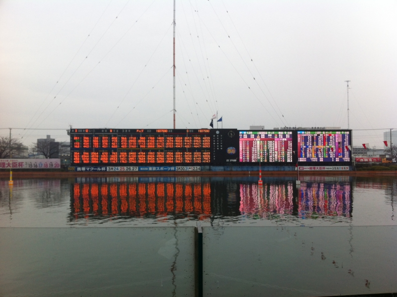
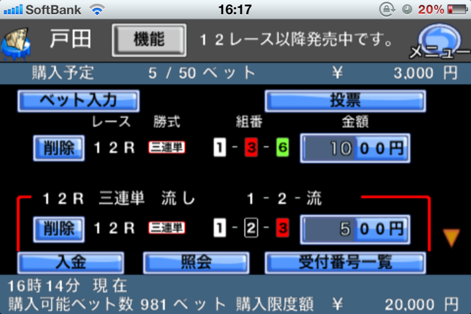

戸田競艇まで、<a class="keyword" href="http://d.hatena.ne.jp/keyword/%C1%ED%CD%FD%C2%E7%BF%C3%C7%D5">総理大臣杯</a>競走を観に行った。

カツを食って願掛けしたにもかかわらず、無残にも敗北した<a href="#f1" name="fn1" title="すべては濱野谷憲吾のせいである！">*1</a>。寒いなか出張ってきたのに、ついていない。ちょっくらカネ稼いで、帰りにアキバで新しい <a class="keyword" href="http://d.hatena.ne.jp/keyword/iPad">iPad</a> を買うつもりだったのだけど、その計画も潰えた。

まぁ、それはどうでもいい。済んだことだ。

<a class="keyword" href="http://d.hatena.ne.jp/keyword/%B8%CD%C5%C4%B6%A5%C4%FA%BE%EC">戸田競艇場</a>で困ったのは、周りにはコンビニがないこと。途中でコンビニでお金を補充したかったのだけど……場内にあるりそな銀行の ATM では<a class="keyword" href="http://d.hatena.ne.jp/keyword/%A5%B8%A5%E3%A5%D1%A5%F3%A5%CD%A5%C3%A5%C8%B6%E4%B9%D4">ジャパンネット銀行</a>のお金下ろせないし、所持金5,000円で途方にくれていた。

でも、わしはテレボート（インターネットで<a class="keyword" href="http://d.hatena.ne.jp/keyword/%BD%AE%B7%F4">舟券</a>が買えるサービス）の会員だったんだよね！　<a class="keyword" href="http://d.hatena.ne.jp/keyword/iPhone">iPhone</a> アプリで<a class="keyword" href="http://d.hatena.ne.jp/keyword/%BD%AE%B7%F4">舟券</a>が買えた。これは便利。ジャパンネットバンクからお金をチャージできるしね。そのおかげでギズが開いたとも言えるけど……！　競艇場にはあんまり大金を持って行きたくない<a href="#f2" name="fn2" title="昔よりはマシだろうけどやっぱりスリとか心配">*2</a>ので、こういうアプリは現場でも活用していきたい。アプリを起動するごとにログインが必要なのはちょっとメンドクサイけど。

今度は桐生か<a class="keyword" href="http://d.hatena.ne.jp/keyword/%CA%BF%CF%C2%C5%E7">平和島</a>あたりでリベンジするつもり。お金は預けただけだからな ( ｰ`дｰ´)ｷﾘｯ

<a href="#fn1" name="f1" class="footnote-number">*1</a>:すべては<a class="keyword" href="http://d.hatena.ne.jp/keyword/%DF%C0%CC%EE%C3%AB%B7%FB%B8%E3">濱野谷憲吾</a>のせいである！

<a href="#fn2" name="f2" class="footnote-number">*2</a>:昔よりはマシだろうけどやっぱりスリとか心配

