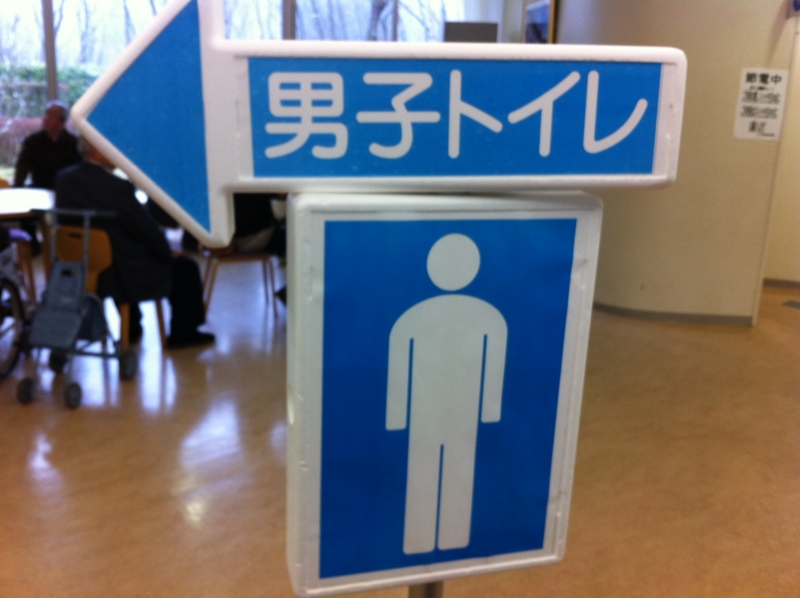
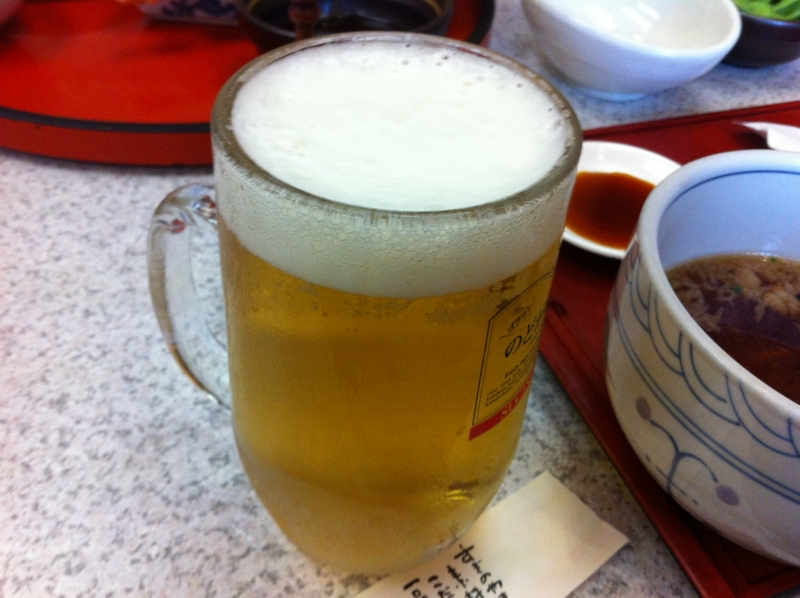

じいちゃんの墓参りに行ってきた。じいちゃんは生前熱心な<a class="keyword" href="http://d.hatena.ne.jp/keyword/%C1%CF%B2%C1%B3%D8%B2%F1">創価学会</a>の会員だったので、墓地も<a class="keyword" href="http://d.hatena.ne.jp/keyword/%C1%CF%B2%C1%B3%D8%B2%F1">創価学会</a>の施設にある。自分はあまり宗教に興味もなく、父が毛嫌いすることもあって、少しそういうものを敬遠していたのだけど、墓参りに行っていないことはずっと気にしていたので、今回混ぜてもらった。知らない人間が行くと、いろいろ面白い。

<ul>
<li>なんか受付が市役所みたいだった</li>
<li>建物が立派</li>
<li>まったく知らない人同志でもおしゃべりしてたみたい</li>
<li>おじいさん・おばあさんから孫まで、みんなで一緒にきてた</li>
<li>自然と助け合い・譲り合いの雰囲気があった</li>
<li>みんな中流階級って感じだった</li>
<li>お経の合唱、自分は知らないのでちょっと居心地が悪かった</li>
<li><a class="keyword" href="http://d.hatena.ne.jp/keyword/%C6%FC%CF%A1">日蓮</a>上人と<a class="keyword" href="http://d.hatena.ne.jp/keyword/%C3%D3%C5%C4%C2%E7%BA%EE">池田大作</a>先生は偉いらしい</li>
</ul>
昨日競艇場で、今日<a class="keyword" href="http://d.hatena.ne.jp/keyword/%C1%CF%B2%C1%B3%D8%B2%F1">創価学会</a>の墓地だと、なんだか世界が違いすぎて少しクラクラした。競艇場だと

<ul>
<li>入場は100円玉入れるタイプの自動改札</li>
<li>建物が立派</li>
<li>皆自分の新聞とにらめっこしてる</li>
<li>だいたい独り、よくて2，3人連れ</li>
<li>結構殺伐としてる</li>
<li>日曜日だけど作業着</li>
<li>レース中はめいめいが違う選手の名前を怒鳴っている</li>
<li>お金と笹川さんがエラい</li>
</ul>
みたいな感じ。ニコニコしながら競艇新聞と100円玉握って橋を渡ってくるおっさんたちも好きなのだけど、まぁ、こうも世界が違うもんだなぁ、と。まったく、イヌとネコぐらいに違う。

それはともかく、久しぶりに母方の親戚と一緒に飲んで、じいちゃんの昔話したり、近況を語り合ったりするのは楽しかった。また折を見つけていこうと思う。伊賀の方の墓参りにも、近いうちに行きたい。

