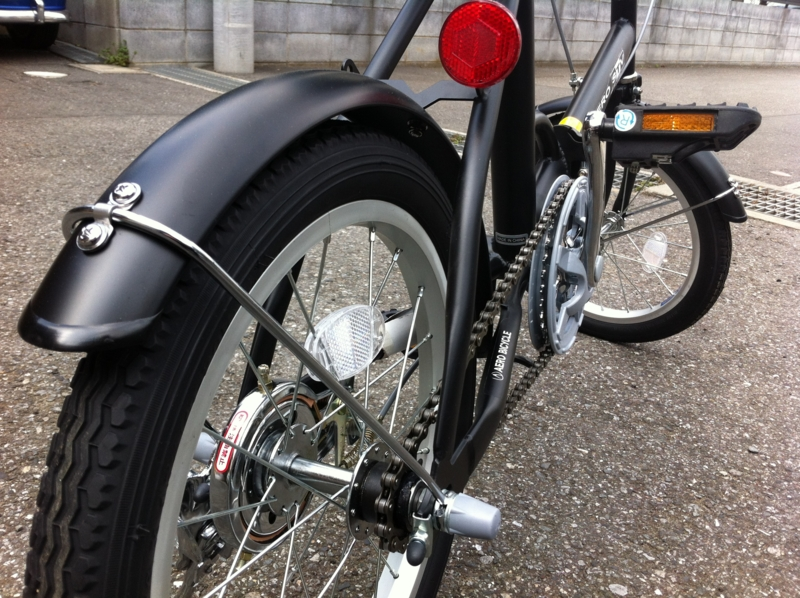
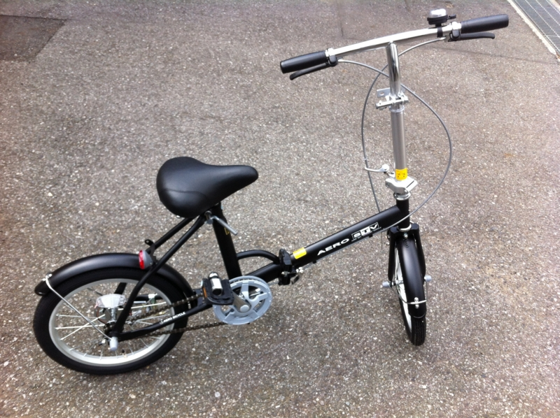
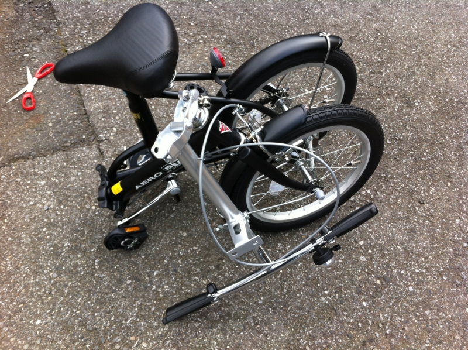

American Express のポイントで貰ったよ！　わーい ＼(^o^)／

ウチの家は下に自転車を止めるところがなくて、階段で4階まで持っていかねばならない。なので、折りたたみ自転車は役に立ちそうな気がする。バイクを出すほどじゃないけど、徒歩ではちょっとしんどい距離ってあるし。これからはアクティブに活動するわ。

むっちゃコンパクトやで！　タイヤが小さいせいか、直進走行時にハンドルがブレやすいのが気になるけど、調整してもらえばマシになるのかしら？

