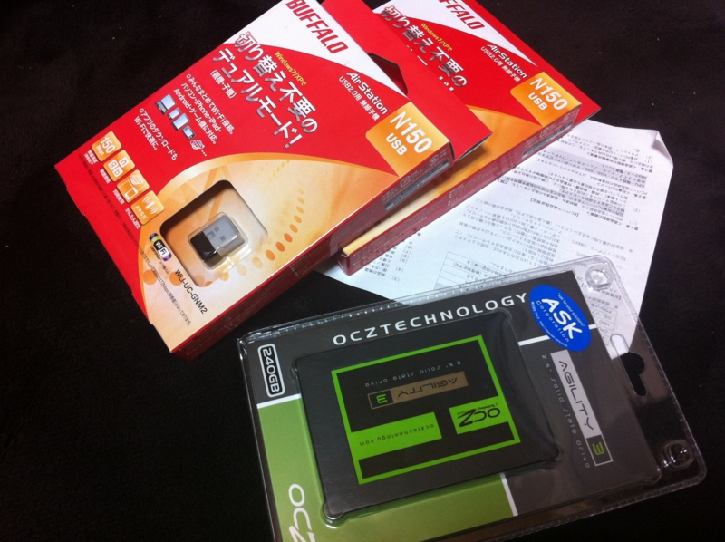

メインマシンのディスクの空き容量が苦しくなってきたので、会社の帰りにアキバによって<a class="keyword" href="http://d.hatena.ne.jp/keyword/SSD">SSD</a>を買ってきた。ちょろちょろ歩きまわって、容量250GB程度で一番リーズナブルなものをチョイス。AGT3-25SAT3-240G というヤツで、お値段は 24,000円ちょっと。

<a href="http://www.amazon.co.jp/exec/obidos/ASIN/B0064V7I0Y/bestylesnet-22/">OCZ Agility3 240GB 2.5inch SSD SATA6Gbps 3年保証 MLC採用 AGT3-25SAT3-240G</a>
<ul><li>出版社/メーカー: <a class="keyword" href="http://d.hatena.ne.jp/keyword/%A5%B7%A1%BC%A1%A6%A5%A8%A5%D5%A1%A6%A5%C7%A1%BC%C8%CE%C7%E4">シー・エフ・デー販売</a></li><li>メディア: Personal Computers</li><li> クリック: 10回</li><li><a href="http://d.hatena.ne.jp/asin/B0064V7I0Y/bestylesnet-22" target="_blank">この商品を含むブログを見る</a></li></ul>

けれど Amazon の方が2000円も安くて、あぁ、もうPCパーツショップなんかもういらないのかもしれないな、と思うなど。

それはともかく、これを何に仕込むかが問題だ。

今の PC 構成は

<ol>
<li>メインマシン（<a class="keyword" href="http://d.hatena.ne.jp/keyword/Core2%20Duo">Core2 Duo</a> 2.0GHzぐらい、4GBメモリ、120GB <a class="keyword" href="http://d.hatena.ne.jp/keyword/SSD">SSD</a>、内臓<a class="keyword" href="http://d.hatena.ne.jp/keyword/GPU">GPU</a>）</li>
<li>ホームサーバー（Atom 1.5GHzぐらい、4GBメモリ、数TB HDD、内臓<a class="keyword" href="http://d.hatena.ne.jp/keyword/GPU">GPU</a>）</li>
<li>MacBookPro 13inch（<a class="keyword" href="http://d.hatena.ne.jp/keyword/Core%20i7">Core i7</a> 2.5GHzぐらい、メモリ4GB、500GBぐらいのHDD、内臓<a class="keyword" href="http://d.hatena.ne.jp/keyword/GPU">GPU</a>）</li>
<li>液晶が壊れた古い<a class="keyword" href="http://d.hatena.ne.jp/keyword/VAIO%20type%20T">VAIO type T</a>（<a class="keyword" href="http://d.hatena.ne.jp/keyword/Pentium">Pentium</a>!!!世代 <a class="keyword" href="http://d.hatena.ne.jp/keyword/Windows%208">Windows 8</a> Developer Preview をインストールしてリモート接続で使っている）</li>
<li><a class="keyword" href="http://d.hatena.ne.jp/keyword/%A5%CD%A5%C3%A5%C8%A5%D6%A5%C3%A5%AF">ネットブック</a>（<a class="keyword" href="http://d.hatena.ne.jp/keyword/Ubuntu">Ubuntu</a>入れて実家で弟が使っている）</li>
</ol>
という感じ。できれば、メインマシンへ今回買った<a class="keyword" href="http://d.hatena.ne.jp/keyword/SSD">SSD</a>を突っ込み、余った<a class="keyword" href="http://d.hatena.ne.jp/keyword/SSD">SSD</a>を MacBookPro で使いたい。MacBookPro はディスクドライブがHDDなので、我が軍最強のCPUを搭載していながら、体感速度はメインマシンに劣る。<a class="keyword" href="http://d.hatena.ne.jp/keyword/SSD">SSD</a> に換装すれば、だいぶ使い勝手が向上して、使用頻度も上がるに違いない<a href="#f1" name="fn1" title="重くて遅いので会社でテストマシンとして使っている">*1</a>。MacBookProをバラすには専用の工具が必要らしいので、それとメモリを今度オンラインで買おう。

問題は、<a class="keyword" href="http://d.hatena.ne.jp/keyword/Diablo">Diablo</a> 3 を買った時にメインマシンのスペックが足りなかったらどうしようということ。当然リプレイスするのだけど、そのときまた環境構築をしなければならない。MiniITXなのでグラボを足すというわけにもいかないしね……

<ul>
<li><a href="http://www.4gamer.net/games/008/G000817/20120315108/">4Gamer.net &#x2015; &#x300C;Diablo III&#x300D;&#xFF0C;2012&#x5E74;5&#x6708;15&#x65E5;&#x306B;&#x30ED;&#x30FC;&#x30F3;&#x30C1;&#x6C7A;&#x5B9A;&#xFF01;&#x3000;Battle.net&#x3067;&#x306F;&#xFF0C;&#x5148;&#x884C;&#x30C0;&#x30A6;&#x30F3;&#x30ED;&#x30FC;&#x30C9;&#x8CA9;&#x58F2;&#x3082;&#x958B;&#x59CB;</a></li>
</ul>

<a href="#fn1" name="f1" class="footnote-number">*1</a>:重くて遅いので会社でテストマシンとして使っている

