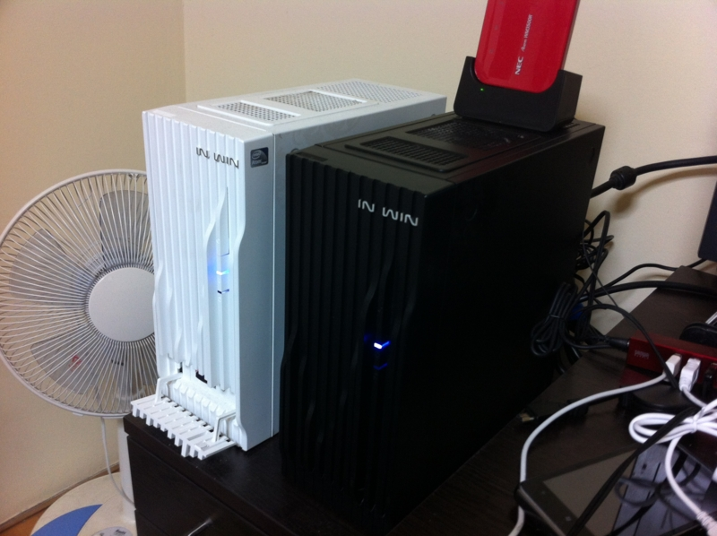
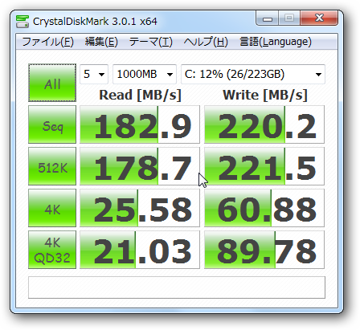
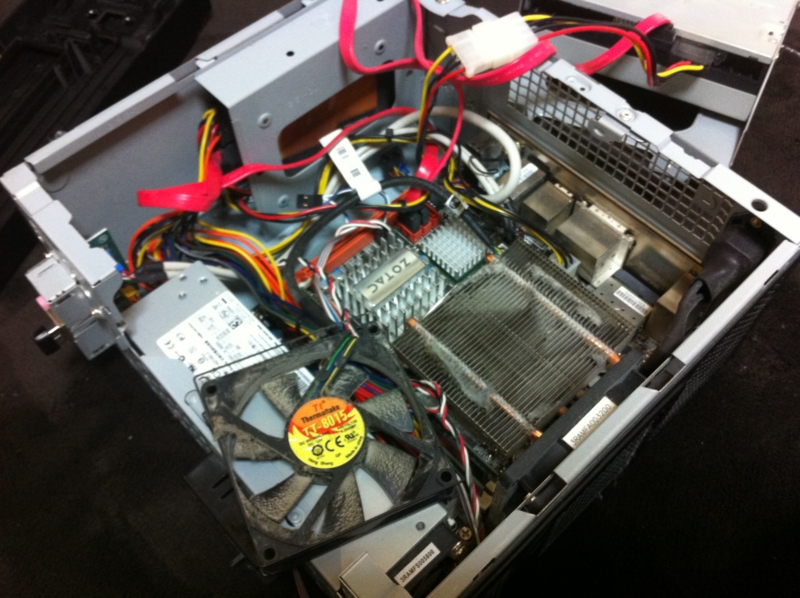

今日はお昼すぎまでに用事を終わらせて、さっそく <a href="http://daruyanagi.hatenablog.com/entry/2012/03/22/220146">&#x65B0;&#x3057;&#x3044; SSD &#x8CB7;&#x3063;&#x305F; - &#x3060;&#x308B;&#x308D;&#x3050;</a> で買った<a class="keyword" href="http://d.hatena.ne.jp/keyword/SSD">SSD</a>をメインマシン（右側の黒いPC<a href="#f1" name="fn1" title="ちなみに左側はWindows Home Serverをインストールしたホームサーバー">*1</a>）に組み込んだ。やったー、ディスク容量が倍になったよ ＼(^o^)／

<a href="http://www.amazon.co.jp/exec/obidos/ASIN/B0064V7I0Y/bestylesnet-22/">OCZ Agility3 240GB 2.5inch SSD SATA6Gbps 3年保証 MLC採用 AGT3-25SAT3-240G</a>
<ul><li>出版社/メーカー: <a class="keyword" href="http://d.hatena.ne.jp/keyword/%A5%B7%A1%BC%A1%A6%A5%A8%A5%D5%A1%A6%A5%C7%A1%BC%C8%CE%C7%E4">シー・エフ・デー販売</a></li><li>メディア: Personal Computers</li><li> クリック: 10回</li><li><a href="http://d.hatena.ne.jp/asin/B0064V7I0Y/bestylesnet-22" target="_blank">この商品を含むブログを見る</a></li></ul>

他のアプリも立ち上げながらのテストなので適当であまり参考にならないけど、HDD なんかよりはずっと速い感じ。それにしても書き込みのほうが速いのはなぜなんだぜ……そういうもんなんだろうか（← ハード音痴

ついでにPCのファンを掃除した。ちょっと騒音が少なくなった気がする。

<a href="#fn1" name="f1" class="footnote-number">*1</a>:ちなみに左側は<a class="keyword" href="http://d.hatena.ne.jp/keyword/Windows%20Home%20Server">Windows Home Server</a>をインストールしたホームサーバー

