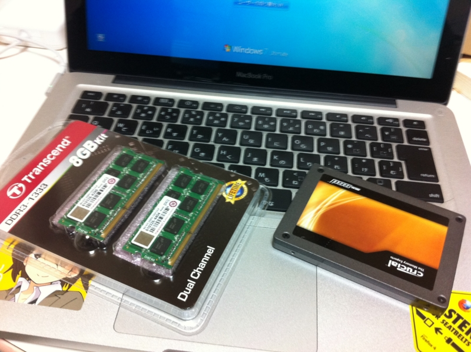
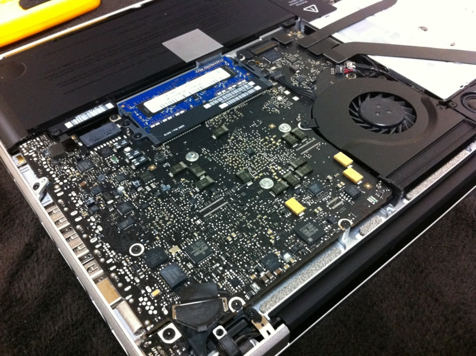
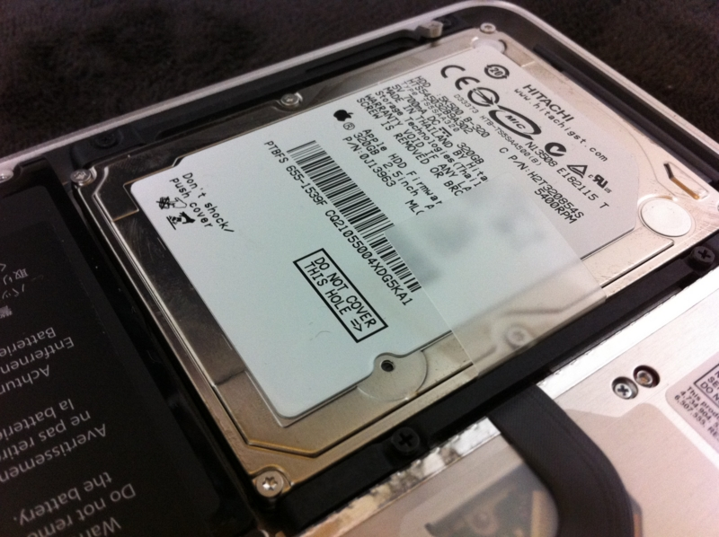
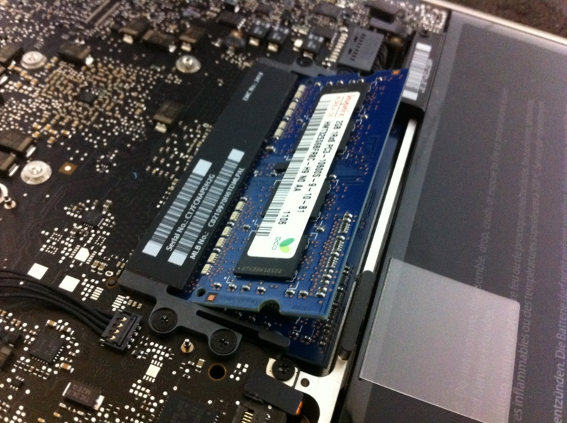
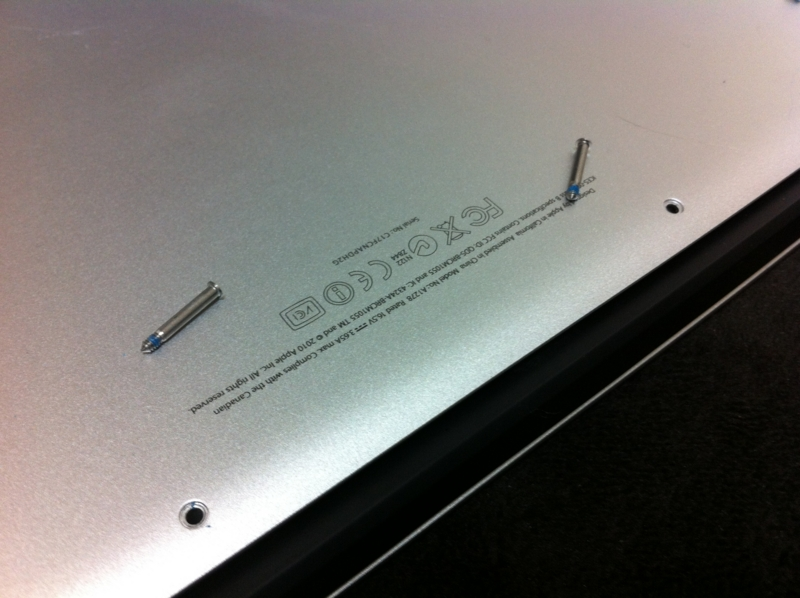
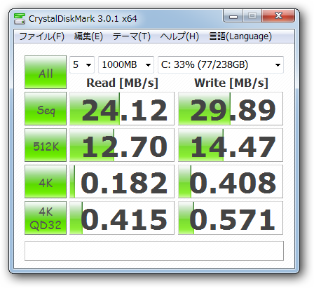
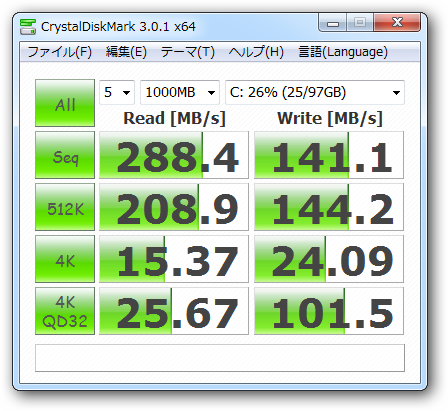

メインPCを <a href="http://daruyanagi.hatenablog.com/entry/2012/03/24/230235">SSD 120GB &rarr; 240GB - &#x3060;&#x308B;&#x308D;&#x3050;</a> へ換装したので、あまった <a class="keyword" href="http://d.hatena.ne.jp/keyword/SSD">SSD</a> （Crucial <a class="keyword" href="http://d.hatena.ne.jp/keyword/SSD">SSD</a> C300 120GB <a href="#f1" name="fn1" title="Flickr にあげていた写真によると、2010年12月に購入したものらしい">*1</a>）を <a class="keyword" href="http://d.hatena.ne.jp/keyword/MacBook%20Pro">MacBook Pro</a> 13inch へ移植。どうせ開腹手術をするなら、とメモリも増設（4GB → 8GB）することにした。

<a href="http://www.amazon.co.jp/exec/obidos/ASIN/B0057K0DVE/bestylesnet-22/">Transcend JetRam ノートPC用増設メモリ PC3-10600(DDR3-1333) 8GB KIT(4GB×2) 永久保証 JM1333KSN-8GK</a>
<ul><li>出版社/メーカー: <a class="keyword" href="http://d.hatena.ne.jp/keyword/%A5%C8%A5%E9%A5%F3%A5%BB%A5%F3%A5%C9%A1%A6%A5%B8%A5%E3%A5%D1%A5%F3">トランセンド・ジャパン</a></li><li>メディア: Personal Computers</li><li>購入: 21人 クリック: 144回</li><li><a href="http://d.hatena.ne.jp/asin/B0057K0DVE/bestylesnet-22" target="_blank">この商品を含むブログを見る</a></li></ul>

手順次第はそんなに難しくなくて、精密ドライバーでバラせばいいだけ。なぜか長いネジが3本だけあった。

換装前。

換装後。

バックグラウンドでアプリを動かしながらの計測なので厳密では決してないけれど……<i>圧倒的ではないか、我が<a class="keyword" href="http://d.hatena.ne.jp/keyword/SSD">SSD</a>は━━━━(ﾟ∀ﾟ)━━━━ｯ!!</i> それにしても、換装前のHDDの数値は何なんだ……ネットワークドライブかよ。

ちなみに、メインPCへ仕込んだ新しい <a class="keyword" href="http://d.hatena.ne.jp/keyword/SSD">SSD</a> （OCZ Agility3 240GB）の<a class="keyword" href="http://d.hatena.ne.jp/keyword/%A5%D9%A5%F3%A5%C1%A5%DE%A1%BC%A5%AF">ベンチマーク</a>。速度的には大して変わらなさそうな感じ。

<del>まぁ、ここまではいいのだけど、<a class="keyword" href="http://d.hatena.ne.jp/keyword/Mac%20OS%20X">Mac OS X</a> で焼いた BootCamp のCDが壊れていて……ドライバやユーティリティが中途半端にインストールされた状態になってしまった。もういやんなってしまう ＞＜ </del> <a class="keyword" href="http://d.hatena.ne.jp/keyword/Mac%20OS%20X">Mac OS X</a> のインストールディスクでインストールできたのね……orz

<a href="#fn1" name="f1" class="footnote-number">*1</a>:<a class="keyword" href="http://d.hatena.ne.jp/keyword/Flickr">Flickr</a> にあげていた写真によると、2010年12月に購入したものらしい

