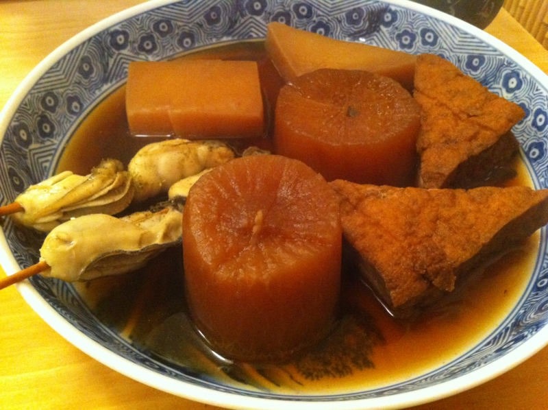
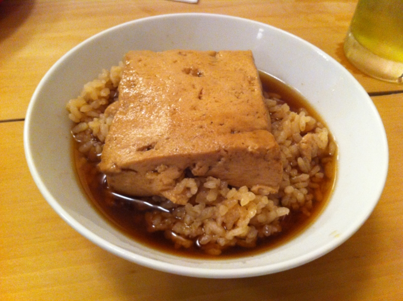
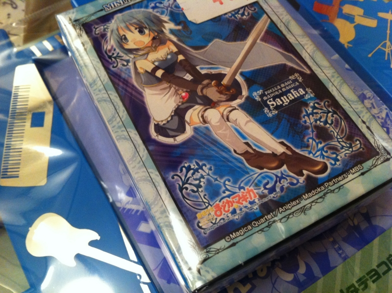
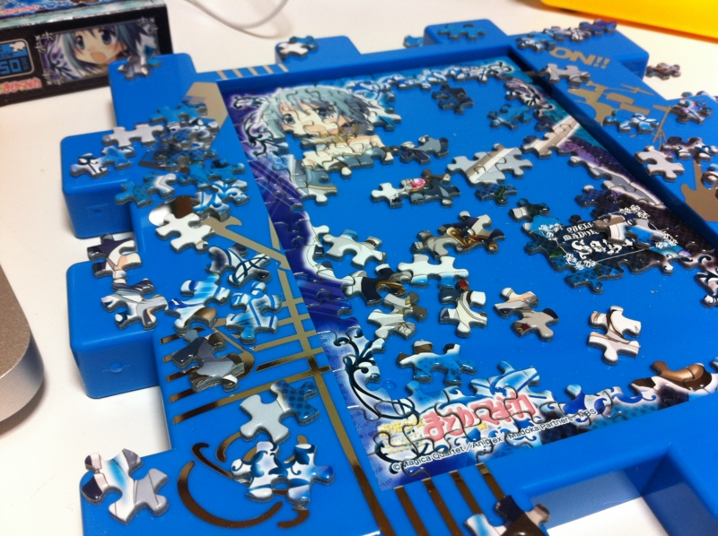
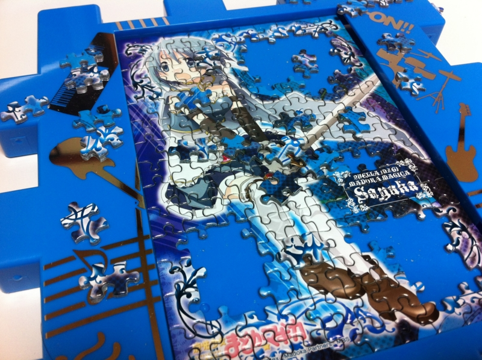
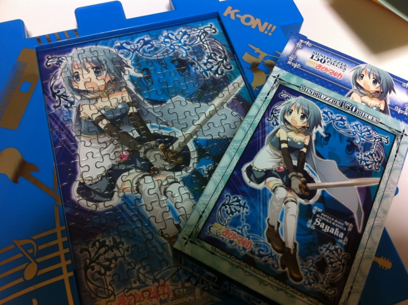

金曜日は、@subsfn と新橋でおでんをツツイた。

<a href="https://ja.foursquare.com/v/%E3%81%8A%E5%A4%9A%E5%B9%B8-%E6%96%B0%E6%A9%8B%E5%BA%97/4b6c032cf964a520961f2ce3">&#x304A;&#x591A;&#x5E78; &#x65B0;&#x6A4B;&#x5E97; - &#x6E2F;&#x533A;, &#x6771;&#x4EAC;&#x90FD; - foursquare</a>

ちょっとジャンキーだけど、ご飯におでんの豆腐をのせて出汁をかけるメニューがなかなかよい。〆に食べると幸せになれるハズ。

それはそうと、一ヶ月早い誕生日プレゼントももらった。<i>さやかちゃんのジグソーパズル ＼(^o^)／</i> なかなか凛々しいお姿ですね。

今週末に済ませてしまわなければならない PC のセットアップ・環境構築も一段落ついたので、気分転換も兼ねて、土曜日の深夜（というか、日曜日の明け方）にさっそくトライ。

ここまでは比較的あっさりできた……けど、ここからがなかなか難しい。

結局二時間ぐらいで完成。ピースの数はそれほど多くないけれど、久しぶりなのでだいぶ手応えがあり、面白かった。<i>それにしても、額縁くれたのはいいけど、<a class="keyword" href="http://d.hatena.ne.jp/keyword/%A4%B1%A4%A4%A4%AA%A4%F3%A1%AA">けいおん！</a>なのはどうなのよ。</i>

