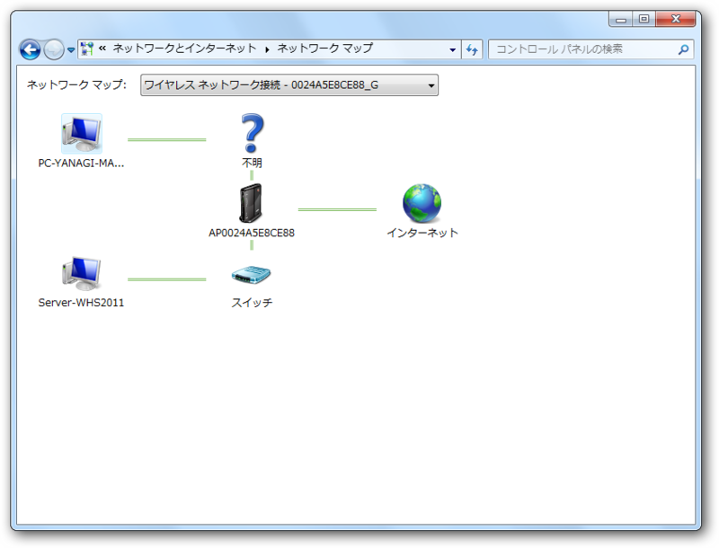
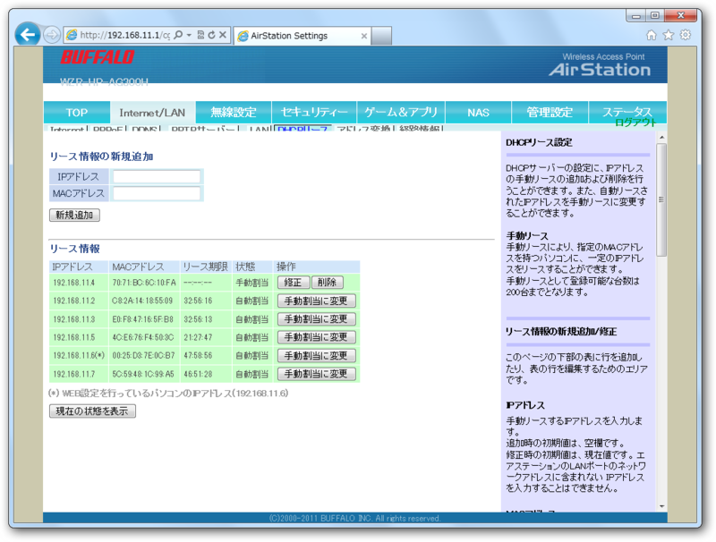
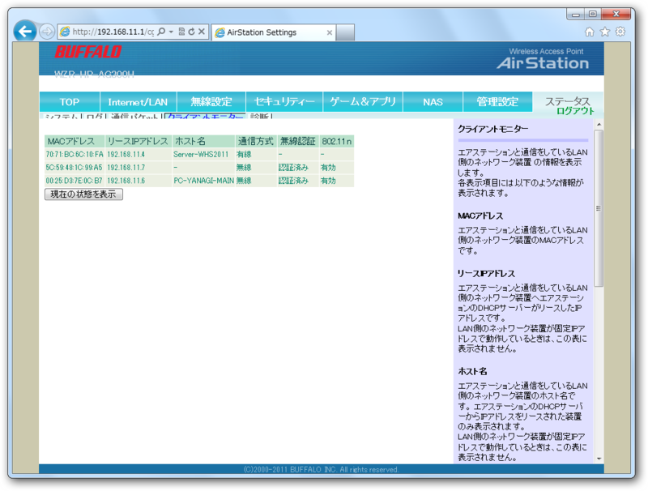
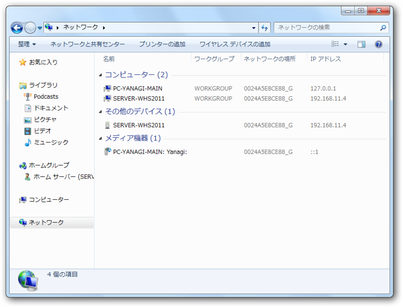
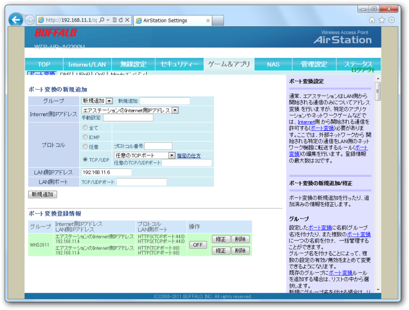
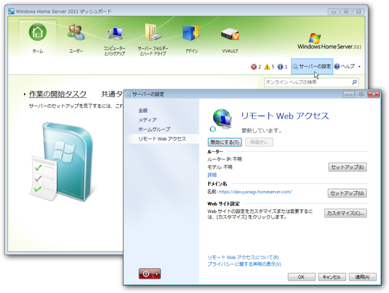

ウチのネットワーク。ほんとは、ここに MacBook Pro だの Windows Phone だの <a class="keyword" href="http://d.hatena.ne.jp/keyword/iPad">iPad</a> だの <a class="keyword" href="http://d.hatena.ne.jp/keyword/iPhone">iPhone</a> だのもぶら下がっているが、基本的にはバッファロー製のルーター WZR-HP-AG300H を介してインターネットに繋がっている。けれど、このルーター、<a class="keyword" href="http://d.hatena.ne.jp/keyword/UPnP">UPnP</a> に対応していないだの何だので <a href="#f1" name="fn1" title="一応ほんとは対応はしているはず">*1</a>、 Windows Home Serevr では自動でリモートアクセス構成をセットアップできない。なので、手動で公開してあげることになる。

<h3>1. Windows Home Server の<a class="keyword" href="http://d.hatena.ne.jp/keyword/IP%A5%A2%A5%C9%A5%EC%A5%B9">IPアドレス</a>を固定する</h3>

まず、［Internet/LAN］－［<a class="keyword" href="http://d.hatena.ne.jp/keyword/DHCP">DHCP</a>リース］とたどって、<a class="keyword" href="http://d.hatena.ne.jp/keyword/WHS">WHS</a>機の<a class="keyword" href="http://d.hatena.ne.jp/keyword/IP%A5%A2%A5%C9%A5%EC%A5%B9">IPアドレス</a>を手動割り当てに変更する。

<a class="keyword" href="http://d.hatena.ne.jp/keyword/WHS">WHS</a>機の<a class="keyword" href="http://d.hatena.ne.jp/keyword/IP%A5%A2%A5%C9%A5%EC%A5%B9">IPアドレス</a>がわからない場合は、［ステータス］－［クライアントモニター］に進めばよい。ここでは、SERVER-WHS2011 に 192.168.11.4 が割り当てられているのがわかる。無論、IPCONFIG コマンドで調べてもいいし、エクスプローラーでも調べられる。

とりあえず、どうにか<a class="keyword" href="http://d.hatena.ne.jp/keyword/IP%A5%A2%A5%C9%A5%EC%A5%B9">IPアドレス</a>を調べてWindows Home Server の<a class="keyword" href="http://d.hatena.ne.jp/keyword/IP%A5%A2%A5%C9%A5%EC%A5%B9">IPアドレス</a>を固定すればいい。

<h3>2. ポートフォワーディングの設定</h3>

続いて、ポートフォワーディングの設定を行う。WZR-HP-AG300H では「ポート変換」と呼ばれており、［ゲーム＆アプリ］設定で変更できる。要は特定のポートに対するリクエストへ応えるマシンを指定してあげるというわけ。

今回の場合は、HTTP（80番）と<a class="keyword" href="http://d.hatena.ne.jp/keyword/HTTPS">HTTPS</a>（443番）に対するリクエストが来たら、ルーターではなく<a class="keyword" href="http://d.hatena.ne.jp/keyword/WHS">WHS</a>機が応答するように設定してあげる。先代の<a class="keyword" href="http://d.hatena.ne.jp/keyword/WHS">WHS</a>機ではリモートデスクトップ接続のポートも開ける必要があったみたいだけれど、2011ではその必要はないようだ。

<h3>3. ドメインの指定</h3>

あとは、ネットワークにドメインを割り当てる。ダッシュボードにある［サーバーの設定］ボタンをクリックして、現れるダイアログで［リモート Web アクセス］を選択する。あとは……まぁ、やってみればわかると思う。ここでは <i><a class="keyword" href="http://d.hatena.ne.jp/keyword/https">https</a>://<任意のID>.homeserver.com/</i> のドメインを取得した<a href="#f2" name="fn2" title="無償です">*2</a>。

2. の設定に失敗していると、ネットワーク外から <a class="keyword" href="http://d.hatena.ne.jp/keyword/https">https</a>://<任意のID>.homeserver.com/ へのアクセスでルーターの設定画面が開いてしまうと思う<a href="#f3" name="fn3" title="ネットワーク内からアクセスした場合は、設定に成功していてもルーターの設定画面が開く。インターネットからのリクエストではないため、ポートフォワーディングが行われないため">*3</a>。ちゃんと <a class="keyword" href="http://d.hatena.ne.jp/keyword/WHS">WHS</a> のWebインターフェイスが開けば成功。おつかれさまでした。

<blockquote class="twitter-tweet" lang="ja">
バッファローのルーター、IE9でデザイン崩れるの何とかならないかな！
&mdash; だるやなぎさん (@daruyanagi) <a href="https://twitter.com/daruyanagi/status/184254589904756736" data-datetime="2012-03-26T12:24:52+00:00">3月 26, 2012</a></blockquote>

<a href="#fn1" name="f1" class="footnote-number">*1</a>:一応ほんとは対応はしているはず

<a href="#fn2" name="f2" class="footnote-number">*2</a>:無償です

<a href="#fn3" name="f3" class="footnote-number">*3</a>:ネットワーク内からアクセスした場合は、設定に成功していてもルーターの設定画面が開く。インターネットからのリクエストではないため、ポートフォワーディングが行われないため

