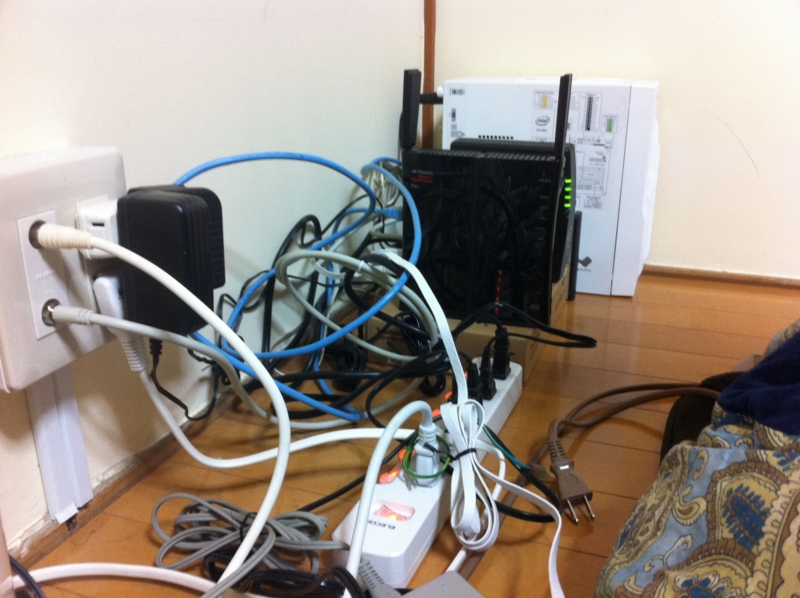
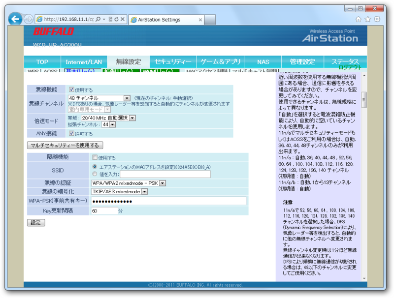

ネットワーク図ではシンプルな構成だけれど……

実際はだいぶヒドい。今週末は忙しいので、そのあとにテーブルやケーブルをまとめるグッズなんかを買って、ちょっと整理整頓しようと思う。

それにしても、うちのバッファローのルーター（Buffalo WZR-HP-AG300H）の調子が悪い。無線がブチブチ切れる。有線は非常に安定しているので、<a class="keyword" href="http://d.hatena.ne.jp/keyword/Windows%20Home%20Server">Windows Home Server</a> はルーターの隣に移設して、有線LANで接続した。メインマンシンはそうもいかないのでルーターの設定も色々いじってみたのだけど、少しマシになったかな？　という程度で、やはり不安定なまま。

<blockquote cite="http://buffalo.custhelp.com/app/answers/detail/a_id/8342/p/1,2,280,281">

<ul>
<li><a class="keyword" href="http://d.hatena.ne.jp/keyword/%CC%B5%C0%FELAN">無線LAN</a>親機のファームウェアが最新ではありません。（最新です）</li>
<li><a class="keyword" href="http://d.hatena.ne.jp/keyword/%CC%B5%C0%FELAN">無線LAN</a>子機のドライバーが最新ではありません。（最新です）</li>
<li>無線の混信や干渉が発生しています。（これが怪しいので対策を施した）</li>
<li>無線が届きにくい環境です。（とても近いし、間にはこたつ程度しかありません）</li>
<li>セキュリティーソフトウェアが影響しています。（そんなんあるんだ……状況が改善しなければ試す）</li>
<li><a class="keyword" href="http://d.hatena.ne.jp/keyword/%CC%B5%C0%FELAN">無線LAN</a>親機の暗号化キーのキー更新間隔を変更してみます。（関係あるのかな？）</li>
</ul>
<cite><a href="http://buffalo.custhelp.com/app/answers/detail/a_id/8342/p/1,2,280,281">&#x7121;&#x7DDA;LAN&#x7121;&#x7DDA;&#x63A5;&#x7D9A;&#x304C;&#x983B;&#x7E41;&#x306B;&#x5207;&#x308C;&#x305F;&#x308A;&#x3001;&#x901A;&#x4FE1;&#x901F;&#x5EA6;&#x304C;&#x9045;&#x304B;&#x3063;&#x305F;&#x308A;&#x3059;&#x308B;&#x3068;&#x304D;&#x306E;&#x5BFE;&#x51E6;&#x65B9;&#x6CD5; | BUFFALO &#x30D0;&#x30C3;&#x30D5;&#x30A1;&#x30ED;&#x30FC;</a></cite>
</blockquote>

<a class="keyword" href="http://d.hatena.ne.jp/keyword/AOSS">AOSS</a> で <a class="keyword" href="http://d.hatena.ne.jp/keyword/WiFi">WiFi</a> の接続を自動で行うと調子悪いという話も聞いたので、それも試してみよう。

<h3>追記</h3>

<del>結局 <a class="keyword" href="http://d.hatena.ne.jp/keyword/AOSS">AOSS</a> ではなく、手動でパスワードを設定すると安定した ＼(^o^)／</del>

全然ダメなので買い替え検討中

