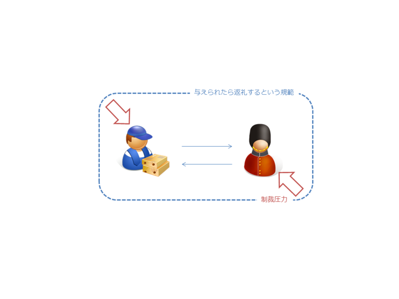
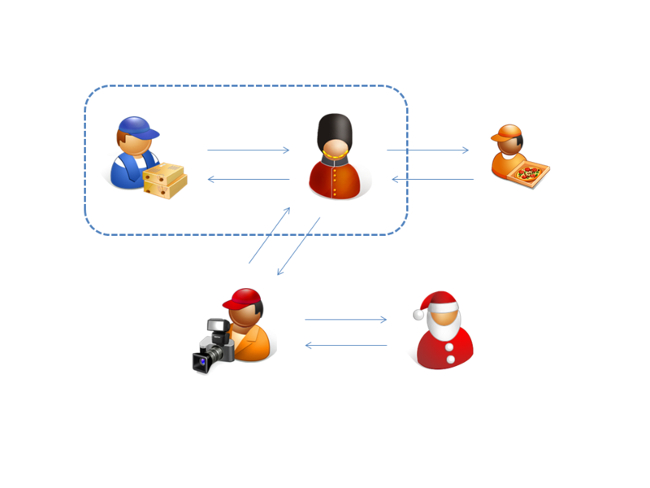
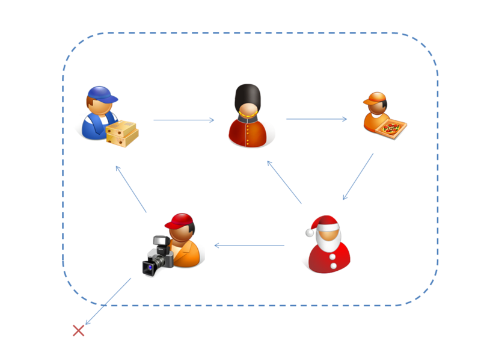

参照: <a href="http://daruyanagi.hatenablog.com/entry/2012/03/12/235246">&#x7D14;&#x7C8B;&#x8D08;&#x4E0E;&#x306B;&#x3064;&#x3044;&#x3066; - &#x3060;&#x308B;&#x308D;&#x3050;</a>

<h3>一対一の贈与関係</h3>

贈与関係が継続される場合、そこには「与えたら返す」という規範（ルール）が成立している。このルールには、有形無形の罰則（制裁）がともなう。これは直接的な報復であるとは限らない。贈与関係に双方が利を感じているならば、贈与関係の停止も制裁行為の一種と見なせる。規範は目に見えないが双方に共有されており、贈与・交換の「場」を形成する。この「場」では与えたものが必ず返ってくるので、「純粋贈与」に対する障害が少なく、むしろ促進・拡大されてゆく。

<h3>一対一の贈与関係の拡張</h3>

一対一の贈与関係を複数取り結んで拡張することも、もちろん考えられる。拡張された一対一の贈与関係では、贈与関係ごとに規範が形成される。一対一の与える＝返すが対応した、一つの完結された贈与関係、互恵の場が複数展開される。しかしよく考えれば、それらの贈与関係には集団で共有可能な多くの基本的な共通項＜道徳＞が見いだせるはず。

<h3>集団的贈与関係</h3>

集団的な贈与関係においては、もはや贈与が一対一で対応している必要がない。集団として<b>"なんとなく帳尻があって"</b>いれば十分だ。

たとえば、家族や友人、サークル、会社組織では、与える＝返す関係が厳密に対応していない。しかし、もらうばかりの<a class="keyword" href="http://d.hatena.ne.jp/keyword/%A5%D5%A5%EA%A1%BC%A5%E9%A5%A4%A5%C0%A1%BC">フリーライダー</a>には、いつか制裁が与えられる。集団的贈与関係においては、与える＝返す関係が一対一で対応しなければならないという制約が緩和されるが、制裁をともなう規範が失われたわけではない。

集団的贈与関係は、「純粋贈与」をプールするための、そして「純粋贈与」のプールを促進するための枠組みといえる。贈与を集団外に漏らすことは肯定されない。それは集団がプールした「純粋贈与」の損失を意味する。

集団的贈与関係のもっとも分かりやすい例は宗教だ。とくにイスラム教はそれが顕著に現れていると思う。

<blockquote cite="http://ja.wikipedia.org/wiki/%E3%82%B8%E3%83%8F%E3%83%BC%E3%83%89">

守旧的<a class="keyword" href="http://d.hatena.ne.jp/keyword/%A5%A4%A5%B9%A5%E9%A1%BC%A5%E0">イスラーム</a>と古典シャリーアの理念においては、<a class="keyword" href="http://d.hatena.ne.jp/keyword/%A5%A4%A5%B9%A5%E9%A1%BC%A5%E0">イスラーム</a>共同体の主権が確立され、シャリーア（<a class="keyword" href="http://d.hatena.ne.jp/keyword/%A5%A4%A5%B9%A5%E9%A1%BC%A5%E0">イスラーム</a>法）が施行される領域、ダール・アル＝<a class="keyword" href="http://d.hatena.ne.jp/keyword/%A5%A4%A5%B9%A5%E9%A1%BC%A5%E0">イスラーム</a> دار السلام（直訳すれば「<a class="keyword" href="http://d.hatena.ne.jp/keyword/%A5%A4%A5%B9%A5%E9%A1%BC%A5%E0">イスラーム</a>の家」だが、<a class="keyword" href="http://d.hatena.ne.jp/keyword/%A5%A4%A5%B9%A5%E9%A1%BC%A5%E0">イスラーム</a>世界のこと）に全世界とその人民が包摂されていなければならない。しかし、現実には「<a class="keyword" href="http://d.hatena.ne.jp/keyword/%A5%A4%A5%B9%A5%E9%A1%BC%A5%E0">イスラーム</a>の家」の外部には、<a class="keyword" href="http://d.hatena.ne.jp/keyword/%A5%A4%A5%B9%A5%E9%A1%BC%A5%E0">イスラーム</a>共同体の力が及ばないダール・アル＝ハルブ دار الحرب‎（同じく「戦争の家」だが、<a class="keyword" href="http://d.hatena.ne.jp/keyword/%A5%A4%A5%B9%A5%E9%A1%BC%A5%E0">イスラーム</a>の及ばない世界のこと）が存在するから、「戦争の家」を「<a class="keyword" href="http://d.hatena.ne.jp/keyword/%A5%A4%A5%B9%A5%E9%A1%BC%A5%E0">イスラーム</a>の家」に組み入れるための努力、すなわちジハードを行うことは<a class="keyword" href="http://d.hatena.ne.jp/keyword/%A5%E0%A5%B9%A5%EA%A5%E0">ムスリム</a>の義務とされる。

<cite><a href="http://ja.wikipedia.org/wiki/%E3%82%B8%E3%83%8F%E3%83%BC%E3%83%89">&#x30B8;&#x30CF;&#x30FC;&#x30C9; - Wikipedia</a></cite>
</blockquote>

<blockquote class="twitter-tweet" lang="ja">
古来宗教は経済と密接に繋がっていた。イスラムのジハードなんかは、商業圏の拡大思想だったかもしれない。同じ教えを奉ずるものは絶対信用しろ、異教徒は絶対信用するな…みたいな。今にしてみりゃ微妙な思想だけど、原始的な血縁による信頼を超えた交易ネットワークの構築に一役買っていたと思う。
&mdash; だるやなぎさん (@daruyanagi) <a href="https://twitter.com/daruyanagi/status/11194227205" data-datetime="2010-03-28T13:29:38+00:00">3月 28, 2010</a></blockquote>

