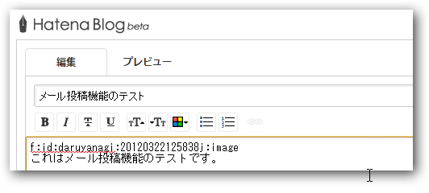

これはメール投稿機能のテストです。

/*--ココマデ--*/

<a href="http://staff.hatenablog.com/entry/2012/03/29/162734">&#x30E1;&#x30FC;&#x30EB;&#x3067;&#x8A18;&#x4E8B;&#x304C;&#x6295;&#x7A3F;&#x3067;&#x304D;&#x308B;&#x6A5F;&#x80FD;&#x3092;&#x8FFD;&#x52A0;&#x3057;&#x307E;&#x3057;&#x305F; - &#x306F;&#x3066;&#x306A;&#x30D6;&#x30ED;&#x30B0;&#x958B;&#x767A;&#x30D6;&#x30ED;&#x30B0;</a> を試してみた。送信後１分程度で反映され、<a class="keyword" href="http://d.hatena.ne.jp/keyword/%A5%B9%A5%AF%A5%EA%A1%BC%A5%F3%A5%B7%A5%E7%A5%C3%A5%C8">スクリーンショット</a>のようなコードが埋め込まれた（<a class="keyword" href="http://d.hatena.ne.jp/keyword/%A4%CF%A4%C6%A4%CA%B5%AD%CB%A1">はてな記法</a>モードの場合）。外部サービス連携までは自動でしてくれないみたい。出先からちょろっと更新するにはいい機能なのかもしれない。

