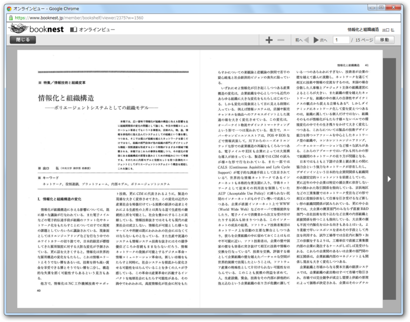
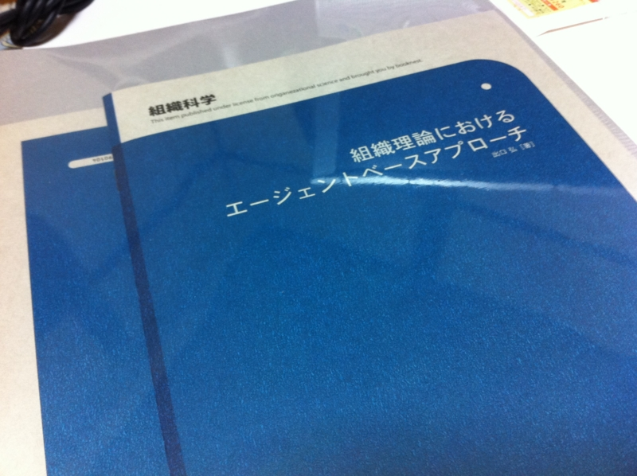
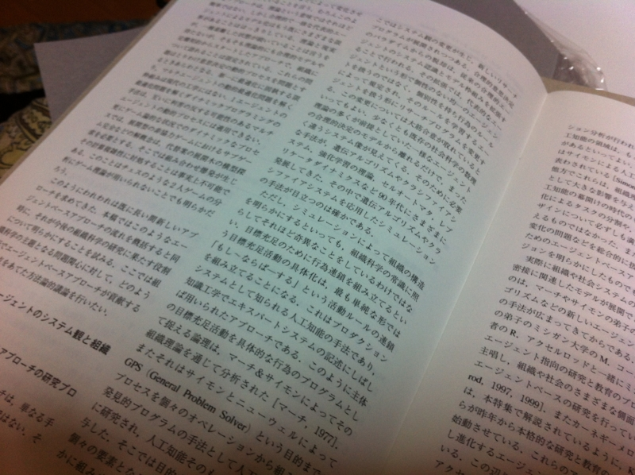

<a href="http://www.booknest.jp/">
 
booknest - &#x672C;&#x304C;&#x5C4A;&#x304F;&#x524D;&#x306B;&#x30AA;&#x30F3;&#x30E9;&#x30A4;&#x30F3;&#x3067;&#x8AAD;&#x3081;&#x308B;&#xFF01;&#x30D3;&#x30B8;&#x30CD;&#x30B9;&#x66F8;&#x5E97;&#x300C;&#x30D6;&#x30C3;&#x30AF;&#x30CD;&#x30B9;&#x30C8;&#x300D;
 
</a>

ここで本を買ってみた。恩師の論文のことを思い出して、ふと読み返したくなったのだけど、どこかに紛失してしまっていた。それが、ここで売っていたというわけ。

<blockquote>

booknest（ブックネスト）は、本が届く前にオンラインで読めるビジネス書店です。

入手困難なビジネス書やビジネス雑誌の記事、論文をお届けするだけでなく、ご購入いただいたタイトルはすぐに「オンラインビュー」で全ページ読めます。すぐ読みたい時や読み返したい時には、「オンラインビュー」で読み、電車や家でじっくり読みたい時には、届いた本で読むといった利用シーンに合わせてお使いいただけます。

</blockquote>

オンラインで読めるというので、試してみた。

まぁ、「とりあえず読める」って感じ。別に <a class="keyword" href="http://d.hatena.ne.jp/keyword/iPad">iPad</a> で読めるとか、Sony Reader で読めるとか、そういうものではないらしい。

数日すると現物が届いた。買う前からわかってたけど、ボリュームの割りには高価（1冊20ページ弱、2冊で1,400円）。でも、一般の書店ではあまり買えないような論文が簡単に手に入るのはやっぱり気軽でいい<a href="#f1" name="fn1" title="ほかの方法だと、図書館で借りて印刷とか？">*1</a>。文系の論文だと、紙で印刷したのを下手くそなスキャンでPDFにしているものがあって、読むに耐えないことがある。探すのだって大変だ<a href="#f2" name="fn2" title="大学にいるときはそんなことで困ることはなかった！">*2</a>。

やはり書籍は、<i>データを購入 → 読みたい媒体（紙、<a class="keyword" href="http://d.hatena.ne.jp/keyword/%C5%C5%BB%D2%BD%F1%C0%D2">電子書籍</a>リーダー）を自由に選んで読む</i>というのが理想だと思う。このサービスがそれに近づいてくれたらうれしい。

<a href="#fn1" name="f1" class="footnote-number">*1</a>:ほかの方法だと、図書館で借りて印刷とか？

<a href="#fn2" name="f2" class="footnote-number">*2</a>:大学にいるときはそんなことで困ることはなかった！

