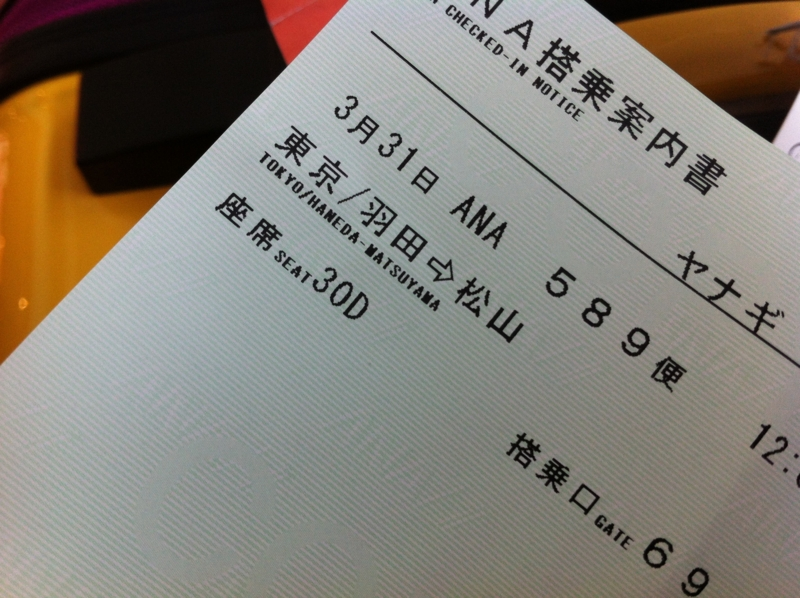
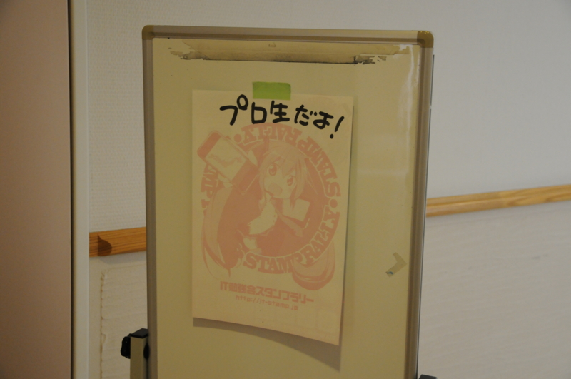
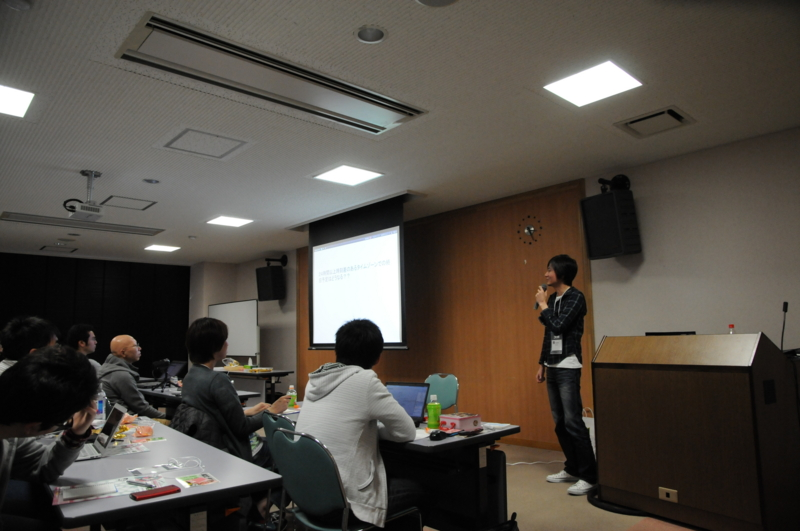
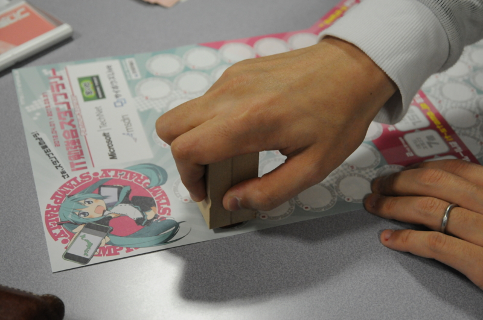

日本で一番可愛らしい名前をもつ県・愛媛まで、プログラミングの勉強会へ参加しに行きましたよ！　実は生まれて初めての羽田空港だよー！　でっかいぞー海が近いぞ―！

でも……余裕をもって5時半に起きて出かけたはずなのに、<i>空港に着いたら飛行機がいませんでした (ﾟ∀ﾟ)ｱﾋｬ？</i>電車の乗り換えとかいろいろ間違って、だいぶ時間をロスしてしまったんですよね……なんという事だ（血涙

旅行気分もすっ飛んで、ドヨーンとした顔で受付にならび、ANA のお姉さんに事情を話すと、すぐに新しい切符を手配してくれた。ところが、「割引なしの航空券って、2万だか3万になるよな……」と思っていたのに、なぜかお金を請求されない。

俺「あの……おいくらになるんでしょうか……((((；ﾟДﾟ))))ｶﾞｸｶﾞｸﾌﾞﾙﾌﾞﾙ」 
お姉さん「こっそり予約変更しておきました。今回だけですよ ☆（ゝω・）vｷｬﾋﾟ」

<b>｡ﾟ(ﾟ´Д｀ﾟ)ﾟ｡＜天使やぁ、お母ちゃん、羽田空港に天使がおったでぇ</b>

あとで聞いたところによると、案外柔軟に対応してくれるらしい。でも、いつもやってもらえると甘えちゃいけないですね。とりあえず、そこに路線があるかぎりANA派で通させていただきます (｀･ω･´)ゞ

結局、空席がなかなかなくて、飛行機に乗れたのはお昼の12時。会場についたのは2時過ぎで、1つ目のセッションは終わり、2つ目のセッションの半ばでした。 @you_and_i さんのセッションを聞きそびれたのは残念至極でござる。

というわけで、詳しいセッションの一覧は @nakaji さんのブログでも読んでほしい（丸投げ

<a href="http://d.hatena.ne.jp/nakaji999/20120401/1333263324">&#x30D7;&#x30ED;&#x30B0;&#x30E9;&#x30DF;&#x30F3;&#x30B0;&#x751F;&#x653E;&#x9001;&#x52C9;&#x5F37;&#x4F1A; &#x7B2C;13&#x56DE;&#xFF20;&#x611B;&#x5A9B; &#x306B;&#x53C2;&#x52A0; #pronama - &#x30BF;&#x30A4;&#x30C8;&#x30EB;&#x306F;&#x672A;&#x5B9A;</a>

個人的には、@ryokdy さんの <a class="keyword" href="http://d.hatena.ne.jp/keyword/i18n">i18n</a> の話がとても興味深かった。小数点がカンマで、位取りに小数点使う国があるって、みんな知ってました？　ガとｶﾞを区別すべき？　同じと扱うべき？　世界にはとんでもない<a class="keyword" href="http://d.hatena.ne.jp/keyword/%A5%BF%A5%A4%A5%E0%A5%BE%A1%BC%A5%F3">タイムゾーン</a>があった！　一般の人が聞いても十分面白かったんじゃなかったですかね。

また、 @linetlock さんとは懇親会で少しお話を聞く機会があったのだけど、若いのに<del>道を踏み外した</del>色々勉強していて、とても頼もしかった。もっと<del>変態性を高めて</del>広く深く研究を進めていってほしいですね！　大学生活は知的興奮でいっぱいやでぇ。おじさんも＜<a class="keyword" href="http://d.hatena.ne.jp/keyword/%A5%E2%A5%CA%A5%C9">モナド</a>＞の意味ぐらいスラスラ説明できるようになるわ。

あとは……<a class="keyword" href="http://d.hatena.ne.jp/keyword/COBOLer">COBOLer</a> 多すぎやろ。けれど、自分が知らないだけで <a class="keyword" href="http://d.hatena.ne.jp/keyword/COBOL">COBOL</a> はまだまだ注目すべき第一級言語なのかもしれないな。

<blockquote cite="http://www.asahi.com/business/update/0402/TKY201204020360.html">

日本生まれの<a class="keyword" href="http://d.hatena.ne.jp/keyword/%A5%D7%A5%ED%A5%B0%A5%E9%A5%DF%A5%F3%A5%B0%B8%C0%B8%EC">プログラミング言語</a>「<a class="keyword" href="http://d.hatena.ne.jp/keyword/%A3%D2%A3%F5%A3%E2%A3%F9">Ｒｕｂｙ</a>（ルビー）」が、<a class="keyword" href="http://d.hatena.ne.jp/keyword/%B9%F1%BA%DD%C9%B8%BD%E0%B2%BD%B5%A1%B9%BD">国際標準化機構</a>（ＩＳＯ）と国際電気標準会議（ＩＥＣ）の国際規格として認められた。広く使われている「Ｃ言語」や「ＣＯＢＯＬ（<a class="keyword" href="http://d.hatena.ne.jp/keyword/%A5%B3%A5%DC%A5%EB">コボル</a>）」などと同列になり、大企業や政府などのプログラムに採用される機会が広がるという。

<cite><a href="http://www.asahi.com/business/update/0402/TKY201204020360.html">&#x671D;&#x65E5;&#x65B0;&#x805E;&#x30C7;&#x30B8;&#x30BF;&#x30EB;&#xFF1A;&#x30D7;&#x30ED;&#x30B0;&#x30E9;&#x30DF;&#x30F3;&#x30B0;&#x8A00;&#x8A9E;&#x300C;&#xFF32;&#xFF55;&#xFF42;&#xFF59;&#x300D;&#x304C;&#x56FD;&#x969B;&#x898F;&#x683C;&#x306B;&#x8A8D;&#x5B9A; - &#x7D4C;&#x6E08;</a></cite>
</blockquote>

もちろん、スタンプも押してもらいましたよ！　スタンプって何って言う方は、下記の記事を参照してくだされ。

<blockquote cite="http://www.forest.impress.co.jp/docs/news/20120321_520058.html">

日本各地で開催されるIT勉強会に参加してスタンプを集めるイベント“IT 勉強会スタンプラリー”が、31日より開始される。開催期間は2013年3月31日までの1年間で、参加は無料。

<cite><a href="http://www.forest.impress.co.jp/docs/news/20120321_520058.html">&#x7A93;&#x306E;&#x675C; - &#x3010;NEWS&#x3011;&#x65E5;&#x672C;&#x5404;&#x5730;&#x306E;&#x52C9;&#x5F37;&#x4F1A;&#x306B;&#x53C2;&#x52A0;&#x3057;&#x3066;&#x30B9;&#x30BF;&#x30F3;&#x30D7;&#x3092;&#x96C6;&#x3081;&#x308B;&ldquo;IT &#x52C9;&#x5F37;&#x4F1A;&#x30B9;&#x30BF;&#x30F3;&#x30D7;&#x30E9;&#x30EA;&#x30FC;&rdquo;&#x304C;&#x958B;&#x50AC;</a></cite>
</blockquote>

<a href="http://it-stamp.jp/">IT &#x52C9;&#x5F37;&#x4F1A;&#x30B9;&#x30BF;&#x30F3;&#x30D7;&#x30E9;&#x30EA;&#x30FC;</a>

それでは、来週品川でお会いしましょう ( ´Д｀)ﾉ~ﾊﾞｲﾊﾞｲ

