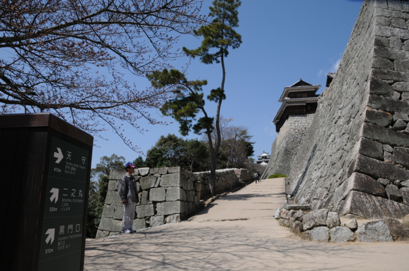

四国の首邑・松山。勉強会（<a href="http://daruyanagi.hatenablog.com/entry/2012/04/02/232457">http://daruyanagi.hatenablog.com/entry/2012/04/02/232457</a>）のメンバーと別れたあと、3時間ぐらい自由な時間ができたので、一人で市内めぐりしてみた。まずはやっぱ松山城でしょ！

松山城はロープウェーとリフトで登ると楽ちん。天守閣への入場券と往復のリフト券のセットで大人1,000円なり。そんなに高くない気がした。

リフトに変な奴がいたけど気にしたらいけない。

城の構えは意外にも立派。こんな石垣、全国の城を見回してもなかなかなさそうだ。伊賀上野城の高さには負けるだろうけどな！ (｀・∀・´)ｴｯﾍﾝ!!

タクシーの運転手さん曰く「ご存知かもしれませんが（知らねーよ！）、松山城は二つの山を削って一つにしたものでしてなぁ」とのこと。山上は平で南北に細長く、一番北の奥に三層の天守閣が鎮座している。

天守閣への入り口は、マスコットキャラクター・ヨシアキくん（築城した戦国武将・加藤嘉明をモチーフとしているらしい）が守っている。ここからは別料金だ。

銃眼からカップルをパパラッチ。戦国時代なら撃たれて死んでいるところじゃよ？

場内では鎧を着せてくれるコーナーもあるらしい。さすがに恥ずかしくて着たいとは言い出せなかった。

天守閣からの眺望はなかなかのもの。四方すべてが見渡せる。

帰りは、テキトーに路面電車（伊予鉄）を楽しんだ。実は古っぽいほうが「坊っちゃん電車」といって、特別なものらしい。わしはフツーに新しい方に乗ってしまったけれど、まぁ、これはこれで面白かった。運賃は大人150円。

――終わり！

松山はのんびりしていて、それでいて歴史と風情を感じさせる。賑わってはいるけれど街の規模は大き過ぎず、コンパクトで市内の交通の便もよさそう。食べ物の名物は若干ほかに見劣りするけれど、どれもまんべんなく美味しくて平均値が高い。空港も近くて、日本各地へすぐにアクセスできる。温泉もある。これはなかなか住むにもよさそうだなぁ、と感じられた。すべてを堪能し尽くせてはいないので、機会を見つけてまた行きたいと思う。

