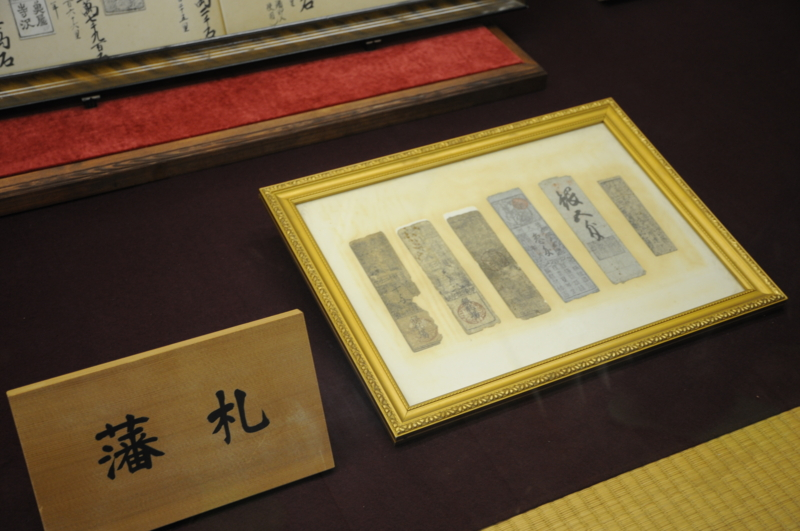

伊予・<a class="keyword" href="http://d.hatena.ne.jp/keyword/%BE%BE%BB%B3%BE%EB">松山城</a>の天守閣には、刀剣や甲冑などが展示されている。そのなかでも興味を引いたのが藩札。今まで見たことがなかったんだよね。

たかだかこんな紙っぺらに価値があるだなんて不思議。

僕達が実際に手に取ることのできるお金には、二つの種類がある。硬貨と紙幣だ。

世界で最も古い硬貨（鋳造貨幣）は、紀元前6世紀ごろ小アジアのリディア王国で生まれたとされている（世界史で習うよね！）。けれど、実際にはもっと古かったようだ。古代では、モノの価値を計るためにさまざまなモノをもちいていた。一番大きな貨幣単位は、やはり家畜と奴隷だろう。けれど、それらをいくつも抱えていられるのは極少数の人たちだけだったので、実際にはもっと安価なものが使われていたはず。

中でも金銀などの金属は分割可能で目減りせず、入手性は悪くないが、かといってだれしもが気軽に手に入れられるモノではないので、価値が安定していて<b>計算の基準として</b>非常に使い勝手がよかった。それがさらに洗練されると、王・寺院・政府が刻印を施し、一定の価値があると布告するようになる。すると、硬貨の価値はその内容から離陸する。理論上は需要供給の論理を飛び越えて、その素材価値にかかわらず、一定の価値が保証される。刻印を施した権威が失墜すると、硬貨はふたたびその素材の価値へと舞い戻る。<a class="keyword" href="http://d.hatena.ne.jp/keyword/%A5%F4%A5%A7%A5%CD%A5%C4%A5%A3%A5%A2">ヴェネツィア</a>のドゥカート貨は共和国が滅びた後も流通したというが、それは刻印によるものではなくて、長きにわたって高く維持されてきた金の含有量による。

一方、紙幣の誕生は中国・<a class="keyword" href="http://d.hatena.ne.jp/keyword/%CB%CC%C1%D7">北宋</a>時代に発行された交子が最初であるという。要するに、その原型は手形であり、つまりは借用証書であり、<b>負債の表象</b>だ。日本でも、<a class="keyword" href="http://d.hatena.ne.jp/keyword/%CA%BF%B0%C2%BB%FE%C2%E5">平安時代</a>には贈り物の添え上から次第に宛先・時候の挨拶が省かれ、送り主と目録だけになり、それが支払手段としてなかば手形のようにやり取りされたという。たとえば、目録だけ送って「お歳暮です。品物は○×卿からお受取りください。彼には貸しがありますので」と言った風に。

<a href="http://www.amazon.co.jp/exec/obidos/ASIN/448001523X/bestylesnet-22/">贈答の日本文化 (筑摩選書)</a>
<ul><li>作者: 伊藤幹治</li><li>出版社/メーカー: 筑摩書房</li><li>発売日: 2011/07/13</li><li>メディア: 単行本</li><li> クリック: 2回</li><li><a href="http://d.hatena.ne.jp/asin/448001523X/bestylesnet-22" target="_blank">この商品を含むブログ (3件) を見る</a></li></ul>

ただ、日本におけるその貨幣システムに限りなく近い風習は、所詮貴族・寺社社会に限ったもので、一般社会に開かれたものではなかった。交子の場合はより開かれた商業社会において行われていた風習が、たまたま権威の刻印を帯びて一般的なシステムへと昇華した。これこそが"進化のクレーン"というやつなのだろう。こうした高度なシステムは、刻印を刻んだ当の権威が滅びても、その有用性故に維持される。

<blockquote cite="http://ja.wikipedia.org/wiki/%E4%BA%A4%E5%AD%90">

四川の交子鋪は事業に失敗して銅銭の準備高が足りなくなり、不払いを起こした。1023年、これを見ていた政府は交子の利益に目を付けてこれを官業とし、民間でこれを行うことを禁じた。宋政府は本銭（兌換準備金）として36万緡（貫）を備え、発行限度額を125万余緡として、交子を流通させた。ここに至って交子は手形ではなく紙幣となったのである。

<cite><a href="http://ja.wikipedia.org/wiki/%E4%BA%A4%E5%AD%90">&#x4EA4;&#x5B50; - Wikipedia</a></cite>
</blockquote>

少し強引だけど、ここでそんなに厳密な話をする気もないのでまとめよう。硬貨は価値を計るための比として生まれ、小額な等価交換からその歩みをはじめた。一方、紙幣は負債を証明する手形として生まれ、大口債務の相殺・支払を媒介するうちに、硬貨と結びついて価値尺度の役割も兼ねた貨幣となった。

硬貨は素材の生産に根付いてそこから離陸したものだけど、紙幣は初めから宙に浮いた負債が根拠になっている。そこが同じ貨幣でも少し違う、と個人的には感じる。

