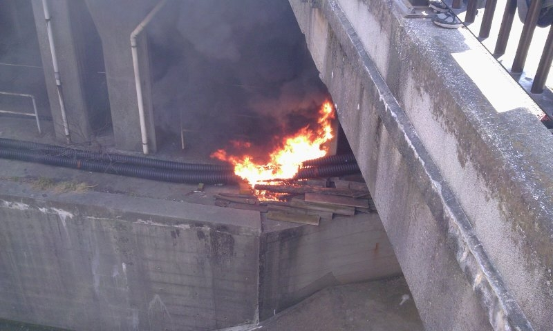

<a href="http://matome.naver.jp/odai/2133393899936234001">JR&#x98EF;&#x7530;&#x6A4B;&#x99C5;&#x3067;&#x30B1;&#x30FC;&#x30D6;&#x30EB;&#x706B;&#x707D;&#x3001;&#x6D88;&#x706B;&#x6D3B;&#x52D5;&#x306E;&#x69D8;&#x5B50;&#x300A;&#x753B;&#x50CF;&#x300B; - NAVER &#x307E;&#x3068;&#x3081;</a>

飯田橋駅で火災があったらしくて、我が愛しの総武線が死亡したので、家で仕事しようかなぁ、と思って会社にそう伝えたら、「休んでいい」とのこと。いや、休むのはいいんだけど、自分の都合以外で有給休暇が消えるのは癪なんですが。急に休んでもほかにやることもないし、天気だってすこぶるイイし、正直黙ってバイクで会社行けばよかったなぁ、とも思ったけど、最近の週末は忙しがしくてのんびりする時間がなかったようにも思うので、羽をのばすことにした。

だから今日は、なにもしない日。

<a href="http://www.amazon.co.jp/exec/obidos/ASIN/4063726746/bestylesnet-22/">宇宙兄弟（1） (モーニングKC)</a>
<ul><li>作者: <a class="keyword" href="http://d.hatena.ne.jp/keyword/%BE%AE%BB%B3%C3%E8%BA%C8">小山宙哉</a></li><li>出版社/メーカー: 講談社</li><li>発売日: 2008/03/21</li><li>メディア: コミック</li><li>購入: 11人 クリック: 481回</li><li><a href="http://d.hatena.ne.jp/asin/4063726746/bestylesnet-22" target="_blank">この商品を含むブログ (302件) を見る</a></li></ul>

掃除をほんの少し、料理を気が向いた分だけやって、1時間半だけゲームして、Kinoppy で『<a class="keyword" href="http://d.hatena.ne.jp/keyword/%B1%A7%C3%E8%B7%BB%C4%EF">宇宙兄弟</a>』を出てるだけ全部買って全部読んだ。『<a class="keyword" href="http://d.hatena.ne.jp/keyword/%B1%A7%C3%E8%B7%BB%C4%EF">宇宙兄弟</a>』はとても面白かったけど、2回も3回も繰り返して読むほどではなかったのが、同じ宇宙モノのマンガ『<a class="keyword" href="http://d.hatena.ne.jp/keyword/%A5%D7%A5%E9%A5%CD%A5%C6%A5%B9">プラネテス</a>』とは少し違った。展開が気になってやめられないタイプだな。7時ぐらいに眠くなったので、好きな時間に寝た。毎日こうやって暮らしたい。

それにしても、Kinoppy。あとラインナップ増えて、紙の最新刊と同じペースで電子版の最新版も出てくれれば、もうオレ的には最強の電子書籍ストアなんだけどな。<a class="keyword" href="http://d.hatena.ne.jp/keyword/Kindle">Kindle</a> も別に要らない。毎月一万円貢ぐから、期待に応えてほしいところ。

