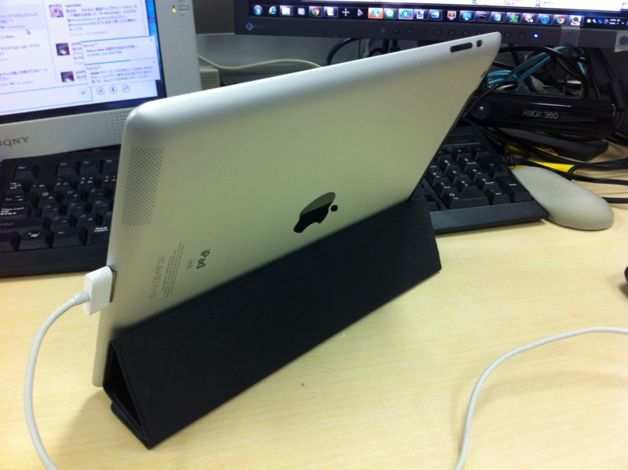
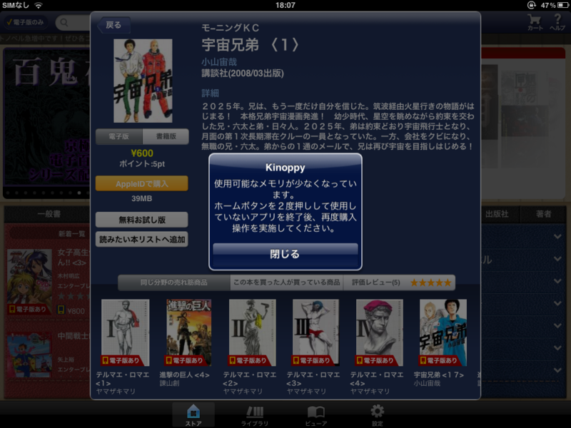
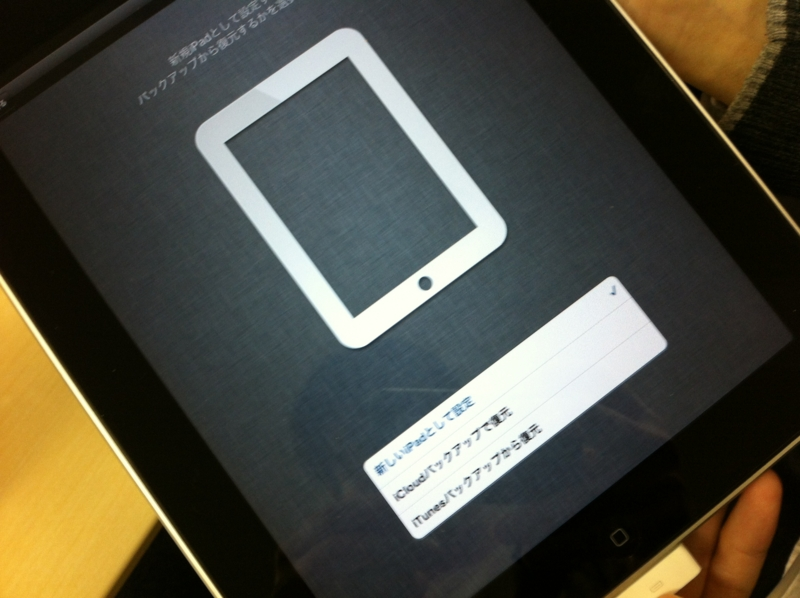

おめでとう！ <a class="keyword" href="http://d.hatena.ne.jp/keyword/%A5%A2%A5%A4%A5%D1%A5%C3%A5%C9">アイパッド</a>は <a class="keyword" href="http://d.hatena.ne.jp/keyword/%A5%A2%A5%A4%A5%D1%A5%C3%A5%C9">アイパッド</a>２ にしんかした！

ひょんなことで、初代<a class="keyword" href="http://d.hatena.ne.jp/keyword/iPad">iPad</a>（16GB、<a class="keyword" href="http://d.hatena.ne.jp/keyword/%CC%B5%C0%FELAN">無線LAN</a>） ＋ 差額で <a class="keyword" href="http://d.hatena.ne.jp/keyword/iPad">iPad</a> 2（64GB、3G） を手に入れました。らっきー♪

けれど、よく考えたら 16GB → 64GB、<a class="keyword" href="http://d.hatena.ne.jp/keyword/%CC%B5%C0%FELAN">無線LAN</a>モデル → 3Gモデルに進化していた<a href="#f1" name="fn1" title="3Gモデルには無線LANモデルにはないGPS機能が付いている">*1</a>ので、あの差額（非公開）では少し足りない気がする。申し訳ないのでこんど上増ししよう。容量増えたのは、出先で一眼レフの画像ビューアとして使うときには大変心強い。16GBではちょっと足りない。

あと、この <a class="keyword" href="http://d.hatena.ne.jp/keyword/iPad">iPad</a> 2 に期待したのは、やっぱりCPUとメモリ（逆に言えば、それ以外はどうでもいい）。とくに Kinoppy でメモリ不足になる問題が解消していないか期待していたのだけど……結論から言えば、足りなくなるときは足りなくなるみたい。電子書籍はコンテンツのサイズが比較的大きいし、仕方のないところなのかな。

ところで、これを見てくれ。

ドナドナした初代<a class="keyword" href="http://d.hatena.ne.jp/keyword/iPad">iPad</a>を初期化すると、<b>新しい<a class="keyword" href="http://d.hatena.ne.jp/keyword/iPad">iPad</a></b>として設定できるのだが……そうした<a class="keyword" href="http://d.hatena.ne.jp/keyword/iPad">iPad</a>は、初代になるのか三代目になるのか。野暮なツッコミだけど、せずにはいられない。そんなツッコミが、ここにはある。

<a href="#fn1" name="f1" class="footnote-number">*1</a>:3Gモデルには<a class="keyword" href="http://d.hatena.ne.jp/keyword/%CC%B5%C0%FELAN">無線LAN</a>モデルにはないGPS機能が付いている

