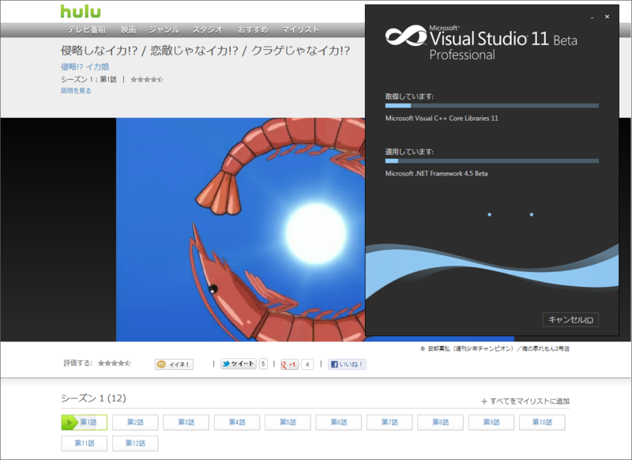
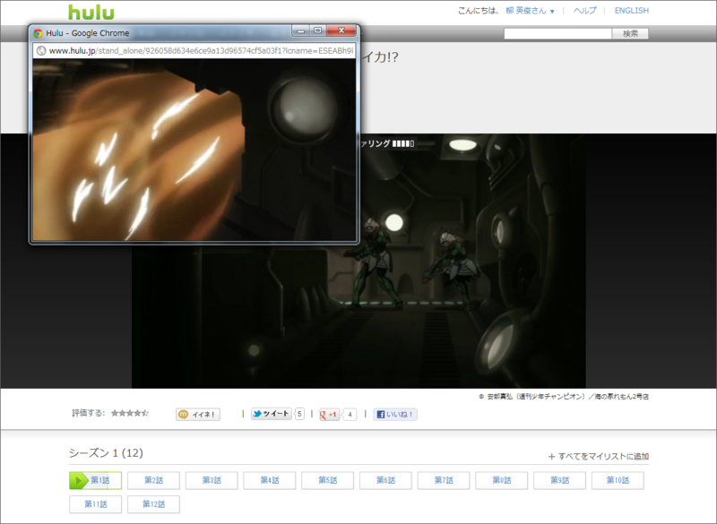
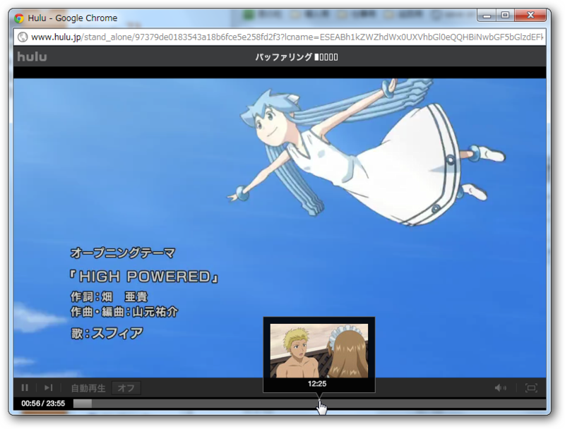
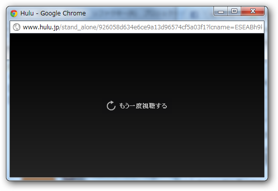

<blockquote cite="http://internet.watch.impress.co.jp/docs/news/20120412_525654.html">

フール―ジャパン<a class="keyword" href="http://d.hatena.ne.jp/keyword/%B9%E7%C6%B1%B2%F1%BC%D2">合同会社</a>（Hulu）は12日、ドラマや映画などを月額定額料金で視聴できる動画配信サービス「Hulu」の日本版サービスについて、月額料金を1480円から980円に値下げした。既存会員も含め、同日より新料金でサービスを提供する。

<cite><a href="http://internet.watch.impress.co.jp/docs/news/20120412_525654.html">&#x6708;&#x984D;1480&#x5186;&#x3067;&#x6620;&#x753B;&#x306A;&#x3069;&#x898B;&#x653E;&#x984C;&#x306E;&#x300C;Hulu&#x300D;&#x3001;980&#x5186;&#x306B;&#x5024;&#x4E0B;&#x3052;&#x3001;&#x5E74;&#x5185;&#x306B;Wii&#x5BFE;&#x5FDC;&#x3082; -INTERNET Watch</a></cite>
</blockquote>

「フル」だと思ってたけど、「<a class="keyword" href="http://d.hatena.ne.jp/keyword/%A5%D5%A1%BC%A5%EB%A1%BC">フールー</a>」なんだね？

<a href="http://www.hulu.jp/">Hulu - &#x4EBA;&#x6C17;&#x6620;&#x753B;&#x3084;&#x30C6;&#x30EC;&#x30D3;&#x756A;&#x7D44;&#x304C;&#x304A;&#x624B;&#x8EFD;&#x306B;&#x898B;&#x653E;&#x984C;</a>

<a class="keyword" href="http://d.hatena.ne.jp/keyword/Visual%20Studio">Visual Studio</a> 11 Beta のインストールに時間を食いそうだったので、値下げされたこともあり、ちょっと試してみることにした。試聴コンテンツは『侵略！？イカ娘』。

最初観たときは「なんだこのクソ画質？」と思った。別ウィンドウで観た時のサイズも小さいし。どうも初期設定で再生品質が自動選択されるらしく、ウラで<a class="keyword" href="http://d.hatena.ne.jp/keyword/Visual%20Studio">Visual Studio</a>のダウンロードをしているせいか、うちの環境では360pになってた。設定画面（<a href="https://secure.hulu.jp/profile/settings">https://secure.hulu.jp/profile/settings</a>）でHDを選択すると、再生ウィンドウを大きくしてもまぁまぁ観れるレベルまでキレイになる。少しだけコマ落ちはあるが……万全の環境ならほぼ問題なく視聴できそう。

プレーヤーを少し大きくしてみた。<a href="http://av.watch.impress.co.jp/docs/topic/20110902_474870.html">&#x65E5;&#x672C;&#x4E0A;&#x9678;&#x3057;&#x305F;&#x5B9A;&#x984D;&#x6620;&#x50CF;&#x914D;&#x4FE1;&#x300C;Hulu&#x300D;&#x3092;&#x8A66;&#x3059; -AV Watch</a> のレビューと少し画面が違うのだけど（設定メニューがないなどなど）、これはコンテンツに依るのだろうか。シークしようとするとそのフレームがプレビューできるのはいいなぁ。

でも、再生が終わったときのコレは今日日ないな。シリーズ物ならば自動的に次の回が再生されるとか、最低でも次の回がサジェストされるぐらいの機能はほしいと思った。

980円なら、これはありだな。とりあえず、<a class="keyword" href="http://d.hatena.ne.jp/keyword/%A1%D824%A1%D9">『24』</a>の観てないヤツを全部観たい。

ほかにも <a class="keyword" href="http://d.hatena.ne.jp/keyword/iPad">iPad</a> での視聴にも対応してるっぽいので、こんどはそれを試そうと思う。お布団やトイレで視聴できるなら嬉しいなぁ。あと、<a class="keyword" href="http://d.hatena.ne.jp/keyword/%A5%C7%A5%E5%A5%A2%A5%EB%A5%C7%A5%A3%A5%B9%A5%D7%A5%EC%A5%A4">デュアルディスプレイ</a>がほしくなったので、次のお給料で買う。やっぱこういうのは、セカンダリモニタで“ながら見”したいもんだ。

