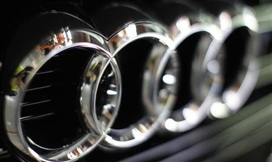
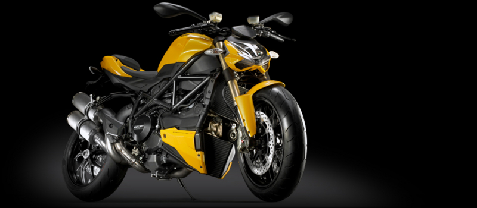

<blockquote cite="http://jp.reuters.com/article/topNews/idJPTYE83B01120120412">

［フランクフルト／ミラノ　１１日　ロイター］　２人の関係筋は１１日、独<a class="keyword" href="http://d.hatena.ne.jp/keyword/%A5%D5%A5%A9%A5%EB%A5%AF%A5%B9%A5%EF%A1%BC%A5%B2%A5%F3">フォルクスワーゲン</a>（ＶＷ）傘下の<a class="keyword" href="http://d.hatena.ne.jp/keyword/%A5%A2%A5%A6%A5%C7%A5%A3">アウディ</a>が、来週にもイタリアの自動二輪（オートバイ）メーカー、<a class="keyword" href="http://d.hatena.ne.jp/keyword/%A5%C9%A5%A5%A5%AB%A5%C6%A5%A3">ドゥカティ</a>買収を発表する見通しだと明らかにした。実現すれば、長年のライバルであるＢＭＷとのスーパーバイク事業での競争に弾みがつきそうだ。

<cite><a href="http://jp.reuters.com/article/topNews/idJPTYE83B01120120412">
&#x72EC;&#x30A2;&#x30A6;&#x30C7;&#x30A3;&#x3001;18&#x65E5;&#x306B;&#x3082;&#x4F0A;&#x30C9;&#x30A5;&#x30AB;&#x30C6;&#x30A3;&#x8CB7;&#x53CE;&#x3092;&#x767A;&#x8868;&#x3078;&#xFF1D;&#x95A2;&#x4FC2;&#x7B4B;
| Reuters

</a></cite>
</blockquote>

ちなみに<a class="keyword" href="http://d.hatena.ne.jp/keyword/%A5%C9%A5%A5%A5%AB%A5%C6%A5%A3">ドゥカティ</a>は現在、スーパーバイク撤退中でござる。「競争に弾み」がつく前に、まず復帰せねばな！

前々から言われていたので今更驚きはないけれど、「ドイツに……」という気持ちはある。やっぱりイタリアとドイツでは感性が違うと思うし。けれど、デザインは相変わらず<a class="keyword" href="http://d.hatena.ne.jp/keyword/%A5%DC%A5%ED%A1%BC%A5%CB%A5%E3">ボローニャ</a>でやるんだろうし。でも、最近は北米市場重視でデザインもアメリカ人受けを狙っているように思うし、AMGとのコラボもやっていたわけだし、一部生産はアジアに移すというし。いまさら「イタリアの……」でもないか。

いい意味でも悪い意味でも、コレが<a class="keyword" href="http://d.hatena.ne.jp/keyword/%A5%B0%A5%ED%A1%BC%A5%D0%A5%EB%B2%BD">グローバル化</a>ってやつなのかねぇ。

<ul>
<li><a href="http://response.jp/article/2010/08/29/144477.html">&#x30C9;&#x30A5;&#x30AB;&#x30C6;&#x30A3;MotoGP&#x3001;&#x30D8;&#x30A4;&#x30C7;&#x30F3;&#x3068;&#x66F4;&#x65B0;&hellip;&#x30B9;&#x30FC;&#x30D1;&#x30FC;&#x30D0;&#x30A4;&#x30AF;&#x306F;&#x64A4;&#x9000; | &#x30EC;&#x30B9;&#x30DD;&#x30F3;&#x30B9; (&#x30B9;&#x30DD;&#x30FC;&#x30C4;&#xFF0F;&#x30A8;&#x30F3;&#x30BF;&#x30E1;&#x3001;&#x30E2;&#x30FC;&#x30BF;&#x30FC;&#x30B9;&#x30DD;&#x30FC;&#x30C4;&#x306E;&#x30CB;&#x30E5;&#x30FC;&#x30B9;)</a></li>
<li><a href="http://bologna.repubblica.it/cronaca/2010/12/14/news/ducati_apre_lo_stabilimento_in_thailandia_i_sindacati_vogliamo_rassicurazioni-10193024/">Ducati apre lo stabilimento in Thailandia i sindacati: &quot;Vogliamo rassicurazioni&quot; - Bologna - Repubblica.it</a> （<a class="keyword" href="http://d.hatena.ne.jp/keyword/%A5%C9%A5%A5%A5%AB%A5%C6%A5%A3">ドゥカティ</a>、アジア市場向けのバイク生産をタイへ移転）</li>
<li><a href="http://www.ducati.co.jp/bikes/diavel/diavel_amg/index.do">Ducati Diavel AMG - Ducati</a>（<a class="keyword" href="http://d.hatena.ne.jp/keyword/%A5%C9%A5%A5%A5%AB%A5%C6%A5%A3">ドゥカティ</a>とAMGのコラボモデル）</li>
</ul>