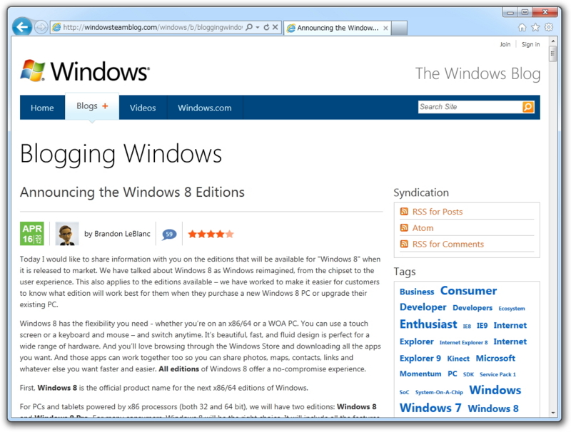

<blockquote cite="http://www.forest.impress.co.jp/docs/news/20120417_526959.html">

　米Microsoft Corporationは16日（現地時間）、次期バージョンのWindowsの正式名とそのラインナップを公式ブログ“The Windows Blog”で公表した。

　それによると、<a class="keyword" href="http://d.hatena.ne.jp/keyword/x86">x86</a>/<a class="keyword" href="http://d.hatena.ne.jp/keyword/x64">x64</a><a class="keyword" href="http://d.hatena.ne.jp/keyword/%A5%A2%A1%BC%A5%AD%A5%C6%A5%AF%A5%C1%A5%E3">アーキテクチャ</a>ー向けWindowsの正式名は「<a class="keyword" href="http://d.hatena.ne.jp/keyword/Windows%208">Windows 8</a>」となる。一般向けに提供されるエディションは「<a class="keyword" href="http://d.hatena.ne.jp/keyword/Windows%208">Windows 8</a>」と「<a class="keyword" href="http://d.hatena.ne.jp/keyword/Windows%208">Windows 8</a> Pro」の2つとなり、「<a class="keyword" href="http://d.hatena.ne.jp/keyword/Windows%207">Windows 7</a>」の5エディション構成から大幅に簡素化された。

<cite><a href="http://www.forest.impress.co.jp/docs/news/20120417_526959.html">&#x7A93;&#x306E;&#x675C; - &#x3010;NEWS&#x3011;&#x6B21;&#x671F;Windows&#x306E;&#x6B63;&#x5F0F;&#x540D;&#x306F;&#x300C;Windows 8&#x300D;&#x3002;&#x4E00;&#x822C;&#x5411;&#x3051;&#x306F;2&#x30A8;&#x30C7;&#x30A3;&#x30B7;&#x30E7;&#x30F3;&#x69CB;&#x6210;&#x306B;</a></cite>
</blockquote>

ARM版の「Windows RT」というネーミングが少し意表をついたというか、正確に言えば「ソレジャナーイ」感があるのを除けば、それほどサプライズはなかった感じ。WinRT（Windows Runtime）と紛らわしいし、なんでこんな名前になったのか、理解に苦しむ。

<blockquote class="twitter-tweet" lang="ja">
公式と非公式もあるんですね＞Windows RT
&mdash; だるやなぎさん (@daruyanagi) <a href="https://twitter.com/daruyanagi/status/192094073891471361" data-datetime="2012-04-17T03:36:10+00:00">4月 17, 2012</a></blockquote>

けれど、ARM版“<a class="keyword" href="http://d.hatena.ne.jp/keyword/Windows%208">Windows 8</a>”に“<a class="keyword" href="http://d.hatena.ne.jp/keyword/Windows%208">Windows 8</a>”という名前を与えず、わざわざ「Windows RT」という名前をつけたのは少し意味深。なぜ「<a class="keyword" href="http://d.hatena.ne.jp/keyword/Windows%208">Windows 8</a> RT」ではなかったのか。

ひとつ考えられるのは、「従来の<a class="keyword" href="http://d.hatena.ne.jp/keyword/x86">x86</a>/<a class="keyword" href="http://d.hatena.ne.jp/keyword/x64">x64</a>向けアプリケーションが利用できない」という点を考慮したという可能性。やはり<i>Windowsの進化の本流は「<a class="keyword" href="http://d.hatena.ne.jp/keyword/Windows%208">Windows 8</a>」「<a class="keyword" href="http://d.hatena.ne.jp/keyword/Windows%208">Windows 8</a> Pro」であり、「Windows RT」はそれとは少し毛色の違うモノですよ</i>ということを名前で示す＝差別化をしたかったのかもしれない。

もうひとつとしては、リリース直後はARM向けのバイナリが揃わないことが当然予想される、ということが挙げられると思う。だから、「Windows RT」においては旧来のデスクトップではなく、WinRTの部分、つまりメトロデスクトップの部分を推したかった、印象付けたかったのではないかな。

そして、もっと勝手な想像を働かせるならば、 Microsoft は「Windows RT」を旧来のデスクトップを切り離した、完全にメトロスタイルだけのOSにしたかったのかもしれない。けれど、それでは「Microsoft Office」の搭載すら難しい＝競争力に不安がある。そういった苦渋の決断の末の折衷案が、<i>「Windows RT」というネーミング＋旧来のデスクトップで動作する「Microsoft Office」のバンドル</i>だったのかもしれない。

まぁ、所詮外野の憶測だし、何も確実なことは言えないのだけど。とにかく、<a class="keyword" href="http://d.hatena.ne.jp/keyword/Windows%208">Windows 8</a>が成功してくれないとWindows StoreやWindows Phone 8も自動的にコケるわけで、なんとか成功して欲しいなぁ、と思うのです。

