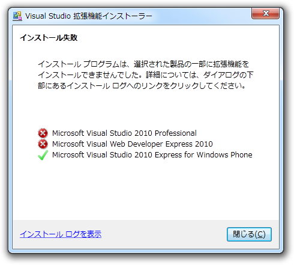
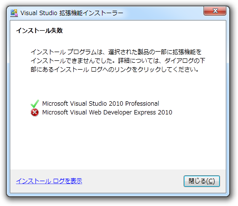

<a class="keyword" href="http://d.hatena.ne.jp/keyword/Visual%20Studio">Visual Studio</a> 2010 の<a class="keyword" href="http://d.hatena.ne.jp/keyword/%B3%C8%C4%A5%B5%A1%C7%BD">拡張機能</a>マネージャーから NuGet を更新しようとしたら失敗。 
最新版のインストーラーをダウンロードしてインストールしても失敗。 
なんでだ━━━━(ﾟ∀ﾟ)━━━━ｯ!!

<blockquote class="twitter-tweet" data-in-reply-to="192517487982678017" lang="ja">
@<a href="https://twitter.com/daruyanagi">daruyanagi</a> 管理者権限で VS 起動して NuGet を一度削除してからインストール
&mdash; しばやんさん (@shibayan) <a href="https://twitter.com/shibayan/status/192518320820457472" data-datetime="2012-04-18T07:41:59+00:00">4月 18, 2012</a></blockquote>

しばやんの言うとおりにしたらなおった（VWDは放置）。しばやんかっこよすぎる。

