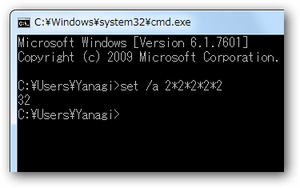

五体満足でこの記念すべきキリのよい歳を迎えられて、ほんとうに嬉しく思います ☆（ゝω・）vｷｬﾋﾟ

ほんと、もう32歳か。もう一度2を掛ければ、次は64歳。僕はちゃんと<a class="keyword" href="http://d.hatena.ne.jp/keyword/%B8%C4%BF%CD%C7%AF%B6%E2">個人年金</a>をかけているので、そのころにはショボイながら年金を受け取って生活していることだろう。その次は128歳で、これはもう多分息してない。お墓の中で迎えているはずだ。いまだにオトナになれた実感が得られていないのに、時が流れるのは早すぎる。

このままでは、何をするにしても時間が足りない。もっともっとアクティブに、全力で行かないと、死んだ時に燃えカスが残ってしまうわ。

