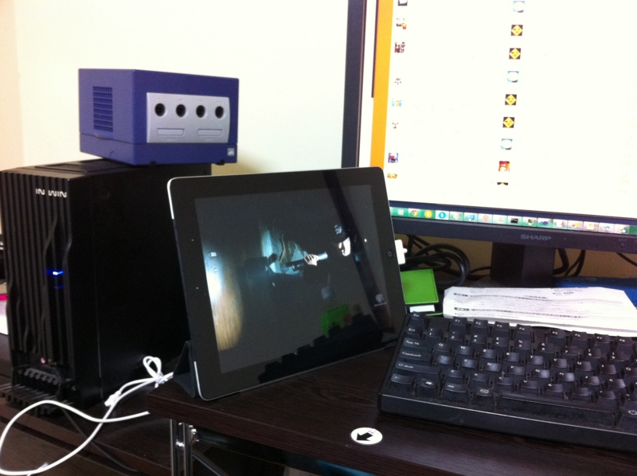

ほかのことしながら、 <a class="keyword" href="http://d.hatena.ne.jp/keyword/iPad">iPad</a> をサブモニターにして Hulu を観ている。 <a class="keyword" href="http://d.hatena.ne.jp/keyword/iPad">iPad</a> だと PC の画面を占有しないし、画質の悪さもそれほど気にならない。むしろ綺麗にみえるし、ちょうどよい BGV（BGMじゃなくて！）になる。 Kinoppy と Hulu のおかげで、最近 <a class="keyword" href="http://d.hatena.ne.jp/keyword/iPad">iPad</a> の利用率がだいぶ高まっている感じ。

その Hulu だが、映画はとりあえずこれまでに『<a class="keyword" href="http://d.hatena.ne.jp/keyword/%B2%D0%C5%B7%A4%CE%BE%EB">火天の城</a>』と『敦煌』を観た。

『<a class="keyword" href="http://d.hatena.ne.jp/keyword/%B2%D0%C5%B7%A4%CE%BE%EB">火天の城</a>』は、正直、劇場で1,800円払って観てたらちょっと損したと感じると思う。でも、 Hulu なら惜しくないや。面白いところもあったし。

『敦煌』は少しだけ見て「あっ！これ知ってる！」と思った。たぶん中学生ぐらいのことに原作読んでたハズ。懐かしい。思い出補正があるかもだけど、内容も結構楽しめた。西域って一度でいいから行ってみたい。

<a class="keyword" href="http://d.hatena.ne.jp/keyword/%A1%D824%A1%D9">『24』</a>（3rd）も少し見たけど、これはながら見ができないな。見たらほかのことできないし、ほかのことしてたら内容がわからなくなる。今度まとめてみたほうがいいかもしれない。

そんなこんなで、まじめに観るというより BGV 的に利用しているので、もっと気軽なコンテンツが増えればいいと思う。バラエティとか、アニメとかね。できたらスポーツやニュースもあればいいのだけど、それはちょっと守備範囲を超えているかな。

ちなみに、日本の Hulu で一番人気の映画は『ふたりエッチ劇場版らしい』。お前らときたら……

