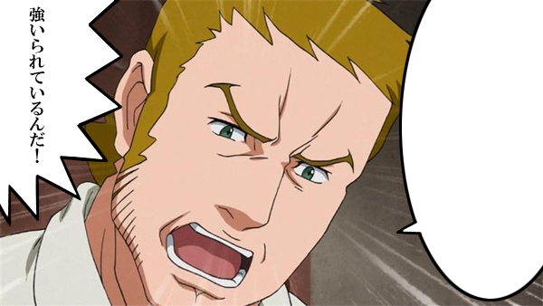

<a href="http://daruyanagi.hatenablog.com/entry/2012/04/21/081025">&#x4ED5;&#x4E8B;&#x306B;&#x3064;&#x3044;&#x3066; - &#x3060;&#x308B;&#x308D;&#x3050;</a> でいう“やるべきこと”って誤解されそうだな。と、朝風呂しながら思った。

個人的には“やるべきこと”と“やらなきゃいけないこと”は微妙に違う。

職務上遂行しなければいけない業務は“やらなきゃいけないこと”だけど、“やるべきこと”ではない。 
家に帰ってプログラミングの勉強やネタ探しをするのは“やらなきゃいけないこと”ではなくて、“やるべきこと”だ。

“やるべきこと”も“やらなきゃいけないこと”も、「義務」であることでは共通している。でも、“やるべきこと”の“べし”には、推量・<b>意思</b>・当然・<b>適当</b>・<b>可能</b>・命令の6つの意味がある（古典の時間に習ったよね！）ように、単なる「義務」という感じではない。

言ってみれば、

<ul>
<li>“やらなきゃいけないこと”＝（誰かに課された、命令寄りの）後ろ向きな「義務」</li>
<li>“やるべきこと”＝（自分が課した、自由寄りの）前向きな「義務」</li>
</ul>
とでも表現できるだろうか。

法律はだいたい「禁止」と「命令」でできているけれど、「禁止」は「否定の命令（～でない状態であれ）」なので、つまりはほとんど「命令」でできている。それで、「命令」からいろんな「義務」<a href="#f1" name="fn1" title="やら「権利」">*1</a>が定められているわけだけど、個人的な用法で言えば、それは“やらなきゃいけないこと”であって、“やるべきこと”ではない。

“やらなきゃいけないこと”の段階では人は奴隷に過ぎず、“やるべきこと”の段階になってはじめて自由人になれる。

「<b>やらなきゃいけない</b>なら、とことん<b>やるべき</b>」

このふたつはちょっと意味が違うと思うのだけど、ときどき、人間は“やらなきゃいけないこと”から「使命」（＝“やるべきこと”）を見出して自分を奮い立たせたり、“やるべきこと”を“やらなきゃいけないこと”（＝「命令」）と勘違いして過労死するまで仕事したりしてしまうみたい。

<a href="#fn1" name="f1" class="footnote-number">*1</a>:やら「権利」

