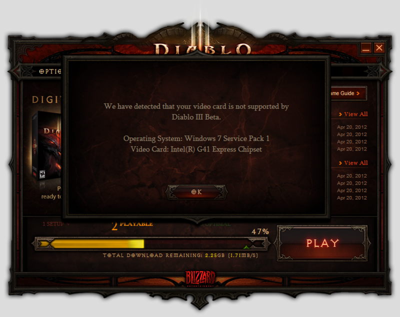

<a href="http://us.battle.net/d3/en/blog/4963739/Diablo%C2%AE_III_Open_Beta_Weekend-4_19_2012#blog">Diablo&reg; III Open Beta Weekend - Diablo III</a> を試してみようと思ったら、動作要件を満たしていなくて泣いた。

<blockquote cite="http://us.battle.net/support/en/article/diablo-iii-system-requirements">

RECOMMENDED SYSTEM SPECIFICATIONS

PC 
OS: <a class="keyword" href="http://d.hatena.ne.jp/keyword/Windows%20Vista">Windows Vista</a>®/Windows® 7 (Latest Service Packs) | Processor: <a class="keyword" href="http://d.hatena.ne.jp/keyword/Intel">Intel</a>® <a class="keyword" href="http://d.hatena.ne.jp/keyword/Core%202%20Duo">Core 2 Duo</a> 2.4 GHz 
or <a class="keyword" href="http://d.hatena.ne.jp/keyword/AMD">AMD</a> AthlonTM 64 X2 5600+ 2.8 GHz | Memory: 2 GB RAM | Video: <a class="keyword" href="http://d.hatena.ne.jp/keyword/NVIDIA">NVIDIA</a>® <a class="keyword" href="http://d.hatena.ne.jp/keyword/GeForce">GeForce</a>® 260 or 
<a class="keyword" href="http://d.hatena.ne.jp/keyword/ATI">ATI</a> <a class="keyword" href="http://d.hatena.ne.jp/keyword/Radeon">Radeon</a>™ HD 4870 or better

Mac 
OS: Mac® <a class="keyword" href="http://d.hatena.ne.jp/keyword/OS%20X">OS X</a> 10.7 or newer | Processor: <a class="keyword" href="http://d.hatena.ne.jp/keyword/Intel">Intel</a>® <a class="keyword" href="http://d.hatena.ne.jp/keyword/Core%202%20Duo">Core 2 Duo</a> | Memory: 2 GB RAM 
Video: <a class="keyword" href="http://d.hatena.ne.jp/keyword/NVIDIA">NVIDIA</a>® <a class="keyword" href="http://d.hatena.ne.jp/keyword/GeForce">GeForce</a>® GT 330M or <a class="keyword" href="http://d.hatena.ne.jp/keyword/ATI">ATI</a> <a class="keyword" href="http://d.hatena.ne.jp/keyword/Radeon">Radeon</a>™ HD 4670 or better

<cite><a href="http://us.battle.net/support/en/article/diablo-iii-system-requirements">Diablo III System Requirements - Battle.net Support</a></cite>
</blockquote>

推奨環境は以上の通り。うちのヘボマシンで満たしているのは辛うじてCPUのみ（<a class="keyword" href="http://d.hatena.ne.jp/keyword/Core%202%20Duo">Core 2 Duo</a> 2.4 GHz）で、グラフィックが弱い。

<a href="http://us.battle.net/support/en/article/diablo-iii-unsupported-video-card-list">Diablo III Unsupported Video Card List - Battle.net Support</a>

最近の<a class="keyword" href="http://d.hatena.ne.jp/keyword/%A5%D3%A5%C7%A5%AA%A5%AB%A1%BC%A5%C9">ビデオカード</a>についてはとんと疎いのだけど、<a class="keyword" href="http://d.hatena.ne.jp/keyword/GeForce">GeForce</a> 260/<a class="keyword" href="http://d.hatena.ne.jp/keyword/Radeon">Radeon</a> HD 4870というのは2008年ぐらいに出たグラフィックチップっぽい。<a class="keyword" href="http://d.hatena.ne.jp/keyword/Google">Google</a> 先生がそう言ってた。ということは、最近の1万円ぐらいの<a class="keyword" href="http://d.hatena.ne.jp/keyword/%A5%D3%A5%C7%A5%AA%A5%AB%A1%BC%A5%C9">ビデオカード</a>なら楽に動かせるんだろう。たぶん。

めんどくさいことが嫌いなのでここ5年以上は内蔵グラフィック派だったのだけど、<a class="keyword" href="http://d.hatena.ne.jp/keyword/%A5%D3%A5%C7%A5%AA%A5%AB%A1%BC%A5%C9">ビデオカード</a>付きの新しいPCを買わないといけない時が来たっぽい。自作もめんどうくさいので、BTOで適当なところを探そうと思う。

