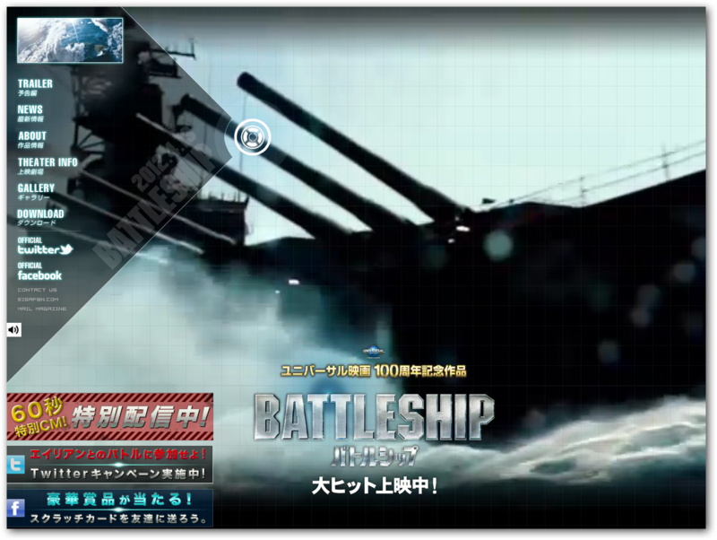

<a href="http://battleship-movie.jp/">&#x6620;&#x753B;&#x300E;&#x30D0;&#x30C8;&#x30EB;&#x30B7;&#x30C3;&#x30D7;&#x300F;&#x516C;&#x5F0F;&#x30B5;&#x30A4;&#x30C8; &#x5927;&#x30D2;&#x30C3;&#x30C8;&#x4E0A;&#x6620;&#x4E2D;&#xFF01; &#xFF34;&#xFF2F;&#xFF28;&#xFF2F;&#x30B7;&#x30CD;&#x30DE;&#x30BA; &#x65E5;&#x5287;&#x307B;&#x304B;&#x5168;&#x56FD;&#x30ED;&#x30FC;&#x30C9;&#x30B7;&#x30E7;&#x30FC;</a>

「海軍は――！？」<i>「世界一ッーー！」</i>「日米が組めば――！？」<i>「世界一ッーー！」</i>という感じの映画だった。序盤で速攻海兵隊の基地が全滅し、すべての運命が海軍に委ねられるご都合設定で、エイリアンと駆逐艦がガチバトルするお話。以前、『インディペンデンス・デイ』の海兵隊版にあたる『<a class="keyword" href="http://d.hatena.ne.jp/keyword/%C0%A4%B3%A6%BF%AF%CE%AC%A1%A7%A5%ED%A5%B5%A5%F3%A5%BC%A5%EB%A5%B9%B7%E8%C0%EF">世界侵略：ロサンゼルス決戦</a>』を観たけど、それの海軍版にあたるのかもしれない。

<ul>
<li><a href="http://blog.daruyanagi.net/archives/218">
&#x300E;&#x4E16;&#x754C;&#x4FB5;&#x7565;&#xFF1A;&#x30ED;&#x30B5;&#x30F3;&#x30BC;&#x30EB;&#x30B9;&#x6C7A;&#x6226;&#x300F; - blog.daruyanagi.net	</a></li>
</ul>
ツッコミどころ満載でとても面白かった。とくに最後、じじいどもと戦艦<a class="keyword" href="http://d.hatena.ne.jp/keyword/%A5%DF%A5%BA%A1%BC%A5%EA">ミズーリ</a>が活躍するシーンは胸熱。

「戦争はハードでやるんじゃねえ、ハートでやるんだ！」<a href="#f1" name="fn1" title="おれの考えた名言">*1</a>

それにしても、ハリウッド映画のくせにやたら自衛隊が活躍するので、ちょっとびっくりした。ナガタ艦長、カッコいい。アメリカ海軍は日米協調路線をお望みのようだな。

<blockquote cite="http://www.yomiuri.co.jp/entertainment/cinema/cnews/20120420-OYT8T00516.htm">

　ハワイ沖での国際軍事演習中、異星からの地球侵略部隊が出現。

　米海軍と共に人類のために闘う、<a class="keyword" href="http://d.hatena.ne.jp/keyword/%B3%A4%BE%E5%BC%AB%B1%D2%C2%E2">海上自衛隊</a>の自衛艦艦長、ナガタを演じた。主人公の米海軍新人将校アレックス（<a class="keyword" href="http://d.hatena.ne.jp/keyword/%A5%C6%A5%A4%A5%E9%A1%BC%A1%A6%A5%AD%A5%C3%A5%C1%A5%E5">テイラー・キッチュ</a>）の良き戦友として大きな存在感を放つ。

<cite><a href="http://www.yomiuri.co.jp/entertainment/cinema/cnews/20120420-OYT8T00516.htm">&#x7C73;&#x6620;&#x753B;&#x300C;&#x30D0;&#x30C8;&#x30EB;&#x30B7;&#x30C3;&#x30D7;&#x300D;&#x306B;&#x51FA;&#x6F14;&#x3000;&#x6D45;&#x91CE;&#x3000;&#x5FE0;&#x4FE1;&#xFF08;&#x3042;&#x3055;&#x306E;&#x3000;&#x305F;&#x3060;&#x306E;&#x3076;&#xFF09; : &#x6620;&#x753B;&#x30CB;&#x30E5;&#x30FC;&#x30B9; : &#x6620;&#x753B; : &#x30A8;&#x30F3;&#x30BF;&#x30E1; : YOMIURI ONLINE&#xFF08;&#x8AAD;&#x58F2;&#x65B0;&#x805E;&#xFF09;</a></cite>
</blockquote>

ナガタ艦長は、<a class="keyword" href="http://d.hatena.ne.jp/keyword/%C0%F5%CC%EE%C3%E9%BF%AE">浅野忠信</a>だったんだね。芸能人にはとんと疎いので、名前を聞いたことはあったけど、顔がぜんぜんわからなかった。<i>「ツナミ・ブーイ」</i>の発音がエレガントで感動した。

<a href="#fn1" name="f1" class="footnote-number">*1</a>:おれの考えた名言

