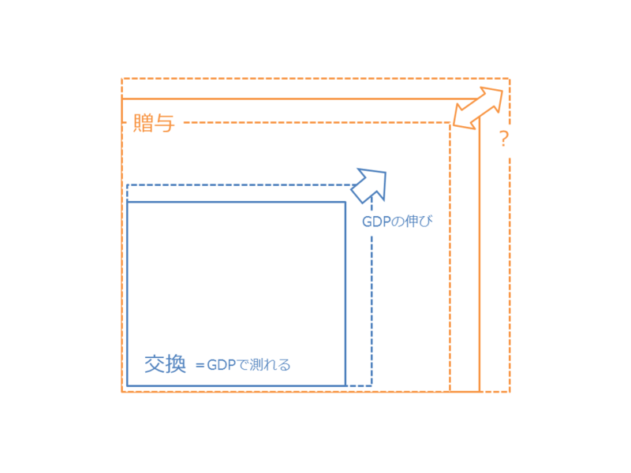

<blockquote cite="http://daruyanagi.hatenablog.com/entry/2012/03/17/081136">

<ul>
<li>社会化された「贈与」（プライベートからパブリックへ）</li>
<li>形式化された「贈与」（前例に従った贈与。「あげたい」という純粋な気持ちの発露ではなく、ある種惰性としての贈与）</li>
<li>規格化された「贈与」（与えられたインプットにはそれに応じたアウトプットが与えられる。その比率は「社会的に」決定される。多く与え-すぎても、少なく受け取りすぎてもよくない。数<a class="keyword" href="http://d.hatena.ne.jp/keyword/%CE%CC%B2%BD">量化</a>された「贈与」）</li>
<li>無記名の「贈与」（義理や人情といったプライベートな感情を排した贈与）</li>
</ul>
<cite><a href="http://daruyanagi.hatenablog.com/entry/2012/03/17/081136">&#x8D08;&#x4E0E;&#x3068;&#x4EA4;&#x63DB;&#x306E;&#x9055;&#x3044;&#x306B;&#x3064;&#x3044;&#x3066;&#x306E;&#x7D20;&#x63CF; - &#x3060;&#x308B;&#x308D;&#x3050;</a></cite>
</blockquote>

<ol>
<li>「交換」の基盤は「贈与」である。</li>
<li>「贈与」は直接的に行われるが、「交換」は貨幣を媒介して行われる。</li>
<li>そのため、「交換」は <a class="keyword" href="http://d.hatena.ne.jp/keyword/GDP">GDP</a>でその規模を計ることができる。</li>
<li>「贈与」は「交換」へ組み込むことができる。</li>
<li>その逆は難しそうだ。</li>
</ol>

たとえば、近所のおばあさんの肩を叩いてあげる代わりに髪の毛を切ってもらっていた子供が、千円札を数枚握って散髪屋を利用するようになれば、 <a class="keyword" href="http://d.hatena.ne.jp/keyword/GDP">GDP</a> は増大する。けれど、これは「交換」＋「贈与」の総体を増やす行為であるとは限らないし、かならずしも豊かさの増大を意味しない<a href="#f1" name="fn1" title="だからといって、「国民総幸福量」などという指標に意味があるとは決して思わないのだけど。客観的なものは計ることができるが、主観的なものは計ることができない。">*1</a>。無機質な「交換」は、情緒的な「贈与」を不可逆的に代替してしまうし、ときに「贈与」そのものを破壊してしまう――少なくともそう見える――のだ。一部の保守派の人たちがよく懸念し、警戒するように。

けれど、属人的な「贈与」と異なり、「交換」は無機的であるがゆえにより普遍的で、見ず知らずの人達でさえ簡単に結びつけることができる。「交換」社会では気に入らない人間との関係であっても拒否できないけれど、「贈与」社会ではそれが許される。

たとえば、タクシーの乗車拒否は「贈与」のシナリオでは肯定されるが、「交換」のシナリオでは否定される。気に入らない人間をタクシーに乗せないのは情緒的に肯定できても、“ビジネスのルール”には明確に反しており、彼を“プロフェッショナル”な運転手と呼ぶことは到底できない。人によって見方はさまざまだろうけど、社会総体としては“不正義である”とみなされるのが妥当だと思う。

<a class="keyword" href="http://d.hatena.ne.jp/keyword/%A5%DE%A5%EB%A5%AF%A5%B9">マルクス</a>が指摘したように、資本がぐるぐる回る社会という舞台で、好むと好まざるとなく役を割り当てられて踊らされているのが、資本主義社会（僕の用語では交換社会）における人――近代人とでも呼ぼうか？――だ。タクシーの運転手に限らず、“ビジネス”に参加する者なら誰しも“プロフェッショナル”であるべきだ。少なくとも、そう要請される。コンビニの店員は、時給800円の代償としてしゃべる自販機の一歩手前を演じる<a href="#f2" name="fn2" title="そのとき彼は、800円にみあったパフォーマンスを発揮する平均的な労働力をもつ人間であることが社会的に要請される。これが、平均以下の人にとって「生きることの息苦しさ」に繋がっている。それ以外の尺度があれば、多少その息苦しさも紛れるだろうのに。">*2</a>。けれどその代わり、彼はその稼ぎでほかのピエロが踊るのを楽しむことができる。誰にも後ろ指を指されずに、自由に。

かといって、「贈与」社会がよいのかといえば、あっちはあっちで“コミュニケーション能力”がないとかなり窮屈なのだけど。近年は“コミュ障”などと言う言葉もあるみたいだが、別に最近になって急に“コミュニケーション能力”が必要になったわけではなく、「交換」の古層に「贈与」があることが最認識されつつあることを意味しているのだと思う。「ピエロになっていればいいんだろ？」と思っていたのが、案外それでは済まなくて面倒くさい、みたいな。

「贈与」と「交換」の境界は、やはり少し渾然としている。「贈与」か「交換」か？ そんな葛藤が、たとえばこんな問題にも表れているようにも思う。

<blockquote cite="http://oshiete.goo.ne.jp/watcher/entry/508f531059b6a0bc558a6763f90eb99c/">

「コミュニケーションを求める方もいらっしゃれば、必要以上のコミュニケーションをとりたくない方（ご質問者様と同じ立場）もいらっしゃいますから、接客する立場の方も、対応に苦慮することがしばしばです。」

<cite><a href="http://oshiete.goo.ne.jp/watcher/entry/508f531059b6a0bc558a6763f90eb99c/">&#x30B3;&#x30F3;&#x30D3;&#x30CB;&#x5E97;&#x54E1;&#x3068;&#x306E;&#x4F1A;&#x8A71;&#x306F;&#x9762;&#x5012;&#xFF1F; - &#x6559;&#x3048;&#x3066;&#xFF01;&#x30A6;&#x30A9;&#x30C3;&#x30C1;&#x30E3;&#x30FC; - &#x6559;&#x3048;&#x3066;&#xFF01;goo</a></cite>
</blockquote>

コンビニは基本的に「交換」の場なのだけど、純粋にそうあって欲しいと思う人と、あくまでも贈与の作法を重視する人がいて、ちょっと興味深い。――ちなみに僕は挨拶するほうが好きですね。

<a href="#fn1" name="f1" class="footnote-number">*1</a>:だからといって、「<a class="keyword" href="http://d.hatena.ne.jp/keyword/%B9%F1%CC%B1%C1%ED%B9%AC%CA%A1%CE%CC">国民総幸福量</a>」などという指標に意味があるとは決して思わないのだけど。客観的なものは計ることができるが、主観的なものは計ることができない。

<a href="#fn2" name="f2" class="footnote-number">*2</a>:そのとき彼は、800円にみあったパフォーマンスを発揮する平均的な労働力をもつ人間であることが社会的に要請される。これが、平均以下の人にとって「生きることの息苦しさ」に繋がっている。それ以外の尺度があれば、多少その息苦しさも紛れるだろうのに。

