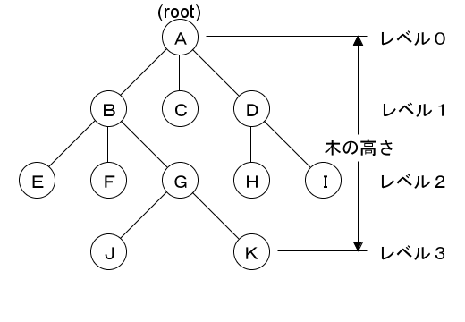

<blockquote cite="http://ja.wikipedia.org/wiki/%E3%83%91%E3%83%AC%E3%83%BC%E3%83%88%E3%81%AE%E6%B3%95%E5%89%87">

<a class="keyword" href="http://d.hatena.ne.jp/keyword/%A5%D1%A5%EC%A1%BC%A5%C8%A4%CE%CB%A1%C2%A7">パレートの法則</a>（パレートのほうそく）とは、経済において、全体の数値の大部分は、全体を構成するうちの一部の要素が生み出しているという説。80:20の法則、ばらつきの法則などと呼ばれることもあるが、本来は別のものである。

イタリアの経済学者ヴィルフレド・パレート（Vilfredo Federico Damaso Pareto）が発見した冪乗則である。経済以外にも自然現象や社会現象等様々な事例に当て嵌められることが多い。

<cite><a href="http://ja.wikipedia.org/wiki/%E3%83%91%E3%83%AC%E3%83%BC%E3%83%88%E3%81%AE%E6%B3%95%E5%89%87">&#x30D1;&#x30EC;&#x30FC;&#x30C8;&#x306E;&#x6CD5;&#x5247; - Wikipedia</a></cite>
</blockquote>

<blockquote cite="http://ja.wikipedia.org/wiki/%E3%83%B4%E3%82%A3%E3%83%AB%E3%83%95%E3%83%AC%E3%83%89%E3%83%BB%E3%83%91%E3%83%AC%E3%83%BC%E3%83%88">

さらに彼は、数<a class="keyword" href="http://d.hatena.ne.jp/keyword/%CD%FD%B7%D0">理経</a>済学の実証的な手法（統計分析）を用いて、経済社会における富の偏在（所得分布の不均衡）を明らかにした。これは<a class="keyword" href="http://d.hatena.ne.jp/keyword/%A5%D1%A5%EC%A1%BC%A5%C8%A4%CE%CB%A1%C2%A7">パレートの法則</a>とよばれている。この法則は、2割の高額所得者のもとに社会全体の8割の富が集中し、残りの2割の富が8割の<a class="keyword" href="http://d.hatena.ne.jp/keyword/%C4%E3%BD%EA%C6%C0%BC%D4">低所得者</a>に配分されるというものである。

<cite><a href="http://ja.wikipedia.org/wiki/%E3%83%B4%E3%82%A3%E3%83%AB%E3%83%95%E3%83%AC%E3%83%89%E3%83%BB%E3%83%91%E3%83%AC%E3%83%BC%E3%83%88">&#x30F4;&#x30A3;&#x30EB;&#x30D5;&#x30EC;&#x30C9;&#x30FB;&#x30D1;&#x30EC;&#x30FC;&#x30C8; - Wikipedia</a></cite>
</blockquote>

贈与・交換関係の階層構造 → 所得の偏りについて考えていたら、ここに行き着いた。経済学を学んだ人なら誰でも知っているパレート先生だ。

所得は<a class="keyword" href="http://d.hatena.ne.jp/keyword/%A5%D9%A5%AD%CA%AC%C9%DB">ベキ分布</a>をなす（実際のところは、税制や倫理、慣習、規範などによって歪められるため、キレイな<a class="keyword" href="http://d.hatena.ne.jp/keyword/%A5%D9%A5%AD%CA%AC%C9%DB">ベキ分布</a>にはならないけれど<a href="#f1" name="fn1" title="グラフでは所得０が割愛されていることに注意してほしいところ！　このグラフから人を排除すれば、見た目上の格差は是正されるということ。偽善も極まれりだな">*1</a>）。それはなぜかというと、やはり「相互依存」と「依存の非<a class="keyword" href="http://d.hatena.ne.jp/keyword/%C2%D0%BE%CE%C0%AD">対称性</a>」があるからだと思う。

「相互依存」は、お互いに贈与・交換しあっている関係。個が独立・孤立しておらず、取引を通じてそれぞれの「可能性」へアクセスできる状態にある。

「依存の非<a class="keyword" href="http://d.hatena.ne.jp/keyword/%C2%D0%BE%CE%C0%AD">対称性</a>」は、「相互依存」関係の数の非<a class="keyword" href="http://d.hatena.ne.jp/keyword/%C2%D0%BE%CE%C0%AD">対称性</a>。たとえば、会社組織では平社員はその上長と関係を取り結ぶ。上長はその上長と関係を取り結ぶ。しかし、その関係性は「1対多」の関係にある<a href="#f2" name="fn2" title="むろん、横のつながりもあるけれど、それは所得にはあまり関係がない">*2</a>。つまり、階層が上になるほどより多くの「可能性」にアクセスすることができる（<a href="http://daruyanagi.hatenablog.com/entry/2012/04/11/060029">&#x306A;&#x305C;&#x76F8;&#x4E92;&#x306B;&#x8D08;&#x4E0E;&#xFF08;&#x4EA4;&#x63DB;&#xFF09;&#x3059;&#x308B;&#x306E;&#x304B; - &#x3060;&#x308B;&#x308D;&#x3050;</a>）。これは別に社内組織ではなくても言える。たとえば、銀行間の取引関係は階層関係をなすそうだ（手元にないが <a href="http://d.hatena.ne.jp/asin/4334032672">経済物理学の発見 (光文社新書)</a> にあったと記憶している）。

この「1対多」の比、レベル間における繋がりの数が、すべての階層でキレイに保たれていれば（そうはならないが、だいたいそうなる）、<a class="keyword" href="http://d.hatena.ne.jp/keyword/%A5%D9%A5%AD%CA%AC%C9%DB">ベキ分布</a>になる。これはまさしく<a class="keyword" href="http://d.hatena.ne.jp/keyword/%A5%D5%A5%E9%A5%AF%A5%BF%A5%EB">フラクタル</a>だ。

ならば、

<blockquote>

ただし、その可能性の「濃度」――または「実現可能性」とでも呼ぶべきモノは薄まっている。

</blockquote>

この「濃度」は、<a class="keyword" href="http://d.hatena.ne.jp/keyword/%A5%D5%A5%E9%A5%AF%A5%BF%A5%EB">フラクタル</a>次元（少数次元）っぽいもので記述できるのかもしれない。

ともあれ、ここで言えるのは、<b>経済格差の原因は相互依存関係、自由経済に参加している状態そのものにある</b>ということ。学術テストのように個人の能力が独立して試されるのであれば標準分布になるのだろうけれど、経済はすなわち相互依存を意味するので、<a class="keyword" href="http://d.hatena.ne.jp/keyword/%A5%D9%A5%AD%CA%AC%C9%DB">ベキ分布</a>――経済的格差――は避けられない。「格差反対」というスローガンがどんなに無意味なものか、これでわかろうものだ。

考えてみよう。経済的格差を解消するには、

<ul>
<li>完全に平等な分配システムを構築する（従来の共産・社会主義的考え方）</li>
<li>個人が完全に独立した、相互依存の非<a class="keyword" href="http://d.hatena.ne.jp/keyword/%C2%D0%BE%CE%C0%AD">対称性</a>のない社会を構築する（相互贈与関係から導き出した結論）</li>
</ul>
しかないわけだけど、前者は（所有権の認められた近代社会では）構成員の誰かが拒否した時点で崩壊する<a href="#f3" name="fn3" title="現在のように、ある程度なら社会の安定性などを考えて、合意の余地がある">*3</a>ので、理想的な民主主義では達成しえない。なので、暴力革命を行うにしても、法的に所有権を禁止するにしても、その達成は非現実的だと言わざるをえない。

後者は<a href="#f4" name="fn4" title="ルソーの想定した“自然状態”に似ている気がする">*4</a>、理論的に不可能だ。相互依存の非<a class="keyword" href="http://d.hatena.ne.jp/keyword/%C2%D0%BE%CE%C0%AD">対称性</a>は、時間・空間・能力の制約から、すべての人がすべての人と同時に・同質な関係を取り結べないことに原因がある。<a class="keyword" href="http://d.hatena.ne.jp/keyword/%A5%BD%A1%BC%A5%B7%A5%E3%A5%EB%A5%CD%A5%C3%A5%C8%A5%EF%A1%BC%A5%AF">ソーシャルネットワーク</a>で取り結べるな繋がりは約150人ぐらいが限度らしいが、そうなると有力なプレーヤーと関係を取り結べたひと、並外れてネットワーク能力に長けたひとなどがハブ（ネットワークの繋がり、階層の要）になり、非<a class="keyword" href="http://d.hatena.ne.jp/keyword/%C2%D0%BE%CE%C0%AD">対称性</a>が生じる。自然、その優位に立つプレイヤーに富が集中するだろう<a href="#f5" name="fn5" title="これが最近一部で話題の「評価経済」にあたるのだと思うのだけど、そう考えれば別に今に始まったことではないのがわかる">*5</a>。

実は、もうひとつ格差を解消する方策がないことはない。

<ul>
<li>そもそも経済に参加せず、孤立して自給自足で暮らす</li>
</ul>
<a class="keyword" href="http://d.hatena.ne.jp/keyword/%A5%ED%A5%D3%A5%F3%A5%BD%A5%F3%A1%A6%A5%AF%A5%EB%A1%BC%A5%BD%A1%BC">ロビンソン・クルーソー</a>になれば格差に悩まなくて済むというわけ。けれど、これこそ馬鹿らしい解決策なので考えるに値しない。今までアクセス可能だった「可能性」をすべて捨てることになる。

===

<blockquote cite="http://openblog.meblog.biz/article/3867715.html">

まず、<a class="keyword" href="http://d.hatena.ne.jp/keyword/%C0%B5%B5%AC%CA%AC%C9%DB">正規分布</a>とは何か？　それは、次のように言える。

「ランダムな動きをなすものの統計的な分布」

基本的には、熱運動をする気体分子の分布だと考えていい。（ボルツマン分布から<a class="keyword" href="http://d.hatena.ne.jp/keyword/%C0%B5%B5%AC%CA%AC%C9%DB">正規分布</a>へ、という流れ。） 
要するに、気体分子のようにバラバラなものが、バラバラに勝手に拡散すると、<a class="keyword" href="http://d.hatena.ne.jp/keyword/%C0%B5%B5%AC%CA%AC%C9%DB">正規分布</a>の形になる。

では、<a class="keyword" href="http://d.hatena.ne.jp/keyword/%A4%D9%A4%AD%CA%AC%C9%DB">べき分布</a>はどうか？　おおむね、次のことが成立する。

「どのような二つの階層を取っても、階層差が一定であれば、そのエネルギー比率は一定である」 
: 
要するに、<a class="keyword" href="http://d.hatena.ne.jp/keyword/%A4%D9%A4%AD%CA%AC%C9%DB">べき分布</a>の本質は、それぞれの階層における「相似」という性質なのだ。

<cite><a href="http://openblog.meblog.biz/article/3867715.html">Open &#x30D6;&#x30ED;&#x30B0;: &#x25C6; &#x3079;&#x304D;&#x5206;&#x5E03;&#x3068;&#x6B63;&#x898F;&#x5206;&#x5E03;</a></cite>
</blockquote>

だいぶわかりやすかった。けれどあんまりわかってないと思うので、これを機会に分布に関する本を読んでみたい。

<a href="#fn1" name="f1" class="footnote-number">*1</a>:グラフでは所得０が割愛されていることに注意してほしいところ！　このグラフから人を排除すれば、見た目上の格差は是正されるということ。偽善も極まれりだな

<a href="#fn2" name="f2" class="footnote-number">*2</a>:むろん、横のつながりもあるけれど、それは所得にはあまり関係がない

<a href="#fn3" name="f3" class="footnote-number">*3</a>:現在のように、ある程度なら社会の安定性などを考えて、合意の余地がある

<a href="#fn4" name="f4" class="footnote-number">*4</a>:ルソーの想定した“自然状態”に似ている気がする

<a href="#fn5" name="f5" class="footnote-number">*5</a>:これが最近一部で話題の「評価経済」にあたるのだと思うのだけど、そう考えれば別に今に始まったことではないのがわかる

