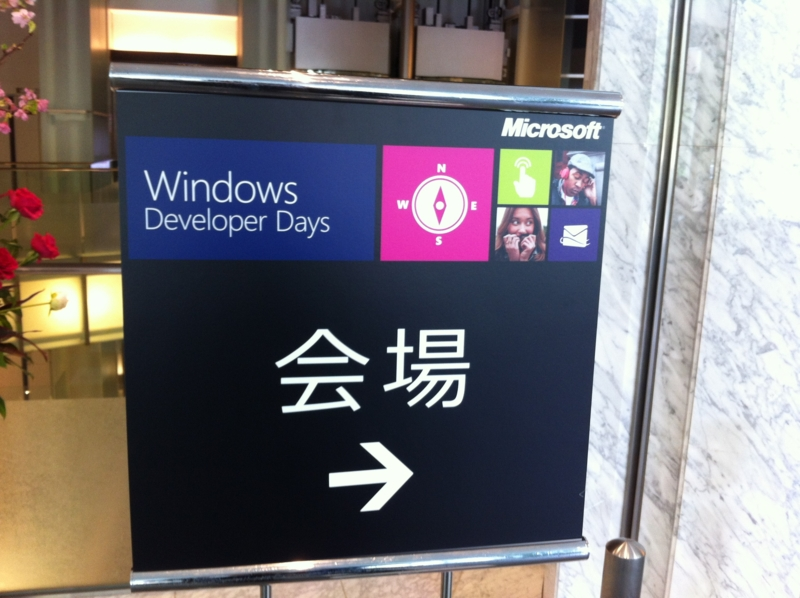
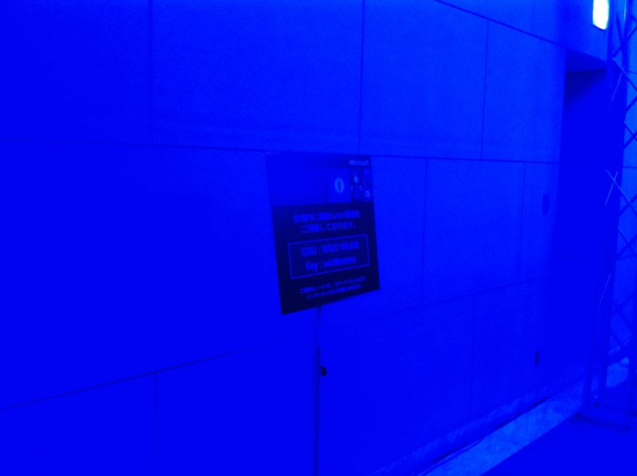
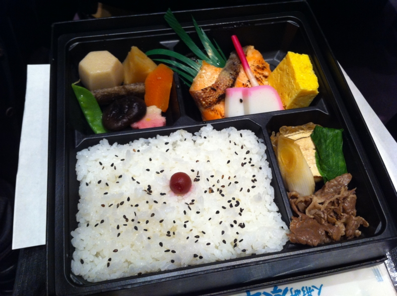
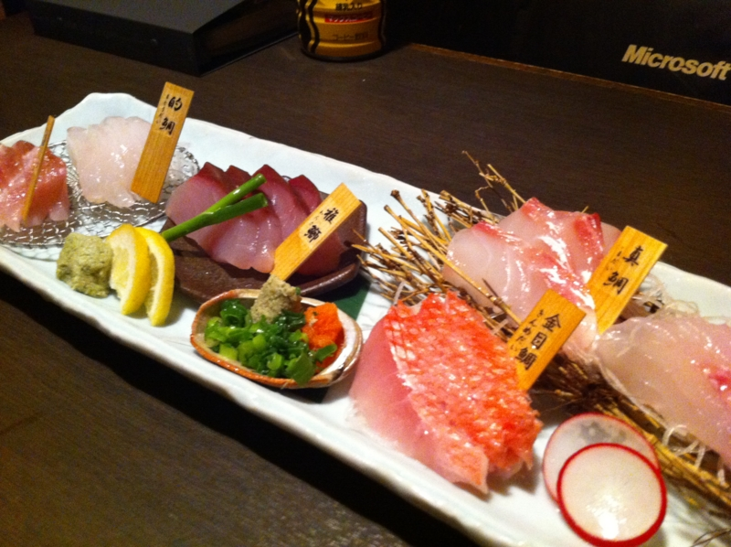

<a href="http://www.microsoft.com/ja-jp/events/wdd/default.aspx">Microsoft Windows Developer Days (WDD)  &#x30DB;&#x30FC;&#x30E0;</a> 行ってきましたよ！

人が多すぎて、人ごみの苦手なブクは密かに気分を悪くしてしまったぐらいですけど、それもほんの最初だけ。充実した内容で、次第にそれどころじゃなくなってきました（笑。今は「あれがやりたい、これもやりたい！」状態ですね。学んだものをカタチにしたい。できたら、フツーにPCを使うだけの人とも、このキモチを共有したいですね。

<a href="http://www.amazon.co.jp/exec/obidos/ASIN/4822294641/bestylesnet-22/">Windows Sysinternals徹底解説　 ―― Windows管理者必携ツールを使い尽くすためのバイブル (マイクロソフト公式解説書)</a>
<ul><li>作者: Mark E. Russinovich,Aaron Margosis,山内和朗</li><li>出版社/メーカー: <a class="keyword" href="http://d.hatena.ne.jp/keyword/%C6%FC%B7%D0BP">日経BP</a>社</li><li>発売日: 2012/03/29</li><li>メディア: 単行本</li><li>購入: 2人 クリック: 17回</li><li><a href="http://d.hatena.ne.jp/asin/4822294641/bestylesnet-22" target="_blank">この商品を含むブログ (3件) を見る</a></li></ul>

<a href="http://www.amazon.co.jp/exec/obidos/ASIN/4822294668/bestylesnet-22/">プログラミングMicrosoft ASP.NET MVC ASP.NET MVC 3対応版 (マイクロソフト公式解説書)</a>
<ul><li>作者: Dino Esposito,日本<a class="keyword" href="http://d.hatena.ne.jp/keyword/%A5%DE%A5%A4%A5%AF%A5%ED%A5%BD%A5%D5%A5%C8">マイクロソフト</a>井上章監訳,<a class="keyword" href="http://d.hatena.ne.jp/keyword/%B3%F4%BC%B0%B2%F1%BC%D2%A5%AF%A5%A4%A1%BC%A5%D7">株式会社クイープ</a></li><li>出版社/メーカー: <a class="keyword" href="http://d.hatena.ne.jp/keyword/%C6%FC%B7%D0BP">日経BP</a>社</li><li>発売日: 2012/05/08</li><li>メディア: 単行本</li><li> クリック: 8回</li><li><a href="http://d.hatena.ne.jp/asin/4822294668/bestylesnet-22" target="_blank">この商品を含むブログ (3件) を見る</a></li></ul>

本の販売もしていたので、この2冊を買いました。ぼちぼち読んでいこうかなぁ、と思います。

それにしても会場青すぎワロタ。

あと、昼食難民が結構な数いたみたい。かくいう僕も、初日は要領を得ず、小さなうなぎ丼に少しありつけただけでした。もっとも、お菓子なんかが食べ放題だったので問題はなかったでしょうけど。あと、おやつ食べながらセッションを受けられたらよかったですね。なかなか難しいのはわかりますけど。

夜はパーティーのあと、気心知れた少人数で呑みに。少しはっちゃけすぎて、家に帰れず、田町のホテルで泊まるハメになりました。まぁ、いろんな人と会えたのも収穫。

<iframe width="420" height="315" src="http://www.youtube.com/embed/ydJinL8Ln3Q?wmode=transparent" frameborder="0" allowfullscreen></iframe>

キーノートやセッションの内容は、すでにあちこちで書かれているみたいなのでとくに僕からはなにも。自分で消化できたら、また改めて書こうと思います。とにかく、まともなスレートPCがほしい。

