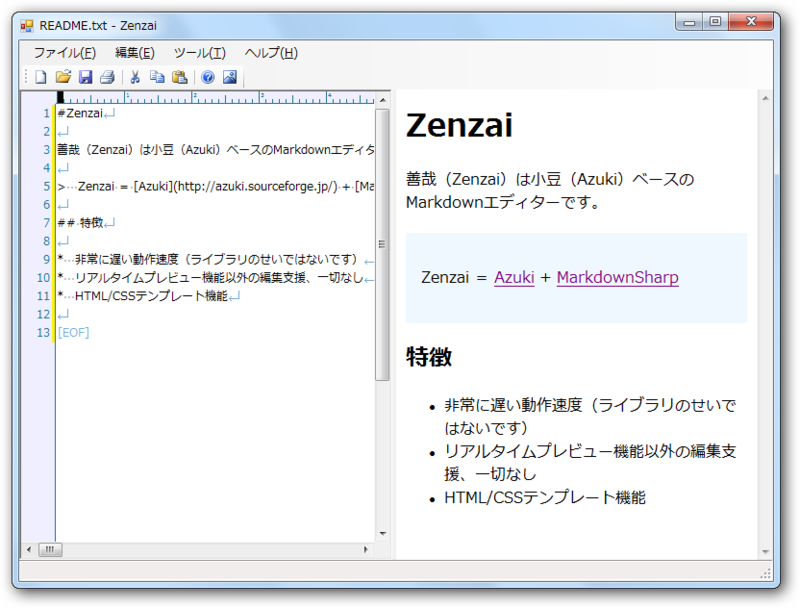
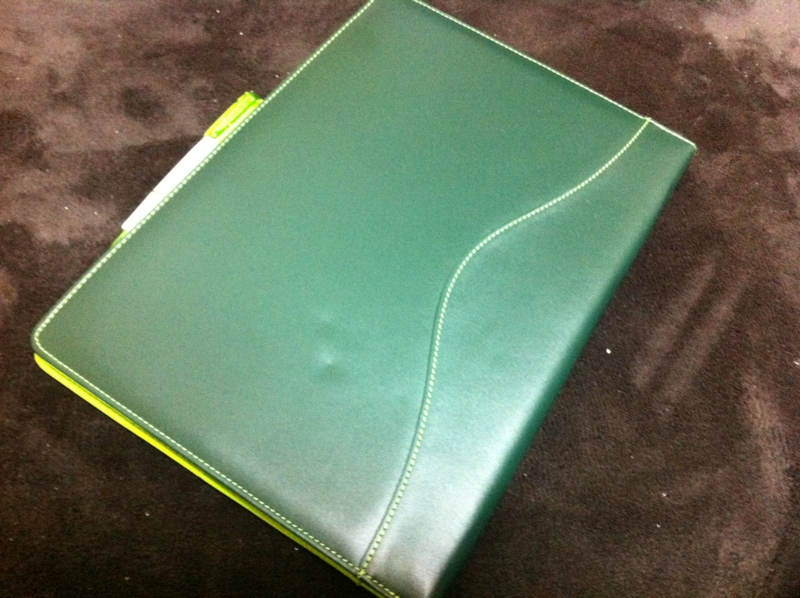
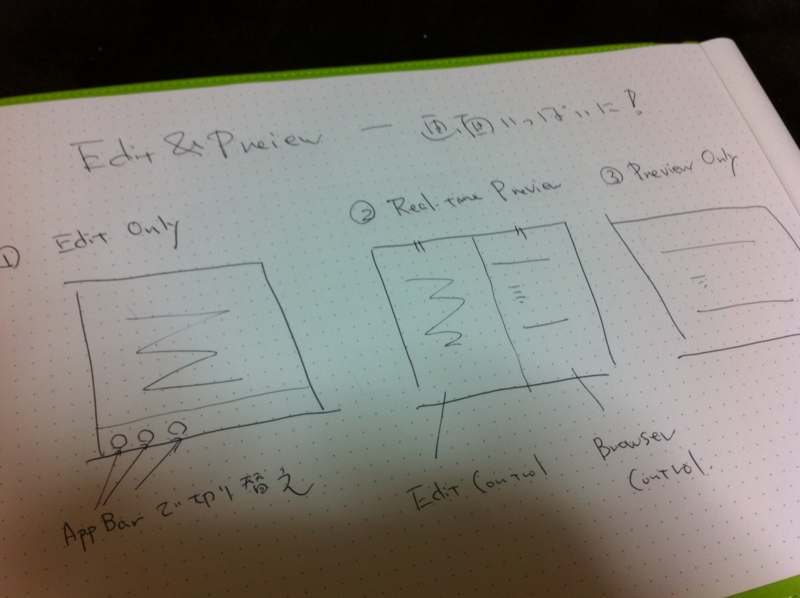
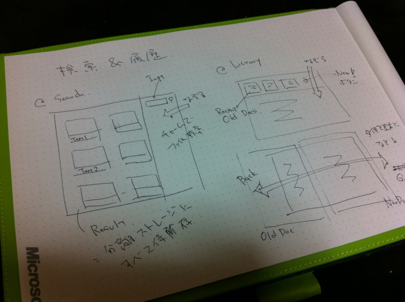
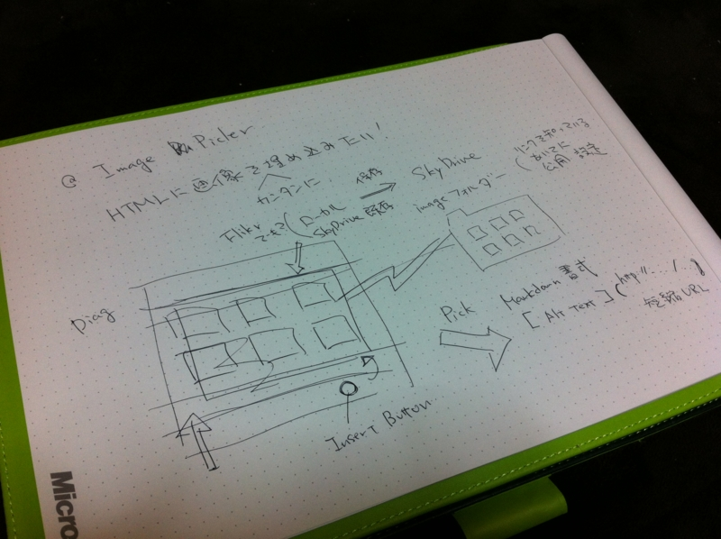
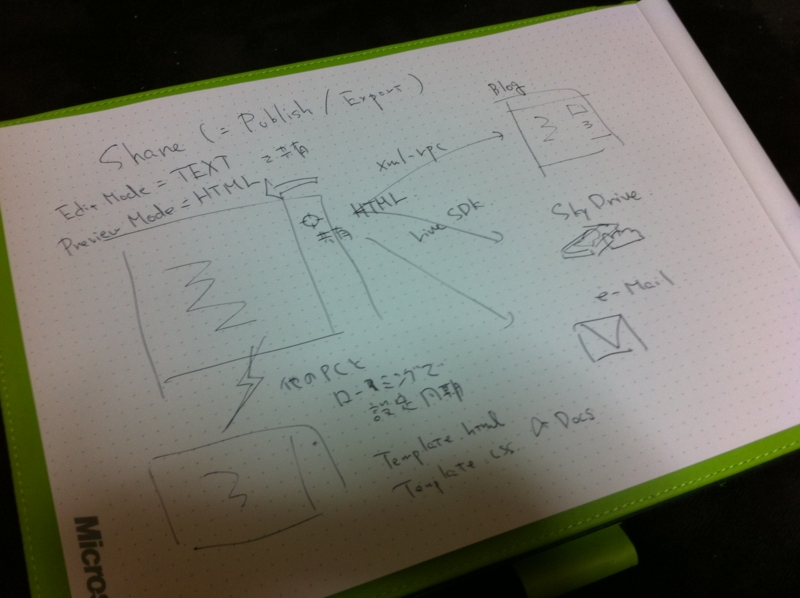

WDD の話の続きのようなもの。

これに関する話題をあちこちで読んでみたけど、 <a href="http://blog.livedoor.jp/lalha/archives/50444177.html">&#x5C0F;&#x91CE;&#x548C;&#x4FCA;&#x306E;&#x30D6;&#x30ED;&#x30B0;:Metro UI&#x306F;&#x300C;UX&#x30A2;&#x30D7;&#x30EA;&#x990A;&#x6210;&#x30AE;&#x30D7;&#x30B9;&#x300D;</a> が言い得て妙でわかりやすいなぁ、と思った。

メトロデザインで必要とされることの一つに「全体のデザインの統一性」が挙げられると思う。「統一されたデザイン」は、使いやすい。ネガティブにとらえるならそれは「制限」に過ぎないのだけど、その分「凝縮」されており、よく練られた「UX思想の土台」になっている。メトロをみると、今までの（Windows）アプリって、自由すぎて無駄が多く、開発者＆ユーザーの思考・試行・空間・時間が知らず知らずのうちに浪費・発散してしまっていたのではないかな、と感じてしまう。

<a class="keyword" href="http://d.hatena.ne.jp/keyword/iPhone">iPhone</a> が登場し、あの迫っ苦しい画面と貧弱なリソースでもデスクトップと同等またはそれ以上の「凝縮された体験」が楽しめるということが実証された。そしてそれが、今度はタブレットへと拡張されつつある。メトロはそれの追随だと思うけれど、iOS がやった以上の「凝縮」を成し遂げているように見えるし、たんなるスマフォからタブレットへのスケールアップにとどまらない機能を提供していると思う<a href="#f1" name="fn1" title="セマンティックズームとか">*1</a>。

まぁ、それはともかく。

今、僕は簡単な Markdown エディターを作っているのだけど、 <a href="http://daruyanagi.hatenablog.com/entry/2012/04/26/050929">WWD &#x3044;&#x3063;&#x3066;&#x304D;&#x305F;&#x3088;&#xFF01; - &#x3060;&#x308B;&#x308D;&#x3050;</a> でいろいろ学んだおかげもあって、ちょっといろいろ改造したくなってきた。メトロをアレだけ見ちゃうと、今作ってるヤツは「コレジャナイーイ」感が半端ない。

どーせならWDDで得た成果を活かして、UX（ユーザーエクスペリエンス）を考えたモノに改造したい。WDDでもらったでっかいメモ帳に、適当にアイデアをまとめていくよ！

<h3>編集とプレビュー</h3>

このアプリでやりたい・実現したいユーザー体験は、Markdownテキストの編集とHTMLのプレビュー。だから、それを全面に押し出すよ！　全画面フルに使って編集＆プレビューしてください。

<h3>検索・履歴</h3>

もうひとつ実現したいのは、以前に書いたテキストを簡単に呼び出せるということ。Windows フォームだったら、検索や履歴機能は小さなメニューへ押し込まれているのが普通だけど、せっかくのメトロスタイルアプリなんだから、その体験はぜひもっとアクセスしやすく、楽しく使えるようにしたい。

たとえば、検索機能はチャームから。ストレージに溜め込まれたドキュメントから目的の物を探し出し、サムネイルで並べる。

履歴機能はAppバーから。<a class="keyword" href="http://d.hatena.ne.jp/keyword/Internet%20Explorer">Internet Explorer</a> 10 のタブみたいな感じにしたい。このアプリにタブという概念はないけれど、強いて言えば“過去の履歴＝タブ”みたいな感じに見えるようにしたい。

もうひとつ考えたのは、左右フリックでの［戻る］［進む］操作。履歴機能のほとんどって、［戻る］［進む］じゃない？　だったら、フリック（またはキーボードショートカット）で手軽に使えたらすごく便利だぞ。ちょっとリッチな書式をもつメモ帳のようにも使ってほしいから、ページをめくるように使えたらいい。しかも、このメモ帳にはページがほとんど無限大にある！

（あー、ページ内検索機能はどうしよう……メトロ版IE10での実装を今度参考にしてみるか）

<h3>イメージピッカー</h3>

HTMLドキュメントに画像を埋め込む作業も少し考えないと。デスクトップと違ってドラッグ＆ドロップというわけにもいかないし。

とりあえず、このアプリに画像を埋め込むときは <a class="keyword" href="http://d.hatena.ne.jp/keyword/SkyDrive">SkyDrive</a> （決め打ち！）を使うようにしてみればどうだろうか。ローカルイメージを選択したら、それを <a class="keyword" href="http://d.hatena.ne.jp/keyword/SkyDrive">SkyDrive</a> へアップロードして<a class="keyword" href="http://d.hatena.ne.jp/keyword/%C3%BB%BD%CCURL">短縮URL</a>を取得し、Markdown の書式として挿入する。もとから <a class="keyword" href="http://d.hatena.ne.jp/keyword/SkyDrive">SkyDrive</a> や <a class="keyword" href="http://d.hatena.ne.jp/keyword/Flickr">Flickr</a> といったオンラインストレージに保存されているイメージなら、そのままURLを取得すればイイ。けれど、オフラインの時困るかな……とりあえずローカルパスを埋め込んで、オンラインの際にそれをクラウドへアップロード・置換するというので何とかなりそうだけど。

<h3>保存・共有</h3>

最後はエクスポート。これはチャームの［共有］から行う。<a class="keyword" href="http://d.hatena.ne.jp/keyword/XML-RPC">XML-RPC</a>でブログへ送ったり、<a class="keyword" href="http://d.hatena.ne.jp/keyword/SkyDrive">SkyDrive</a> なんかにファイルとして吐き出したり、メールで送ったり。

エディットモードで共有したときはテキスト形式で、プレビューモードで共有したときはHTML形式で共有。ここはメニューを増やさず（テキストとして共有とかHTMLとして共有とか）、なるべく規約ベースで機能を表現したい。となると困るのはエディット＆リアルタイムプレビューモード（エディット画面とプレビュー画面が半々）の場合だけど……まぁ、あとで考えよう。

それにしても「ファイルとして保存」機能は必要かなぁ……できれば削りたいけど、デスクトップアプリとの連携を考えれば必要かな。

あと、複数の環境で設定を<a class="keyword" href="http://d.hatena.ne.jp/keyword/%A5%ED%A1%BC%A5%DF%A5%F3%A5%B0">ローミング</a>できるようにもしたい。とりあえずは基本的な設定を、できれば分離ストレージの保存してあるドキュメントも全部同期させたいけど、さすがにそれは審査で怒られるかも。

===

以上、こんな感じ。実現するのがいつになるのかはわかんないけど、妄想するだけでも楽しいよね（ぁ 
最近は <a class="keyword" href="http://d.hatena.ne.jp/keyword/WPF">WPF</a> に対する理解も少し高まってきたので、メトロスタイルアプリも頑張ればいけるんじゃないかなぁ……そうだったらいいなぁ……みた感じ簡単そうなんだけどなぁ……

WDD にいくまでは Markdown エディターのUXを考えようだなんて、思いつきもしなかった……。それも、メトロという「制限」にして「UX思想の土台」があったればこそだと思う。

<a href="#fn1" name="f1" class="footnote-number">*1</a>:セマンティックズームとか

