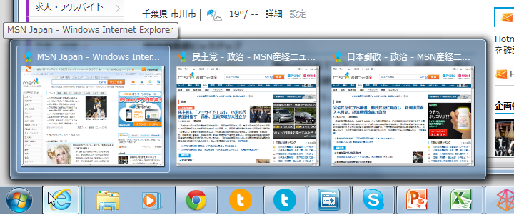
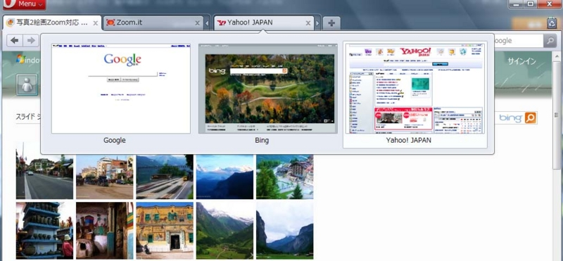
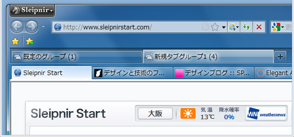
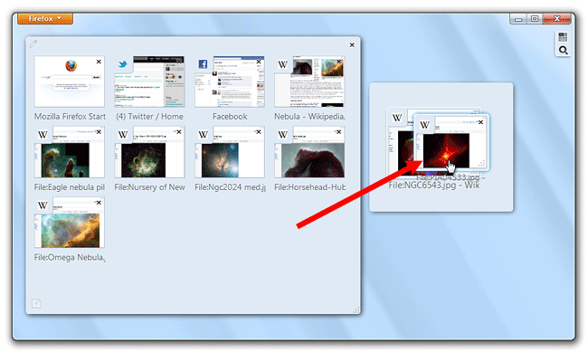

<h3>ドキュメントの階層とタブ</h3>

ウィンドウにタブなんかいらない。

だって、だいたいの場合、これで十分じゃない？　<a class="keyword" href="http://d.hatena.ne.jp/keyword/Windows%207">Windows 7</a>のライブサムネイルのなせるわざだけど。

もちろん例外はある。たとえば、「<a class="keyword" href="http://d.hatena.ne.jp/keyword/Visual%20Studio">Visual Studio</a>」なんかはタブがないと怖い。それはなんでかって言うと、VSではウィンドウ＝プロジェクトであり、かつさらに、そのプロジェクトが複数のドキュメント＝タブを管理しているから。管理データの階層が二つ以上あるので、ウィンドウにタブがないと困る。その点、「<a class="keyword" href="http://d.hatena.ne.jp/keyword/Internet%20Explorer">Internet Explorer</a>」の場合はウィンドウ＝ドキュメントの一階層なので、タブがなくてもやっていける<a href="#f1" name="fn1" title="Windows Vista以前のOSのことなんか(ﾟ⊿ﾟ)ｼﾗﾈ">*1</a>というわけ。

ドキュメント階層とタブの有無は関連しているし、すべきだ。

<h3>ネストしたタブ</h3>

だから、こういうユーザーインターフェイス（ネストしたタブ、タブグループ）にはある種の迷走っぷりを感じる。

あまり必要のないタブがあり、それを管理するためのタブグループがある感じ。そのうち、タブグループを管理するタブが必要になるんじゃないか？　まぁ、こういうアプリは上級者向け<a href="#f2" name="fn2" title="自称も含めて">*2</a>なんだろうし、<a class="keyword" href="http://d.hatena.ne.jp/keyword/Windows%20Vista">Windows Vista</a>以前ではライブサムネイルがないわけだし、そもそも使わないという選択肢もあるので、廃止しろとまでは言わないけど。

ちなみに、「<a class="keyword" href="http://d.hatena.ne.jp/keyword/Google%20Chrome">Google Chrome</a>」ではウィンドウ＝タブグループ、ドキュメント＝タブという二階層構成をもち、またそれをちゃんと意識して、早くからウィンドウ間のタブのドラッグ＆ドッキングをサポートしている。「<a class="keyword" href="http://d.hatena.ne.jp/keyword/Google%20Chrome">Google Chrome</a>」のウィンドウはタブをグループ化するコンテナなんだ。タブの位置を真似ただけのほかのブラウザーとは違い、デザイン（UXと呼ぶべき？）がよく練られていると改めて思う<a href="#f3" name="fn3" title="その点、IEは少し寄り道してしまった感じを受ける">*3</a>。ただ、これは<a class="keyword" href="http://d.hatena.ne.jp/keyword/Windows%207">Windows 7</a>のライブサムネイルを活かした構成ではない。でも、<a class="keyword" href="http://d.hatena.ne.jp/keyword/%A5%AF%A5%ED%A5%B9%A5%D7%A5%E9%A5%C3%A5%C8%A5%D5%A5%A9%A1%BC%A5%E0">クロスプラットフォーム</a>アプリであることを考えれば、批判にはあたらない。Windows環境以外のことも考えれば、これがベストなんだろう。

とにかく、タブは要らない。少なくとも、<a class="keyword" href="http://d.hatena.ne.jp/keyword/Windows%207">Windows 7</a>では極力ないほうがスッキリすると思う。SDIの復権バンザイ！

<h3>ドキュメントの切り替え</h3>

とはいえ、ウィンドウにタブがない＝たぶん［Ctrl］＋［Tab］もない＝同一アプリ内でのドキュメント切り替えが面倒 なのは困る。できれば OS 側で機能をもっておいて（そして、それにみんなが馴染んでいて）ほしいのだけど、猫も杓子もタブインターフェイスのWindows デスクトップでは無理かな。なにか統一的なインターフェイスが用意されていればいいのだけど。

現状、ドキュメントの切り替え機能はアプリが個々に実装するしかない。だったら、［Ctrl］＋［Tab］のメタファとしてのタブはあっていいのかもしれない。タブがある＝［Ctrl］＋［Tab］を使えまっせ！というわけだ。この記事を書き始めたときは「IE9にだってタブは要らないよな」と思ってたけど、［Ctrl］＋［Tab］のことを考えれば、これはこれでバランスのとれたデザインなのかもしれない。

<h3>まとめ</h3>

<ul>
<li>タブを付けるときは、アプリケーションが管理するデータ（ドキュメント）の階層を考えたほうがいいと思う</li>
<li>ドキュメント階層が1つなら、SDIでいい。複数あるなら、タブインターフェイスを検討すべき</li>
<li>ドキュメント階層は2つまでがいいんじゃないかなぁ</li>
<li>ドキュメント切り替え機能は必要だと思う。そのメタファとしてのタブはありかも</li>
</ul>
目新しいことではないかもしれないけど、せっかくなのでこれを機会に考えてみてもいいと思う。

<h3>おまけ</h3>

「Microsoft Office」の歴史と、そのユーザーインターフェイスの変態っぷりには敬意を表する (｀･ω･´)ゞ

<a href="#fn1" name="f1" class="footnote-number">*1</a>:<a class="keyword" href="http://d.hatena.ne.jp/keyword/Windows%20Vista">Windows Vista</a>以前のOSのことなんか(ﾟ⊿ﾟ)ｼﾗﾈ

<a href="#fn2" name="f2" class="footnote-number">*2</a>:自称も含めて

<a href="#fn3" name="f3" class="footnote-number">*3</a>:その点、IEは少し寄り道してしまった感じを受ける

