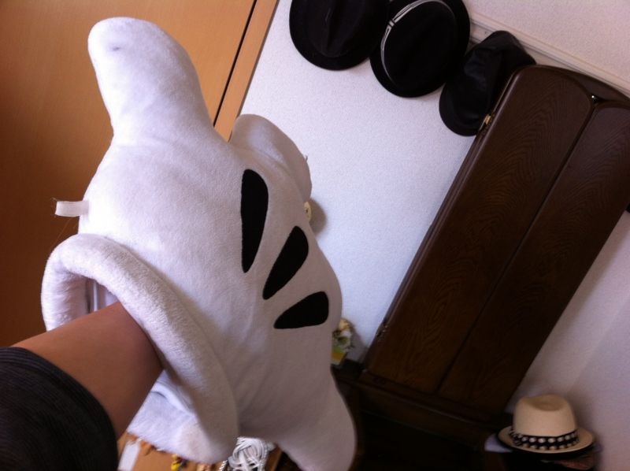
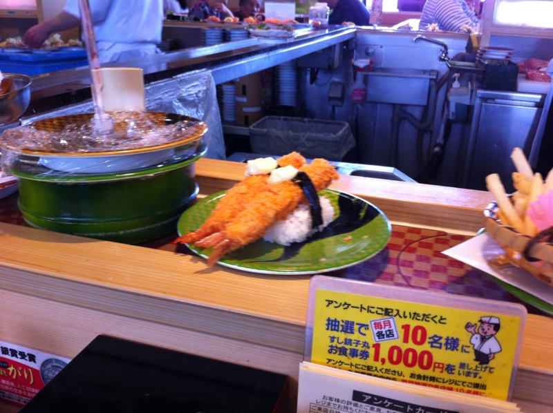
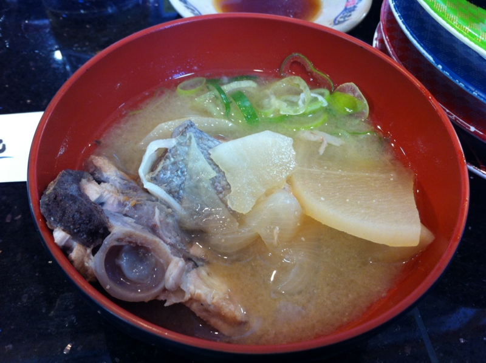

昨晩は妹夫婦のところにお邪魔して、浦安で呑んだ。やることなかったので、ミッキーマウスの手を付けて踊ったりして怒られたりしてた。おじゃま虫でゴメンナサイ。

そんで今日は、おかんにクルマで浦安から市川まで送ってもらって帰宅。あとは掃除と昼寝。起きたら夕方の6時で、もうなにもできなかった。

おかんに家へ送ってもらう途中、回転寿司をご馳走してあげたのだけど、最近、回転寿司で回ってる寿司を食べなくなったなーと思った。直接注文するので、回転している必要がないんじゃないか？

けれどよく考えると、何を食べたいというわけでもない時でも、寿司が回ってると何かしらパクパク食べてしまう……というのはやはりある。食べ物をみてるうちに、食べたいものが浮かんでくる。隣の人が食べているのをみて、自分も食べたくなるのは誰しも経験のあることだろう。要するに、寿司の回転テーブル、あれは、一種の商品ディスプレーなんだな。

まぁ、そうじゃなくても、いろいろ回転しているのをみるのはそれだけで楽しくもあるし、ときどきある隣の人との駆け引きも面白い。回転テーブルを通じた妙な共有感が、回転寿司にはある。やっぱり回転寿司というのはすごいアイデアなのかもしれない。

あら汁タダだった。ごちそうさま！

