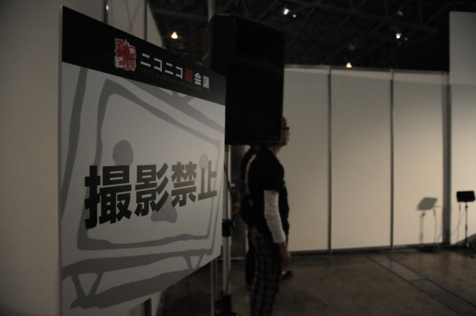
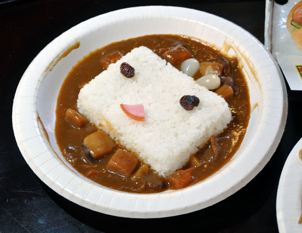
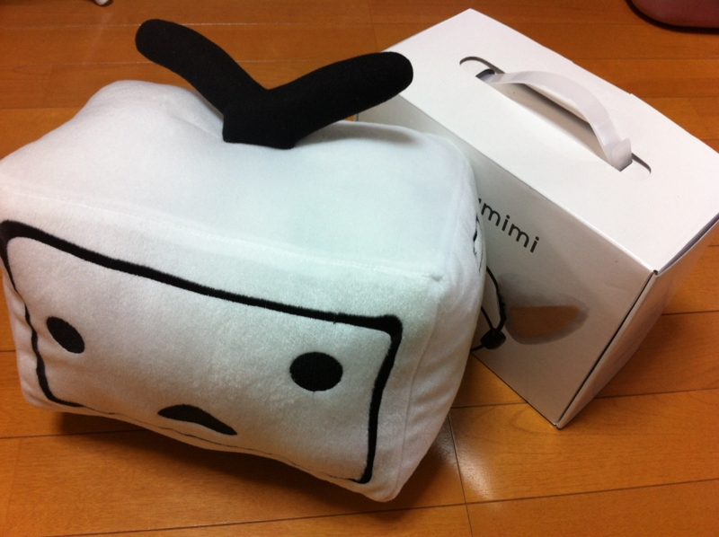

連休二日目は <a href="http://www.chokaigi.jp/">&#x30CB;&#x30B3;&#x30CB;&#x30B3;&#x8D85;&#x4F1A;&#x8B70;2012 &#x516C;&#x5F0F;&#x30B5;&#x30A4;&#x30C8;</a> へ参加。行ってみたにもかかわらず、いまだにアレが何だったのかさっぱりわからない、なんとも不思議なイベントでした。<a class="keyword" href="http://d.hatena.ne.jp/keyword/%A5%CB%A5%B3%A5%CB%A5%B3%C6%B0%B2%E8">ニコニコ動画</a>のプレミアム会員ではなもいボクがなぜそんなところにいたのかというと……単に <a href="http://atnd.org/events/27760">&#x30D7;&#x30ED;&#x751F;&#x52C9;&#x5F37;&#x4F1A;&#xFF20;&#x8D85;&#x4F1A;&#x8B70; #pronama : ATND</a> の写真係です。会場は撮影禁止。もちろん許可をいただいて撮影したのだけど……それを私物化するのはアレなんで、写真のほうはじきに更新されるであろう公式サイトの方でお楽しみください。

超エンジニアミーティングの最初と最後のセッションは @koizuka さんと @VoQn さんで、片方はエンジニア、もう片方はデザイナのの視点から見た <a class="keyword" href="http://d.hatena.ne.jp/keyword/Windows%208">Windows 8</a> Metro 版<a class="keyword" href="http://d.hatena.ne.jp/keyword/%A5%CB%A5%B3%A5%CB%A5%B3%C6%B0%B2%E8">ニコニコ動画</a>アプリの開発秘話になっていて、興味のある人にとってはかなり面白かったんじゃないかな。WDD はどちらかと言うと「新しい技術バンザイ！」だったけど、今回は現場の苦労をちょっと感じたというか。プログラミングモデルが既存とまったく違うのが、やっぱり戸惑うポイントみたい。あと「<a class="keyword" href="http://d.hatena.ne.jp/keyword/Visual%20Studio">Visual Studio</a>」に染まらない開発スタイルはイバラの道かな、やっぱり。 @koizuka さんは懇親会でもご一緒させてもらったのだけど、また機会を改めてもっとディープなお話が聞きたい。

もちろん、超エンジニアミーティングではないふつーの（？）超会議の方も楽しみましたよ。人が多くてちょっと気分が悪くなったのと、あんまりニコニコ文化を知らないのとで、さらっと一周した程度ですけど。それにしても、若い子が多かったですね。あからさまにヲタクなおっさんはあまりおらず、中学から高校ぐらいの子と、コスプレした女の子（や男の娘！）がほとんどってかんじ。

<blockquote class="twitter-tweet" lang="ja">
頭の上でニョロニョロしてる <a href="http://t.co/HEvAzq33" title="http://twitter.com/daruyanagi/status/196454270520926209/photo/1">twitter.com/daruyanagi/sta…</a>
&mdash; だるやなぎさん (@daruyanagi) <a href="https://twitter.com/daruyanagi/status/196454270520926209" data-datetime="2012-04-29T04:22:03+00:00">4月 29, 2012</a></blockquote>

@shibayan にたのまれていた脳波ネコミミも無事ゲット。脳波に反応してミミが動くのだけど、トイレ行くとおしっこしてる間はミミがタレて、おしっこし終わってぶるぶるっとなるとミミもぷるぷるするのがなんともおかしい。

<blockquote class="twitter-tweet" lang="ja">
なんだこれw <a href="http://t.co/1KOcwOgM" title="http://twitter.com/daruyanagi/status/196466131505127424/photo/1">twitter.com/daruyanagi/sta…</a>
&mdash; だるやなぎさん (@daruyanagi) <a href="https://twitter.com/daruyanagi/status/196466131505127424" data-datetime="2012-04-29T05:09:11+00:00">4月 29, 2012</a></blockquote>

あと、すごい列を並んでカレー食ったけど糞まずかった。

だいたい想像図と全然違うし！ 無料エリアのご飯は美味しいらしかったので、そっちのほうがよかったっぽい。

まぁ、それも含めて「ネタをネタとして楽しむ」のがニコ動の流儀なんでしょうけど。わしも生主でもやって、女子高生の彼女でもゲットしますかな（ぁ

ちなみに、今回の戦利品（ネコミミは二つ）。これで諭吉二人分ですね。

