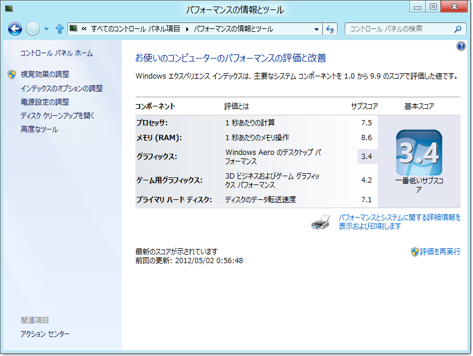
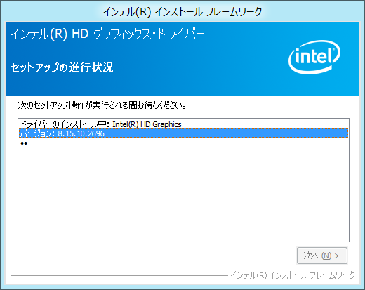
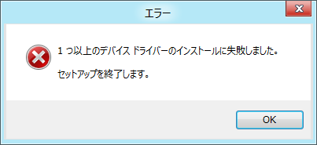
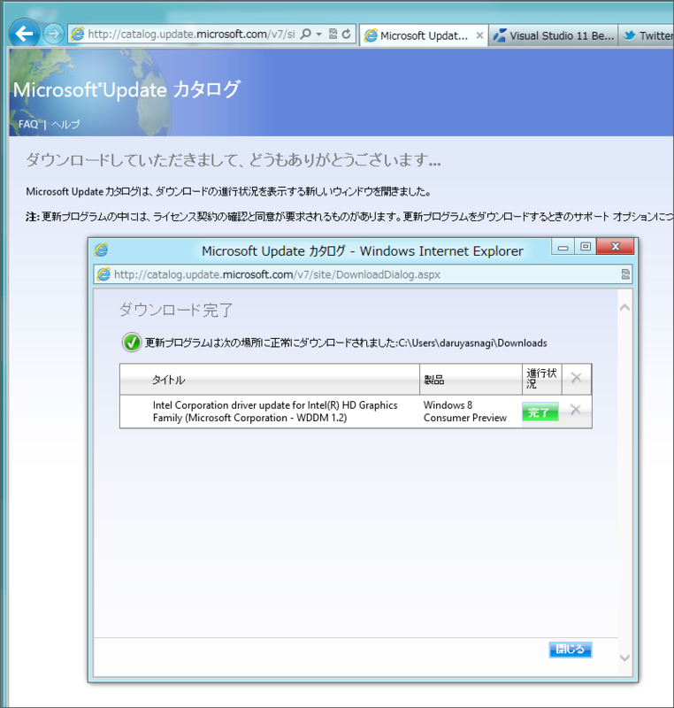
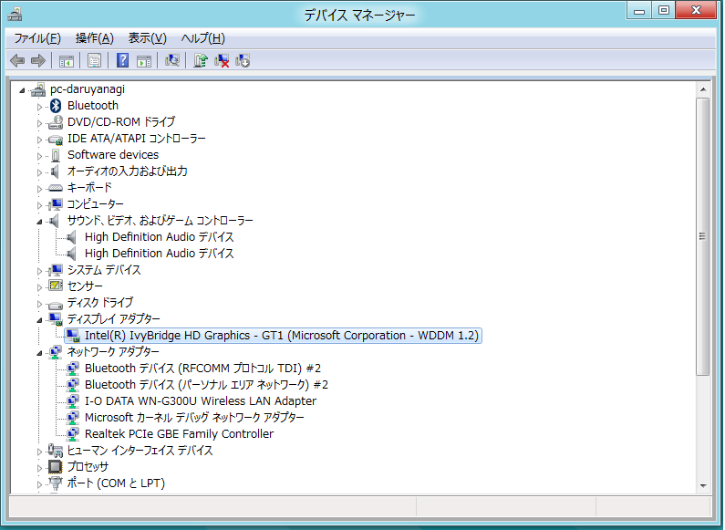
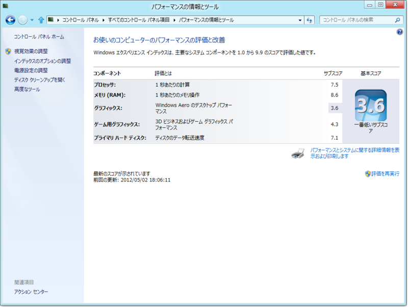

<a href="http://daruyanagi.hatenablog.com/entry/2012/05/02/083431">&#x9023;&#x4F11;4&#x65E5;&#x76EE;&#x3002;PC&#x3092;&#x81EA;&#x4F5C;&#x3057;&#x305F;&#x3002; - &#x3060;&#x308B;&#x308D;&#x3050;</a> で <a class="keyword" href="http://d.hatena.ne.jp/keyword/Windows%208">Windows 8</a> マシンが完成したわけだけど、さすがにWindows エクスペリエンス インデックス（WEI）で 3.4 はスコアが低すぎるかなと思ったので、ドライバー（グラフィック＆オーディオ）をアップデートしてみた。<a class="keyword" href="http://d.hatena.ne.jp/keyword/Windows%208">Windows 8</a>用は見当たらなかったので、とりあえず <a class="keyword" href="http://d.hatena.ne.jp/keyword/Windows%207">Windows 7</a>用をインストールしてみる。

デンッ♪

＼(^o^)／／(^o^)＼＼(^o^)／

しょうがないので、<a class="keyword" href="http://d.hatena.ne.jp/keyword/Windows%20Update">Windows Update</a> カタログ（<a href="http://catalog.update.microsoft.com/">http://catalog.update.microsoft.com/</a>）でベータ版のドライバーを探してダウンロード。CABファイルになっていたのだけど、これをどうしていいのかわからない。とりあえず展開して、ファイルを先ほどの <a class="keyword" href="http://d.hatena.ne.jp/keyword/Windows%207">Windows 7</a> 用ドライバーの Graphics フォルダーに上書きして再度実行。すると、HDオーディオのドライバーのインストールには失敗したものの、グラフィックドライバーはちゃんと入った。

さて、WEI は……っと。

3.6に急上昇……ぇ？　そんなに上がらなかった＼(^o^)／ <a href="#f1" name="fn1" title="ちなみにG41チップセットで試したら3.0だった。内蔵グラフィックスでは所詮こんなもんということらしい">*1</a>

現在は、こんな面倒な事をしなくてもベータ版のドライバーが<a class="keyword" href="http://d.hatena.ne.jp/keyword/%A5%A4%A5%F3%A5%C6%A5%EB">インテル</a>のサイトで公開されているようだ。

<ul>
<li><a href="http://downloadcenter.intel.com/Detail_Desc.aspx?agr=Y&ProdId=3128&DwnldID=21235">http://downloadcenter.intel.com/Detail_Desc.aspx?agr=Y&ProdId=3128&DwnldID=21235</a>（32bit）</li>
<li><a href="http://downloadcenter.intel.com/Detail_Desc.aspx?agr=Y&ProdId=3128&DwnldID=21180">http://downloadcenter.intel.com/Detail_Desc.aspx?agr=Y&ProdId=3128&DwnldID=21180</a>（64bit）</li>
</ul>

<a href="#fn1" name="f1" class="footnote-number">*1</a>:ちなみにG41チップセットで試したら3.0だった。内蔵グラフィックスでは所詮こんなもんということらしい

