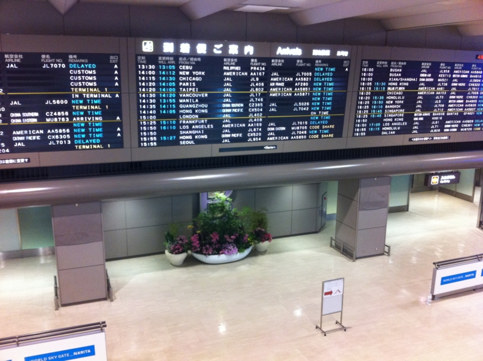
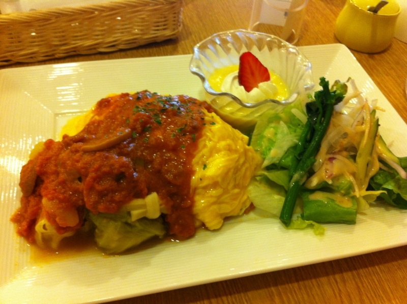

朝っぱらから、弟を成田空港まで車でお見送り。ついでに、お昼にアメリカから帰ってくるY氏をお出迎え。

空港で6時間ぐらい時間をつぶす羽目になったので、ご飯食べたり、本を読んだりしていた。オムライス、1,200円。

家に帰ると、@5zj と @daisuke_nomura と @toriimiyukki がゴロゴロしていた。しかも、作ったばかりのPC（<a href="http://daruyanagi.hatenablog.com/entry/2012/05/02/083431">&#x9023;&#x4F11;4&#x65E5;&#x76EE;&#x3002;PC&#x3092;&#x81EA;&#x4F5C;&#x3057;&#x305F;&#x3002; - &#x3060;&#x308B;&#x308D;&#x3050;</a>）に電源入れたら起動しないし。どうやら<a class="keyword" href="http://d.hatena.ne.jp/keyword/%A5%DE%A5%B6%A1%BC%A5%DC%A1%BC%A5%C9">マザーボード</a>ぶっ壊した？ これはショックだ／(^o^)＼

とりあえず、古いPCを復旧させた。

