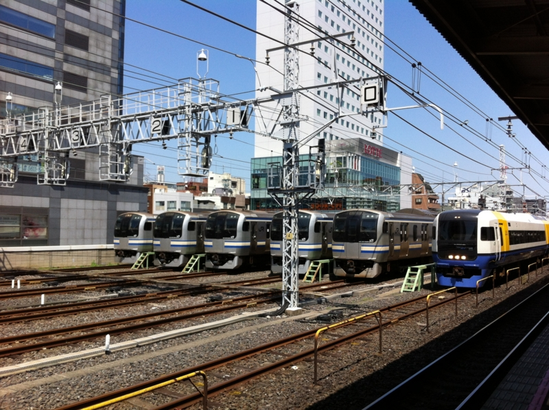
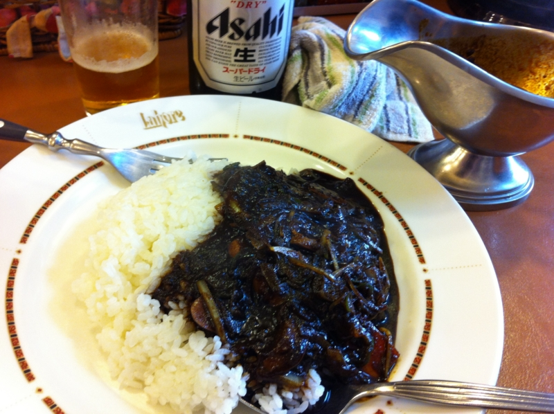

<a href="http://daruyanagi.hatenablog.com/entry/2012/05/05/060711">&#x9023;&#x4F11;7&#x65E5;&#x76EE;&#x3002;&#x6210;&#x7530;&#x7A7A;&#x6E2F;&#x3002; - &#x3060;&#x308B;&#x308D;&#x3050;</a> で借りた車を実家に帰さなければならなかったので、途中、我が家を数日にわたって占拠していた @5zj と @toriimiyukki を東京駅へ放り出し、その足で千葉へ向かった。途中、<a class="keyword" href="http://d.hatena.ne.jp/keyword/%B5%FE%CD%D5%C6%BB%CF%A9">京葉道路</a>がダダゴミで、下道へ逃げたのだけど、それでも2時間ぐらいかかってほんとげんなりした。やっぱ連休中はクルマに乗るものじゃないな。

<a href="http://www.amazon.co.jp/exec/obidos/ASIN/B007MWZKQI/bestylesnet-22/">GIGABYTE intel H77 LGA1155 ATX GA-H77-D3H</a>
<ul><li>出版社/メーカー: 日本ギ<a class="keyword" href="http://d.hatena.ne.jp/keyword/%A5%AC%A5%D0%A5%A4%A5%C8">ガバイト</a></li><li>発売日: 2012/04/09</li><li>メディア: Personal Computers</li><li> クリック: 1回</li><li><a href="http://d.hatena.ne.jp/asin/B007MWZKQI/bestylesnet-22" target="_blank">この商品を含むブログを見る</a></li></ul>

帰りは電車だったのだけど、ついでだしアキバまで足を延ばして、初期不良（？）だった<a class="keyword" href="http://d.hatena.ne.jp/keyword/%A5%DE%A5%B6%A5%DC">マザボ</a>の代替品を買いに行った。今回は B75 チップセットの<a class="keyword" href="http://d.hatena.ne.jp/keyword/%A5%DE%A5%B6%A1%BC%A5%DC%A1%BC%A5%C9">マザーボード</a>ではなくて、H77 チップセットの<a class="keyword" href="http://d.hatena.ne.jp/keyword/%A5%DE%A5%B6%A1%BC%A5%DC%A1%BC%A5%C9">マザーボード</a>を買った。なぜそんな気になったのかはよくわからないけれど……。B75マザーは返品がきかなかったらイタいなぁ。

この前ぶっ壊した <a class="keyword" href="http://d.hatena.ne.jp/keyword/iPad">iPad</a> の修理<a href="#f1" name="fn1" title="後日詳述">*1</a>とお昼御飯もアキバで。いつも気になってた<a class="keyword" href="http://d.hatena.ne.jp/keyword/%B9%F5%A5%AB%A5%EC%A1%BC">黒カレー</a>をアテにビールを嗜む。三辛に挑戦したのだけど、もっとがっつり辛くてよかったので、今後は五辛にしようかなぁ、と思う。個人的にはもっと本格なインドカレーのほうが好みだけど、これはこれでありなのかな。

<a class="keyword" href="http://d.hatena.ne.jp/keyword/%A5%DE%A5%B6%A1%BC%A5%DC%A1%BC%A5%C9">マザーボード</a>の封は開けず、その日はそのまま寝落ち。

<a href="#fn1" name="f1" class="footnote-number">*1</a>:後日詳述

