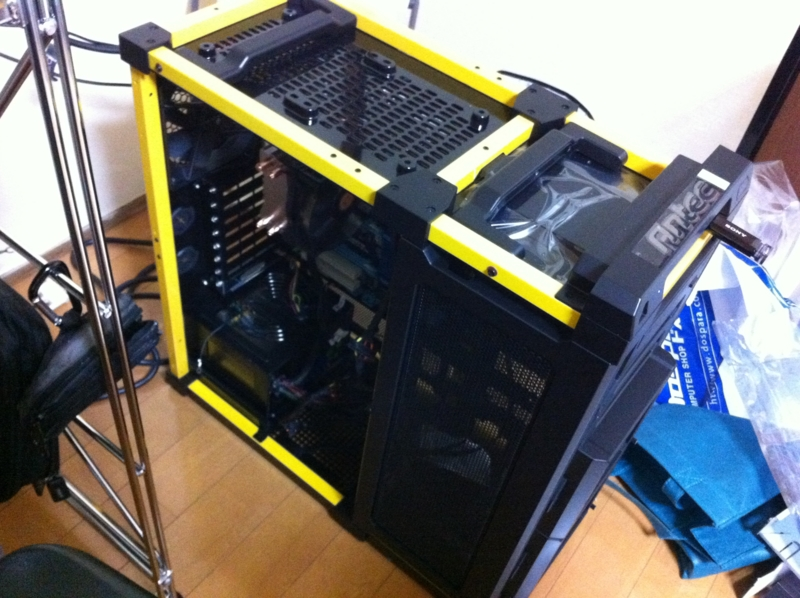
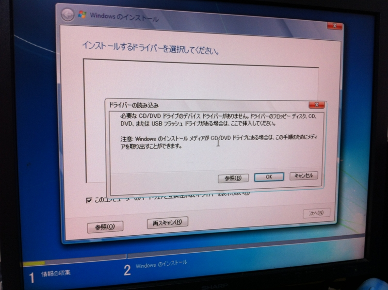
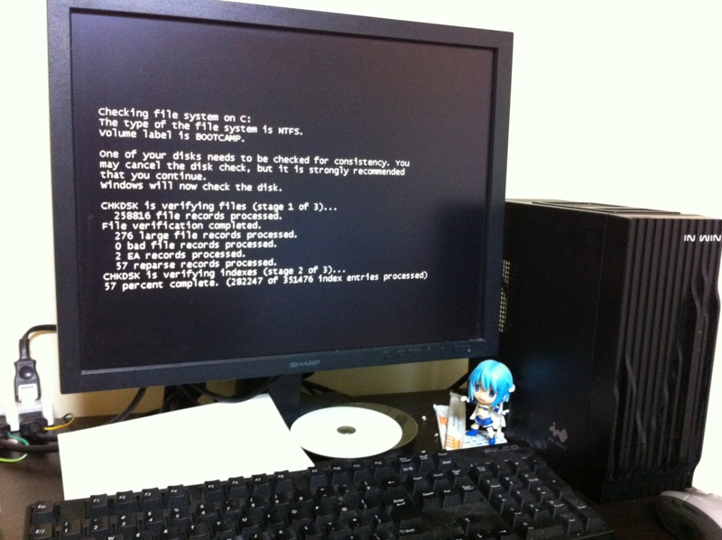
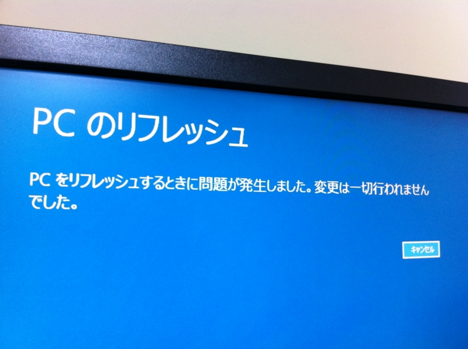
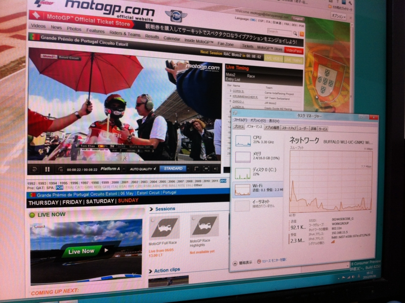

つくばで竜巻が大変だったようで。うちは屋上で布団を干そうとして物干し台をぶっ倒し、土台が少し割れた程度の被害。大家さんに謝らないとなぁ……

連休最終日は、掃除と洗濯でもしながらのんびり過ごそうと決めていた（これまでも十分のんびりだったけど）。けれど、散らばった部屋を片付けるには、自作パーツの整理をしなければならず、そのためにはPCを組んでしまわなければならない。<a href="http://daruyanagi.hatenablog.com/entry/2012/05/07/044714">&#x9023;&#x4F11;8&#x65E5;&#x76EE;&#x3002;&#x304A;&#x898B;&#x9001;&#x308A;&#x3068;&#x30A2;&#x30AD;&#x30D0;&#x5F98;&#x5F8A;&#x3002; - &#x3060;&#x308B;&#x308D;&#x3050;</a> で買った<a class="keyword" href="http://d.hatena.ne.jp/keyword/%A5%DE%A5%B6%A1%BC%A5%DC%A1%BC%A5%C9">マザーボード</a>も放置状態だし。結局、PCを組んで環境を構築するという、精神的にちょっと面倒な作業からは逃げられなかった。

（基本構成はこちら → <a href="http://daruyanagi.hatenablog.com/entry/2012/05/02/083431">&#x9023;&#x4F11;4&#x65E5;&#x76EE;&#x3002;PC&#x3092;&#x81EA;&#x4F5C;&#x3057;&#x305F;&#x3002; - &#x3060;&#x308B;&#x308D;&#x3050;</a> <a class="keyword" href="http://d.hatena.ne.jp/keyword/%A5%DE%A5%B6%A1%BC%A5%DC%A1%BC%A5%C9">マザーボード</a>だけ<a href="http://d.hatena.ne.jp/asin/B007MWZKQI">GIGABYTE intel H77 LGA1155 ATX GA-H77-D3H</a>へ換装してある）

以下にハマった点を――

<h3><a class="keyword" href="http://d.hatena.ne.jp/keyword/USB%A5%E1%A5%E2%A5%EA">USBメモリ</a>で<a class="keyword" href="http://d.hatena.ne.jp/keyword/Windows%207">Windows 7</a>のインストーラーを作成したのだけど</h3>

背面のポートに刺さないと起動しなかったばかりか、ドライバーがないといってインストールが中断される

<h3>しかたないので <a class="keyword" href="http://d.hatena.ne.jp/keyword/Windows%208">Windows 8</a> をインストールしたのだけど</h3>

 <a href="http://daruyanagi.hatenablog.com/entry/2012/05/05/060610">Windows 8 &#x3078; Ivy Bridge &#x306E;&#x30B0;&#x30E9;&#x30D5;&#x30A3;&#x30C3;&#x30AF;&#x30C9;&#x30E9;&#x30A4;&#x30D0;&#x30FC;&#x3092;&#x30A4;&#x30F3;&#x30B9;&#x30C8;&#x30FC;&#x30EB;&#x3059;&#x308B; - &#x3060;&#x308B;&#x308D;&#x3050;</a> で紹介したベータ版のグラフィックドライバーをインストールすると電源が頻繁に切断される。ディスクチェックが走りまくって心臓に悪い。

<h3>そこでOSのリフレッシュという新機能を試してみたのだけど</h3>

役に立たない。

でも、とりあえず <a class="keyword" href="http://d.hatena.ne.jp/keyword/MotoGP">MotoGP</a> が始まるまでには完成。Moto2 クラスはエキサイティングだったけど、GP クラスは眠いレース展開だったので、その日はそのまま寝落ち。

