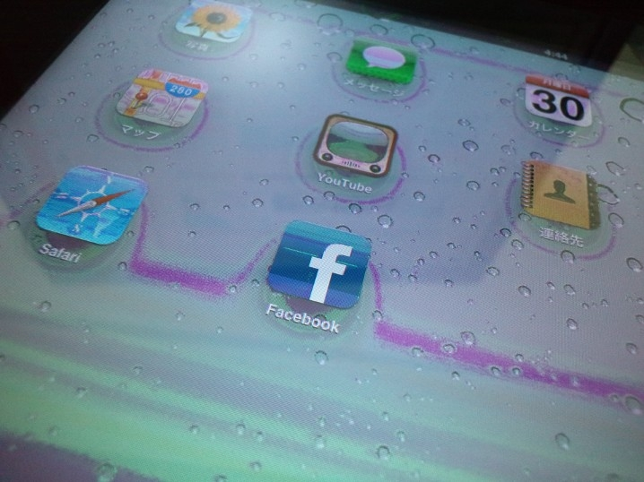
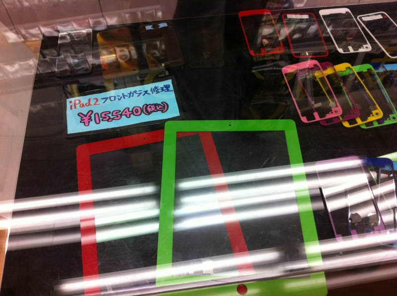
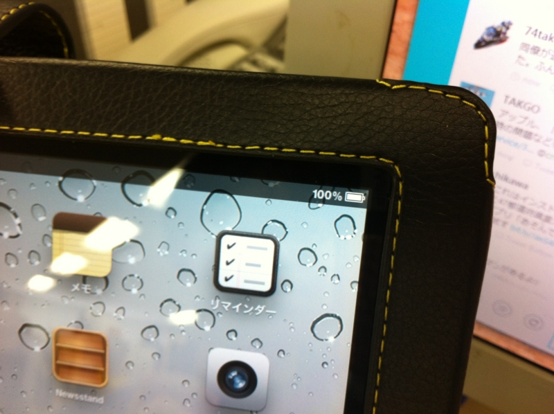
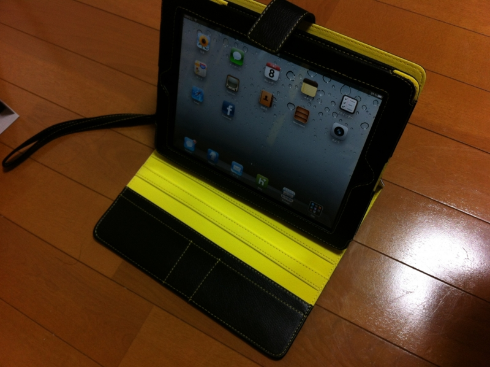

あれはいつだったか、ベッドで <a class="keyword" href="http://d.hatena.ne.jp/keyword/iPad">iPad</a> 2 を開いて Hulu を愉しみ、そのまま寝落ちしてしまった日のこと。目が覚めて、いつものように四つん這いになってメガネを探していたところ、誤って <a class="keyword" href="http://d.hatena.ne.jp/keyword/iPad">iPad</a> を床に落としてしまった。その高さは、ほんのひざ下程度までしかなかったのだけど、<a class="keyword" href="http://d.hatena.ne.jp/keyword/iPad">iPad</a> からあの鮮やかな発色を奪うには十分であった。

つまり何が言いたいのかというと、見事液晶を壊してしまった。ガラス面は割れていなくて、表示だけがおかしくなった状態。液晶画面の全体にわたって虹のような滲みが生じ、内容の視認は辛うじてできるものの、マンガや映画を楽しむにはあまりにも無様な有様。おーまいがーでございますよ、ほんと。

そんなわけで、<a href="http://daruyanagi.hatenablog.com/entry/2012/05/07/044714">&#x9023;&#x4F11;8&#x65E5;&#x76EE;&#x3002;&#x304A;&#x898B;&#x9001;&#x308A;&#x3068;&#x30A2;&#x30AD;&#x30D0;&#x5F98;&#x5F8A;&#x3002; - &#x3060;&#x308B;&#x308D;&#x3050;</a> でアキバへ行ったついでに、<a class="keyword" href="http://d.hatena.ne.jp/keyword/iPad">iPad</a> の修理もお願いしてきた。

<a href="http://www.dr-mobile.jp/smart/akihabara/price/">S/MART!&#x79CB;&#x8449;&#x539F;&#x5E97;&#x4FEE;&#x7406;&#x30B5;&#x30FC;&#x30D3;&#x30B9;&#x4FA1;&#x683C;&#x8868; | S/MART!&#x516C;&#x5F0F;&#x30DB;&#x30FC;&#x30E0;&#x30DA;&#x30FC;&#x30B8;</a>

あまり他のお店を知らないのだけど、お値段（15,000円程度）は結構良心的じゃないかな。かわいいお姉さんが修理してくれるところも評価に織り込めば、格安と言っても過言ではない。できあがりも上々。多少ガラス面が浮くが、もともとフレームに凹みがあり、ガラス面の接着剤を剥がしたあと同じ強度に戻すのは難しいと事前に説明を受けていたので想定の範囲内。また、作業の際に最悪ガラス面が割れる恐れがあるとの説明も受けていたが、それは杞憂に終わったようだ。なお、割れてしまったときの修理代は、先方がもってくださるとのこと。十分な事前説明もあいまって、信頼できるお店だなぁと感じられた。

まぁ、割れてしまったときはついでにカスタムしようと思っていたので、そこを責めるつもりはなかったが。いろんな色のフレームがあって、ちょっとほかの人と違うのがほしいなんてニーズを満たしてくれる。

あと、預けたときは電池がすっからかんだったのに、引き渡されたときは100％まで充電されていたのもポイントが高い。

帰りにイケショップで少し頑丈そうな <a class="keyword" href="http://d.hatena.ne.jp/keyword/iPad">iPad</a> ケースも買ったし、もう壊さないように気を付けよう。新しいケースは、ちょっと目を引く黄色の革＆ステッチが少し気に入っている。毎度毎度真っ黒なケースってのも、なんだか味気ないしね。

