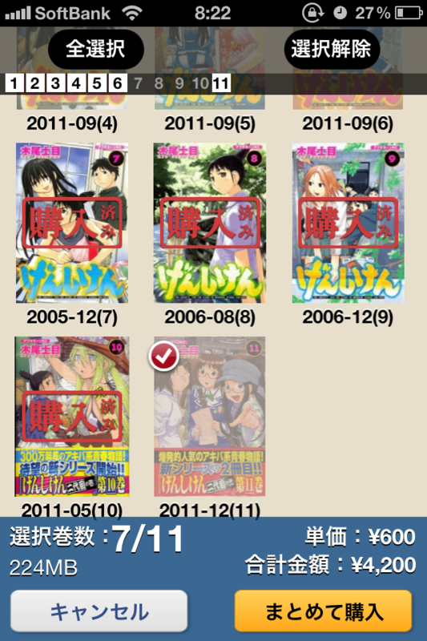
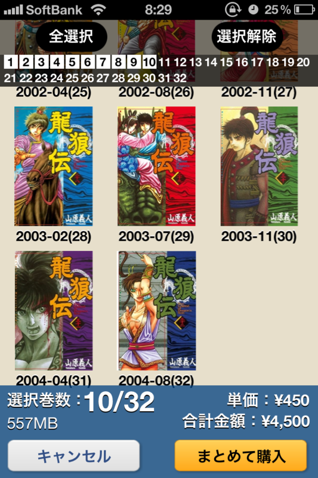

多少旧聞に付するけど……まとめ買い機能 ｷﾀ━━━━(ﾟ∀ﾟ)━━━━ｯ!!

ずっと既刊の本をまるっと変えれば便利だよなーって思ってたんだよね。これまではわざわざ前回の購入画面にもどって、関連書籍情報なんかから次の巻の購入画面を辿って買ってた。

ただ、こうやってまとまった額の購入金額が提示されると、ちょっと買うの躊躇するね。カードで数冊ずつ買って月末の請求が万単位に……というのが今までのパターンだったけど。実はまだこの機能でまとめ買いをしたことはない（ぉ

ちなみに、1回のまとめ買いで買えるのは10冊までみたい。いきなり何十冊も買わされるよりは、こっちのほうがいいなと思う。

あとはラインナップの拡充と、紙の新刊と刊行ペースをあわせてくれれば、個人的には完璧。活字は紙で読みたいけれど、マンガはもう全部<a class="keyword" href="http://d.hatena.ne.jp/keyword/%C5%C5%BB%D2%BD%F1%C0%D2">電子書籍</a>にしてしまいたい。

<ul>
<li><a href="http://daruyanagi.hatenablog.com/entry/2012/04/11/030841">&hellip;&hellip;&#x304A;&#x3084;&#xFF1F; &#x30A2;&#x30A4;&#x30D1;&#x30C3;&#x30C9; &#x306E;&#x3088;&#x3046;&#x3059;&#x304C;&hellip;&hellip;&#xFF01; - &#x3060;&#x308B;&#x308D;&#x3050;</a></li>
<li><a href="http://daruyanagi.hatenablog.com/entry/2012/02/28/211909">Kinoppy &#x306E; TraceZoom &#x6A5F;&#x80FD; - &#x3060;&#x308B;&#x308D;&#x3050;</a></li>
<li><a href="http://daruyanagi.hatenablog.com/entry/2012/02/23/210810">Kinoppy &#x304C;&#x3068;&#x3063;&#x3066;&#x3082;&#x9811;&#x5F35;&#x3063;&#x3066;&#x3044;&#x308B;&#x306E;&#x3067;&#x3001;&#x5FDC;&#x63F4;&#x304C;&#x3066;&#x3089;&#x4E0D;&#x5177;&#x5408;&#x5831;&#x544A;&#x3059;&#x308B; - &#x3060;&#x308B;&#x308D;&#x3050;</a></li>
<li><a href="http://daruyanagi.hatenablog.com/entry/2012/02/22/050039">&#x982D;&#x75DB;&#x3044;&#x3057;&#x30C0;&#x30EB;&#x3044;&#x306E;&#x3067; Kinoppy &#x3067;&#x30DE;&#x30F3;&#x30AC;&#x8AAD;&#x3093;&#x3067;&#x305F; - &#x3060;&#x308B;&#x308D;&#x3050;</a></li>
<li><a href="http://daruyanagi.hatenablog.com/entry/2012/02/16/231349">iPad &#x7248;&#x306E; Kinoppy &#x306B;&#x300C;&#x79C0;&#x82F1;&#x660E;&#x671D;&#x300D;&#x30D5;&#x30A9;&#x30F3;&#x30C8;&#x304C;&#x8FFD;&#x52A0; - &#x3060;&#x308B;&#x308D;&#x3050;</a></li>
</ul>