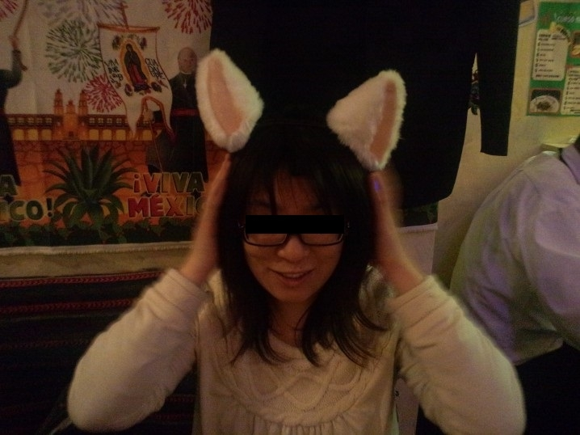
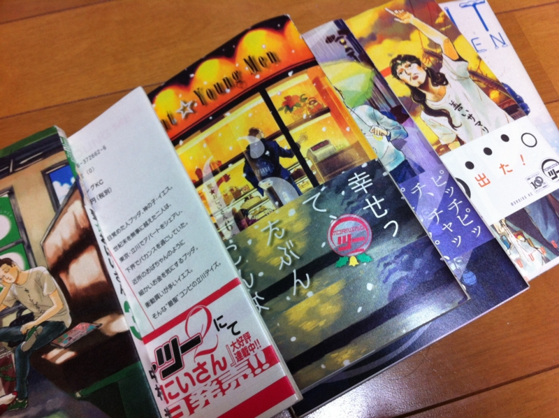

昨日は友人とお茶の水でメキシコ料理食べた。ついでに <a href="http://daruyanagi.hatenablog.com/entry/2012/04/30/070800">&#x9023;&#x4F11;&#x4E8C;&#x65E5;&#x76EE;&#x3002;&#x8D85;&#x30A8;&#x30F3;&#x30B8;&#x30CB;&#x30A2;&#x30DF;&#x30FC;&#x30C6;&#x30A3;&#x30F3;&#x30B0;&#xFF20;&#x30CB;&#x30B3;&#x30CB;&#x30B3;&#x8D85;&#x4F1A;&#x8B70; - &#x3060;&#x308B;&#x308D;&#x3050;</a> で買った脳波ネコミミをつけてもらった。こういうのはやっぱおっさんがつけるより女の子がつけたほうがいい。なかなかよろしいんじゃないでしょうか。ビール飲むとミミがピクピクしてた。

ちなみに、料理の写真は撮り忘れた。

あと、『<a class="keyword" href="http://d.hatena.ne.jp/keyword/%C0%BB%A1%F9%A4%AA%A4%CB%A4%A4%A4%B5%A4%F3">聖☆おにいさん</a>』も借りた。前々からお願いしてたんだよね。今日はなんか喉と頭の調子が悪くて会社を早退したので、布団でのんびりマンガでも読んで過ごそうかと思う。

<a href="http://www.amazon.co.jp/exec/obidos/ASIN/4063726622/bestylesnet-22/">聖☆おにいさん（1） (モーニングKC)</a>
<ul><li>作者: <a class="keyword" href="http://d.hatena.ne.jp/keyword/%C3%E6%C2%BC%B8%F7">中村光</a></li><li>出版社/メーカー: 講談社</li><li>発売日: 2008/01/23</li><li>メディア: コミック</li><li>購入: 69人 クリック: 1,629回</li><li><a href="http://d.hatena.ne.jp/asin/4063726622/bestylesnet-22" target="_blank">この商品を含むブログ (1335件) を見る</a></li></ul>

実は我慢できずに Kinoppy で1巻だけ買っちゃったのだけど、イエスはともかく、ブッダのネタがあまりわからん。そういえば、ブッダの伝記って読んだことないや。なんかコンパクトかつ内容が浅くないの、ないかなぁ。

